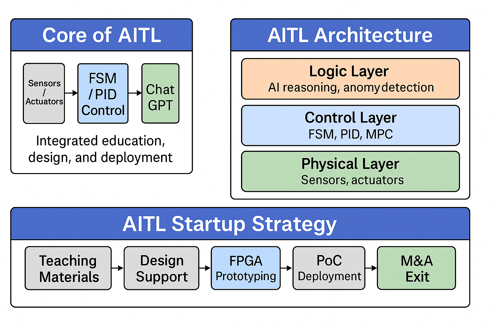

# 🇯🇵 **AITL戦略提言書** / 🇺🇸 **AITL Strategy Proposal** {#top}

  <a class="btn" href="#introduction">📎 Jump to Introduction</a>
  <a class="btn" href="./Figures/AITL_Strategy_Proposal_Draft_v3.pdf">⬇️ Download PDF</a>
  <a class="btn" href="https://samizo-aitl.github.io/Edusemi-Plus/">🏠 Edusemi-Plus</a>

---

## 📑 目次 / Table of Contents {#toc}

- [1. はじめに / Introduction](#introduction)
- [2. 背景と課題認識 / Background & Issues](#background)
  - [2.1 技術教育の分断 / Edu–Industry Gap](#edu-gap)
  - [2.2 LLM偏重PoCの限界 / Limits of LLM-centric PoCs](#llm-limit)
  - [2.3 先端偏重戦略の限界 / Limits of Advanced-Node Focus](#advanced-limit)
  - [2.4 単体PoC vs 統合PoC / Single vs Integrated PoC](#single-vs-integrated)
- [3. AITL構想の概要 / AITL Overview](#aitl-overview)
- [4. 教育モデル / Education Framework](#edu-framework)
  - [4.1 教材・支援ツール / Materials & Tools](#materials-tools)
  - [4.2 教育→設計→PoC / Seamless Flow](#seamless-flow)
  - [4.3 国際的独自性 / Global Uniqueness](#global-uniqueness)
- [5. 社会実装 / PoC & Real-World Applications](#poc)
  - [5.1 実装例 / Use Cases](#use-cases)
  - [5.2 FPGA検証の意義 / FPGA Verification](#fpga)
- [6. スタートアップ構想 / Startup Strategy](#startup)
  - [6.1 小規模・実装型モデル / Lean Model](#lean-model)
  - [6.2 エグジット戦略 / Exit](#exit)
- [7. 提言と施策 / Policy Recommendations](#policy)
  - [7.1 SystemDKの戦略的役割 / SystemDK as Enabler](#systemdk-policy)
- [8. おわりに / Conclusion](#conclusion)
- [付録 図・注記 / Figures & Notes](#figures)
- [戻る / Back](#back)

---

## 1. **はじめに / Introduction** {#introduction}

本提言書は、**生成AI（ChatGPT）**と**制御理論（FSM/PID）**を統合した  
**AITL（All-in-Theory Logic）**構想に基づき、**教育・設計・社会実装**を一体化させた国家戦略・地域活性の**具体モデル**を示す。  
This proposal outlines a national & regional model based on **AITL**, integrating **generative AI** with **control theory** across **education, design, implementation**.

**AITL戦略**は、**先端ノードや大規模資本に依存せず**、**テンプレート設計**と**老朽ファウンドリ再活用**により、  
**PoC→スタートアップ創出**を可能にする“**もう一つの半導体戦略**”。  
An **alternative** to capital-intensive advanced-node paths—**template-based design** + **legacy foundry reuse** enable a route from **PoC to startups**.

---

## 2. **背景と課題認識 / Background & Issues** {#background}

### 2.1 **技術教育の分断 / Edu–Industry Gap** {#edu-gap}
- 教育と実装の**断絶**。**HDL/制御**が“見えない技術”化。  
- A widening gap between **education** and **deployment**; **HDL/control** skills become invisible.

### 2.2 **LLM偏重PoCの限界 / Limits of LLM-centric PoCs** {#llm-limit}
- ChatGPT等の活用が**単体PoC止まり**。構造的連携が不足。  
- Lacks **structural integration** with **control** and **hardware**.

### 2.3 **先端偏重戦略の限界 / Limits of Advanced-Node Focus** {#advanced-limit}
- **国家資本依存**で再現性が低く、**地域教育/SME**には導入困難。  
- Hard to replicate outside state-funded settings; inaccessible for **local institutes & SMEs**.

### 2.4 **単体PoC vs 統合PoC / Single vs Integrated PoC** {#single-vs-integrated}
- **単体PoC**: ChatGPT対話デモ、単独センサ試験 → **再利用性に乏しい**。  
- **統合PoC（AITL）**: **センサ → PID/FSM → UARTログ → ChatGPT解析** → **教育・実装・評価**まで繋がる設計。

---

## 3. **AITL構想の概要 / AITL Overview** {#aitl-overview}

三層アーキテクチャ：  
- **Logic Layer** — **LLM推論/異常検知/言語生成**  
- **Control Layer** — **FSM / PID / MPC** による**明示的制御**  
- **Physical Layer** — **センサ/アクチュエータ/物理制約**

🎯 **Goal:** **説明可能性**・**安全性**・**実装容易性**をAI–制御–物理で両立。

---

## 4. **教育モデル / Education Framework** {#edu-framework}

### 4.1 **教材と支援ツール / Materials & Tools** {#materials-tools}
- **Edusemi**（基礎・Sky130演習）  
- **EduController**（PID・FSMシミュレーション）  
- **AITL-H**（**FSM×PID×LLM**統合制御テンプレート）  
- **SamizoGPT**（プロンプト設計・自動化）

### 4.2 **教育→設計→PoC の統合 / Seamless Flow** {#seamless-flow}
- **FSM設計**, **PIDチューニング**, **UART** を**ChatGPTテンプレ化**。  
- **FPGA**でリアルタイムPoC → ログを**ChatGPT解析**。

### 4.3 **国際的独自性 / Global Uniqueness** {#global-uniqueness}
- **明示的アーキテクチャ**でAI制御の**透明性**を担保。  
- **AI×制御×テンプレ設計**の**教育モデル**は国際的にも希少。

---

## 5. **社会実装 / PoC & Real-World Applications** {#poc}

### 5.1 **実装例 / Use Cases** {#use-cases}

| Field | PoC Content | Node |
|---|---|---|
| **Agriculture** | Greenhouse: **Temp/Humidity → PID → Fan → ChatGPT log analysis** | Sky130 / 180nm |
| **Disaster** | Tilt sensor: **FSM + ChatGPT** | 65nm |
| **Care** | Gait assist: **IMU + PID + fall detection** | 130nm |
| **Factory** | Thermal control AI: **FSM + LLM optimization** | 0.35µm HVMOS |
| **AMS Design** | HV-ADC control (**SystemDK + PID + Sky130 AMS**) | Sky130 / 180nm |

> **SystemDK×AMS**: Sky130高耐圧ADCの**PID制御ブロック**と**AMS制約モデル**を統合し、実環境PoCを実施。  
Constraints are **templated** and aligned to **Edusemi** materials.

### 5.2 **FPGA検証の意義 / FPGA Verification** {#fpga}
- **FSM/PID/LLM**を**リアルクロック**で検証。  
- **UARTログ**でPoC評価→**ChatGPT解析**が可能。

---

## 6. **スタートアップ構想 / Startup Strategy** {#startup}

### 6.1 **小規模・実装型モデル / Lean, Practical Model** {#lean-model}
- **テンプレ＋教材**で開発を加速。  
- **Sky130/180nm/FPGA**で**地域LSI**を実装。

### 6.2 **エグジット戦略 / Exit Strategy** {#exit}
- **技術・PoC・人材**の単位で買収可能性。  
- **教育×製品開発**の両立が強み。

---

## 7. **提言と施策 / Policy Recommendations** {#policy}

| Target | Recommendation |
|---|---|
| **MEXT** | 高専/大学に **FSM・PID・LLM統合教材** を導入支援 |
| **METI** | **Sky130/180nm PoC** 支援制度の整備 |
| **MAFF** | **テンプレ制御LSI** のスマート農業導入 |
| **Local Gov.** | **地域PoC＋設計＋教育** の一体支援 |

### 7.1 **SystemDKの戦略的役割 / SystemDK as an Enabler** {#systemdk-policy}

**SystemDK** は **物理制約統合設計**の要。**GAA/AMS/MRAM**等の**ノード特性**に応じた制約をテンプレ化し、  
**教育→評価→試作→起業**を一貫支援。  
**Action:** 教材整備（MEXT）、PoC助成（METI）、演習化（高専/大学）、地域プロラム（中小機構）。

---

## 8. **おわりに / Conclusion** {#conclusion}

**AITL戦略**は **教育 → PoC → 実装/起業** を結ぶ**現実志向の設計戦略**。  
先端偏重ではなく、**地域に根ざし教育に立脚した設計力の再興**を目指す。  
**It can start—right now, right here.**

---

## 付録：図・注記 / Figures & Notes {#figures}

### 📊 **AITL統合構成図 / AITL Integrated Architecture**

**Notes**  
1) **Core Flow**: Sensor → **FSM/PID** → UART → **ChatGPT**（非リアルタイム解析）  
2) **Three-Layer Architecture**: Logic / Control / Physical（再利用性・説明性）  
3) **Startup Path**: Education → Template → FPGA → ASIC PoC → M&A

---

## 🔙 戻る / Back {#back}

- **Edusemi-Plus Top:** https://samizo-aitl.github.io/Edusemi-Plus/  
- **Repo Home:** https://github.com/Samizo-AITL/AITL-Strategy-Proposal  
- **Contact:** ✉️ shin3t72@gmail.com ｜ X: https://x.com/shin3t72
