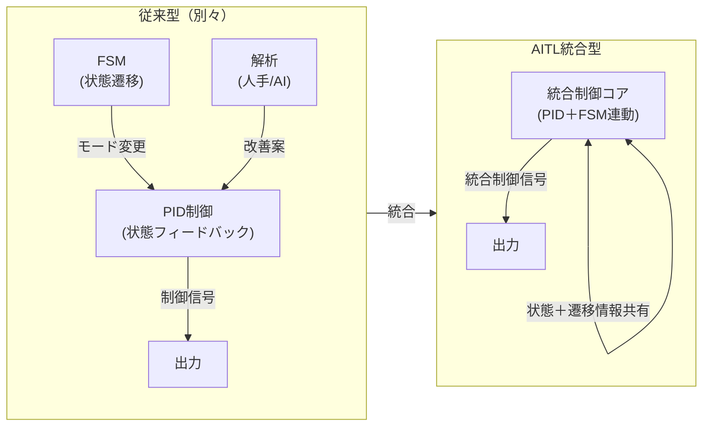

# 🇯🇵 **AITL戦略提言書 v4.0** / 🇺🇸 **AITL Strategy Proposal v4.0** {#top}

<div class="btn-row">
  <a class="btn" href="#overview">📎 Jump to Overview</a>
  <a class="btn" href="./Figures/AITL_Strategy_Proposal_Draft_v4_0.pdf">⬇️ Download PDF</a>
</div>

---

## 📑 目次 / Table of Contents {#toc}

- [0. 概要 / Overview](#overview)
- [1. 状態フィードバックと状態遷移統合の価値 / Value of Feedback–Transition Integration](#feedback-transition)
- [2. LLM融合によるAITLの価値 / Value of AITL with LLM](#aitl-llm-value)
- [3. PoC具体例 / Real-World PoC Examples](#poc-examples)
- [4. 政策提言 / Policy Recommendations](#policy)
- [5. おわりに / Conclusion](#conclusion)

---

## 0. **概要 / Overview** {#overview}

現代の工学・産業では、**状態フィードバック制御（PID等）**、**状態遷移制御（FSM）**、そして**AI（LLM）による解析・設計**は、ほぼ全て**独立運用**されている。  
AITL戦略はこれらを**統合**し、**リアルタイム～準リアルタイム**での**仕様変更・故障時再設計・最適化**を可能にする。  
さらに、**SystemDK** によって物理制約を反映した**ワンチップSoC化**を推進する。

---

## 1. **状態フィードバックと状態遷移統合の価値 / Value of Feedback–Transition Integration** {#feedback-transition}

現在の産業・研究現場では、  
① 状態フィードバック制御（PID, MPC 等）  
② 状態遷移制御（FSM, Sequence Control）  
③ システム解析・最適化（通常は人手 or AI解析）  
が別々に存在している。

これを統合すると、以下の価値が生まれる：

| 項目 / Item | 価値 / Value |
|---|---|
| **制御の一貫性** / Unified Control | 状態遷移と連動したフィードバック制御で、システム挙動が滑らかかつ安定化 |
| **仕様変更耐性** / Resilience to Spec Changes | 動作モードが変わっても制御パラメータを自動再調整 |
| **故障対応力** / Fault Adaptation | 一部モジュールが故障しても残存機能で動作継続（例：ロボットの片腕故障時の再設計） |
| **最適化効率** / Optimization Efficiency | 状態と遷移情報が揃っているため、最適化探索範囲が減少 |
| **SoC統合容易性** / Easier SoC Integration | 状態管理と制御が一体化され、ワンチップ実装しやすい |

---

### ① 状態フィードバック＋状態遷移統合の価値（GitHub対応Mermaid）

📎 [Mermaid公式ドキュメント (GitHub)](https://github.com/mermaid-js/mermaid)



---

## 2. **LLM融合によるAITLの価値 / Value of AITL with LLM** {#aitl-llm-value}

AITLは上記統合制御に**LLM（大規模言語モデル）**を加えることで、新しい価値を創出する。

| LLM活用領域 / LLM Role | 新しい価値 / New Value |
|---|---|
| **状況解析** / Situation Analysis | ログやセンサーデータから異常検知・原因推定を自動化 |
| **準リアルタイム設計** / Quasi-Real-Time Design | 数分単位で仕様変更に対応し、制御アルゴリズムやFSM構造を再設計 |
| **統合アーキ設計** / Integrated Architecture Design | 仕様書から直接、状態制御とフィードバック制御を統合した全体設計図を生成 |
| **故障時再設計** / Fault-Time Redesign | 残存機能を活用した動作モード再構築（例：ロボットが別アームで作業続行） |
| **SystemDK連携** / SystemDK Collaboration | 物理制約・ノード特性を設計段階から反映し、ワンチップSoC化を加速 |

---

### ② LLM融合アーキテクチャ（GitHub対応Mermaid）

📎 [Mermaid公式ドキュメント (GitHub)](https://github.com/mermaid-js/mermaid)

```mermaid
flowchart TB
    subgraph Physical["物理層<br/>Sensors &amp; Actuators"]
        SENSORS["センサ入力"]
        ACT["アクチュエータ出力"]
    end

    subgraph Control["統合制御層<br/>PID＋FSM"]
        CTRL["統合制御コア"]
    end

    subgraph LLM["LLM層<br/>解析・再設計・仕様生成"]
        AI["大規模言語モデル"]
    end

    SENSORS --> CTRL
    CTRL --> ACT
    CTRL --> AI
    AI -->|再設計指示| CTRL

    %% ← 空行が大事（リンク行と note の間に入れる）

    note right of AI
      故障時再設計
      仕様変更対応
      最適化提案
    end note
```

---

## 3. **PoC具体例 / Real-World PoC Examples** {#poc-examples}

以下はAITL戦略によるPoC例である：

1. **ロボット制御統合**  
   - 状態フィードバックと状態遷移を統合し、LLMで動的に制御構造を再構築。  
   - 片腕故障時、残存アームで作業続行する制御系を自動生成。

2. **スマート工場ライン最適化**  
   - 生産工程の状態遷移とフィードバックを統合、LLMが設備状態を解析し、数分単位で制御ロジックを更新。  
   - 故障発生時、代替ラインを自動編成。

3. **自律移動ロボット群制御**  
   - 複数ロボットのFSMを統合管理し、状態フィードバックで全体動作を同期化。  
   - LLMが交通状況や障害物情報を解析して経路最適化。

---

## 4. **政策提言 / Policy Recommendations** {#policy}

- **研究開発支援**：統合制御＋LLM＋SystemDKのR&Dを重点支援  
- **標準化推進**：統合制御仕様、PoC評価指標、LLM連携プロトコルの国際標準化  
- **産業連携促進**：製造、ロボティクス、AI企業間の協力枠組みを構築

---

## 5. **おわりに / Conclusion** {#conclusion}

AITL戦略は、これまで分断されてきた制御技術とAI設計を統合し、  
仕様変更や故障にも即応できる新しい産業システムを実現する。  
SystemDKとの組み合わせにより、物理制約を考慮したワンチップSoC実装が可能となり、  
産業・社会全体の効率化と新たな価値創造を加速する。

---

## 🔙 戻る / Back {#back}

**Repository Home**: [github.com/Samizo-AITL/AITL-Strategy-Proposal](https://github.com/Samizo-AITL/AITL-Strategy-Proposal)  
**Contact**: ✉️ [shin3t72@gmail.com](mailto:shin3t72@gmail.com) ｜ 🐦 [x.com/shin3t72](https://x.com/shin3t72)
