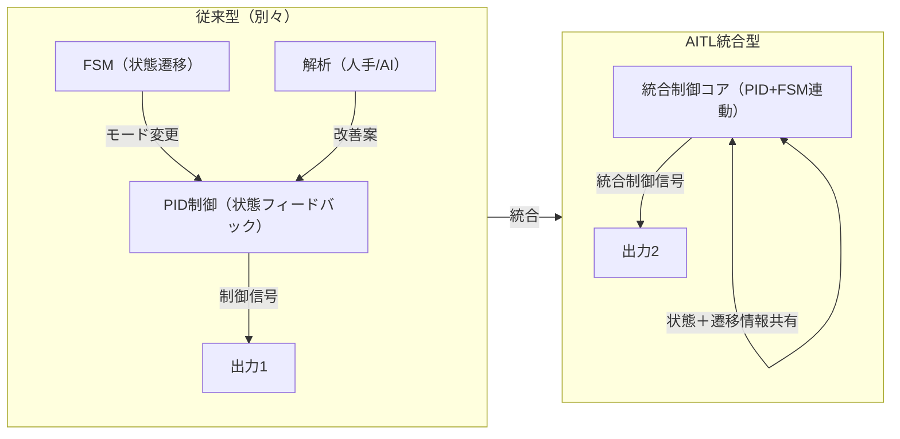
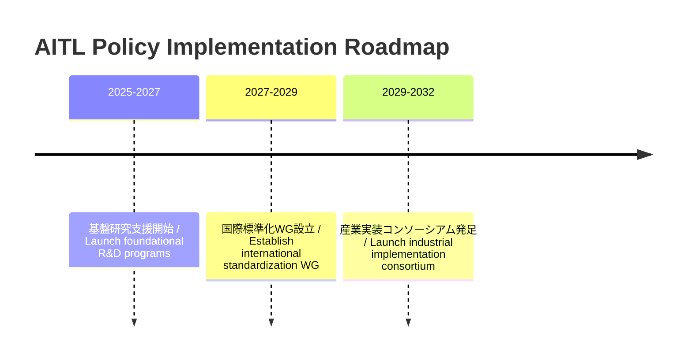

---

# 🇯🇵 **AITL戦略提言書 v4.1（政策寄り・改善版）** / 🇺🇸 **AITL Strategy Proposal v4.1 (Policy-Oriented, Improved)** {#top}

> ⚠️ **注意 / Note:**  
> 本提案は **v4.1 改訂版（政策寄り・改善版）** であり、記載内容は検討中です。  
> 詳細な実行計画・政策ロードマップは今後の議論を踏まえて更新されます。

  <a class="btn" href="#overview">📎 Jump to Overview</a>
  <a class="btn" href="./Figures/AITL_Strategy_Proposal_Draft_v4_1_Improved.pdf">⬇️ Download PDF</a>

---

## 📑 目次 / Table of Contents {#toc}

- [0. 概要 / Overview](#overview)
- [1. 統合制御の価値 / Value of Feedback–Transition Integration](#feedback-transition)
- [2. LLM融合によるAITLの価値 / Value of AITL with LLM](#aitl-llm-value)
- [3. PoC具体例 / Real-World PoC Examples](#poc-examples)
- [4. AITL実装とSystemDKの必要性 / Need for SystemDK in AITL Implementation](#systemdk)
- [4.1 技術的課題とリスク / Technical Challenges and Risks](#risks)
- [5. 政策提言 / Policy Recommendations](#policy)
- [6. おわりに / Conclusion](#conclusion)

---

## 0. **概要 / Overview** {#overview}

**対象読者 / Intended Audience:**  
- 🇯🇵 政策立案者、学術研究機関、産業技術戦略担当者  
- 🇺🇸 Policymakers, academic institutions, and industrial R&D strategy planners  

現代の工学・産業では、**状態フィードバック制御（PID等）**、**状態遷移制御（FSM）**、そして**AI（LLM）による解析・設計**は、ほぼ全て**独立運用**されている。  
AITL戦略はこれらを**統合制御（Feedback–Transition Integration）**として統合し、**リアルタイム～準リアルタイム**での**仕様変更・故障時再設計・最適化**を可能にする。  
さらに、**SystemDK** によって物理制約を反映した**実装形態（ワンチップSoCやマルチチップ構成）**を設計段階から最適化する。

**現状の課題 / Current Issues:**  
- 制御・解析技術が分断され、全体最適化が困難  
- 仕様変更や故障発生時の対応に時間とコストがかかる  
- 製造・インフラ分野ではダウンタイム増大による経済損失が発生  
- AI技術は導入されつつあるが、リアルタイム性と物理実装最適化が不足

---

## 1. **統合制御の価値 / Value of Feedback–Transition Integration** {#feedback-transition}

現在の産業・研究現場では、  
① 状態フィードバック制御（PID, MPC 等）  
② 状態遷移制御（FSM, Sequence Control）  
③ システム解析・最適化（通常は人手 or AI解析）  
が別々に存在している。

これを**統合制御（Feedback–Transition Integration）**として統合すると、以下の価値が生まれる：

| 項目 / Item | 価値 / Value |
|---|---|
| **制御の一貫性** / Unified Control | 状態遷移と連動したフィードバック制御で、システム挙動が滑らかかつ安定化 |
| **仕様変更耐性** / Resilience to Spec Changes | 動作モードが変わっても制御パラメータを自動再調整 |
| **故障対応力** / Fault Adaptation | 一部モジュールが故障しても残存機能で動作継続 |
| **最適化効率** / Optimization Efficiency | 状態と遷移情報が揃っているため、最適化探索範囲が減少 |
| **実装容易性** / Easier Physical Integration | 状態管理と制御が一体化され、ワンチップ・マルチチップを問わず実装しやすい |

📎 **Mermaid参照**: [GitHubで開く](https://github.com/Samizo-AITL/AITL-Strategy-Proposal/blob/main/AITL_Strategy_Proposal_Draft_v4_0.md)

---

## 2. **LLM融合によるAITLの価値 / Value of AITL with LLM** {#aitl-llm-value}

AITLは**統合制御**に**LLM（大規模言語モデル）**を加えることで、新しい価値を創出する。

| LLM活用領域 / LLM Role | 新しい価値 / New Value |
|---|---|
| **状況解析** / Situation Analysis | ログやセンサーデータから異常検知・原因推定を自動化 |
| **準リアルタイム設計** / Quasi-Real-Time Design | 数分単位で仕様変更に対応し、制御アルゴリズムやFSM構造を再設計 |
| **統合アーキ設計** / Integrated Architecture Design | 仕様書から直接、統合制御を含む全体設計図を生成 |
| **故障時再設計** / Fault-Time Redesign | 残存機能を活用した動作モード再構築 |
| **SystemDK連携** / SystemDK Collaboration | 物理制約・ノード特性を設計段階から反映し、最適な実装形態を選択 |

---

## 3. **PoC具体例 / Real-World PoC Examples** {#poc-examples}

1. **ロボット制御統合**  
   - **課題:** 従来は各関節やアームの制御が個別で、故障時に全停止が必要  
   - **AITL解決:** 統合制御＋LLMにより、片腕故障時でも残存アームで作業続行可能な制御系を自動生成

2. **スマート工場ライン最適化**  
   - **課題:** 故障時に代替ライン構成を人手で調整するため再稼働に数日要する  
   - **AITL解決:** 統合制御でライン全体を最適化し、LLMが設備状態解析から数分で代替ラインを編成

3. **自律移動ロボット群制御**  
   - **課題:** 複数ロボットの経路調整に遅延が発生し、全体効率が低下  
   - **AITL解決:** 統合制御で全体動作を同期し、LLMが交通状況解析に基づきリアルタイム経路最適化

---

## 4. **AITL実装とSystemDKの必要性 / Need for SystemDK in AITL Implementation** {#systemdk}

AITLを実システムに実装する際には、**物理制約（熱・応力・電源・EMIなど）**を初期段階から設計に反映する必要がある。  
**SystemDK（System Design Kit）**は、これを可能にする設計基盤である。

SystemDKの適用範囲はAITLに限らず、**半導体チップ全般**に渡る。  
特に、今後の**先端ノード半導体チップ**においては、物理制約を設計初期段階で統合的に扱う**SystemDKによる設計手法は必須**となる。

- 高密度実装環境での熱・信号干渉の早期対策が可能  
- FEM解析を設計段階に組み込み、回路・パッケージ・基板の統合最適化を実現  
- 長期的には設計効率・製品信頼性・量産歩留まりの向上につながる

---

## 4.1 **技術的課題とリスク / Technical Challenges and Risks** {#risks}

| 分類 / Category | 課題 / Challenge | リスク / Risk |
|---|---|---|
| **AI信頼性** / AI Reliability | LLM応答の精度・一貫性の保証 | 誤判断・幻覚応答による制御ミス |
| **セキュリティ** / Security | 統合制御系のサイバー攻撃耐性 | 生産停止・安全性低下 |
| **物理モデル融合** / Physical Model Integration | FEM等の物理制約モデルとリアルタイム制御の融合 | 設計遅延・性能劣化 |
| **標準化とIP** / Standardization & IP | 標準化に伴う知財・ライセンス調整 | 国際競争力低下 |

---

## 5. **政策提言 / Policy Recommendations** {#policy}

### 5.1 **導入効果試算 / Expected Benefits (Model Case)**

> **前提条件:** 国内製造ラインにAITL導入、PoC評価データに基づく試算値

| 項目 / Item | 従来型 / Conventional | AITL導入後 / With AITL | 効果 / Impact |
|---|---|---|---|
| 故障対応時間 / Fault Response Time | 8時間 | 30分 | ダウンタイム94%削減 |
| 生産ライン再構成時間 / Line Reconfiguration | 2日 | 2時間 | 生産性向上8倍 |
| 設計変更対応コスト / Design Change Cost | 100 | 60 | 40%削減 |

---

### 5.2 **政策ロードマップ / Policy Roadmap**

---

## 6. **おわりに / Conclusion** {#conclusion}

AITL戦略は、これまで分断されてきた制御技術とAI設計を統合し、  
仕様変更や故障にも即応できる新しい産業システムを実現する。  
SystemDKとの組み合わせにより、物理制約を考慮した最適な実装形態（ワンチップ・マルチチップ）が可能となり、  
産業・社会全体の効率化と新たな価値創造を加速する。

---

## 🔙 戻る / Back {#back}

**Repository Home**: <https://github.com/Samizo-AITL/AITL-Strategy-Proposal>  
**Contact**: ✉️ <mailto:shin3t72@gmail.com> ｜ 🐦 <https://x.com/shin3t72>
