---

# 🇯🇵 **AITL戦略提言書 v4.1 完成版**  
# 🇺🇸 **AITL Strategy Proposal v4.1 Final Edition** {#top}

  <a class="btn" href="#overview">📎 Jump to Overview</a>
  <a class="btn" href="./Figures/AITL_Strategy_Proposal_Draft_v4_1_Improved.pdf">⬇️ Download PDF</a>

---

## 📑 目次 / Table of Contents {#toc}

- [0. 概要 / Overview](#overview)
- [1. 統合制御の価値 / Value of Feedback–Transition Integration](#feedback-transition)
- [2. LLM融合によるAITLの価値 / Value of AITL with LLM](#aitl-llm-value)
- [3. PoC具体例 / Real-World PoC Examples](#poc-examples)
- [4. AITL実装とSystemDKの必要性 / Need for SystemDK in AITL Implementation](#systemdk)
- [4.1 技術的課題とリスク / Technical Challenges and Risks](#risks)
- [5. 政策提言 / Policy Recommendations](#policy)
- [6. おわりに / Conclusion](#conclusion)

---

## 0. 概要 / Overview
本提案は、**状態フィードバック制御**と**状態遷移制御**を統合し、さらに**LLM（大規模言語モデル）**と**SystemDK（System Design Kit）**を組み合わせることで、リアルタイム〜準リアルタイムでの仕様変更対応・故障時再設計・物理制約考慮設計を可能にする「AITL戦略（AI-Integrated Transition & Loop）」を提示するものである。

従来、制御・解析・物理実装は独立して運用されてきたが、先端ノード半導体や次世代自律システムにおいては、**これらを同一設計基盤上で統合運用することが国際競争力確保の必須条件**となる。本提案はそのための具体的枠組みを示す。

> **==本提案で統合する技術群は、制御（状態フィードバック＋状態遷移）、解析・設計（LLM）、物理実装最適化（SystemDK）という、互いの成果物と制約条件を直接共有できる相補的要素で構成されている。==**  
> **==これにより、部分的改善では到達できない、リアルタイムかつ物理制約を考慮した統合的最適化が実現可能となる。==**

**==さらに、世界の半導体市場と制御系産業はいま急速な変化の只中にあり、この3つの技術を「今」統合しないことは、（例：EUV世代の半導体設計、産業用自律システム制御）における国家的な技術競争で致命的な遅れを招く可能性が高い。==**  
**==特に、SystemDKはAITL固有の要素に留まらず、全ての先端ノード半導体設計に必須の基盤技術である。==**

---

## 1. 状態フィードバック＋状態遷移統合制御の価値
統合制御は、従来型制御の課題（局所最適化・仕様変更耐性不足・故障時脆弱性）を解消し、以下の効果をもたらす。

| 項目 / Item | 効果 / Effect |
|---|---|
| **安定性 / Stability** | 異なるモード間でも連続的で安定した動作を維持 |
| **柔軟性 / Flexibility** | 設計時点と運用中の要求変更に柔軟対応 |
| **冗長性 / Redundancy** | 一部機能喪失時にも安全かつ効率的に動作継続 |

```mermaid
flowchart LR
    A[状態フィードバック制御] --> C[統合制御コア]
    B[状態遷移制御] --> C
    C --> D[安定性 + 柔軟性 + 冗長性]
```

---

## 2. **LLM融合によるAITLの価値 / Value of AITL with LLM** {#aitl-llm-value}

AITLは**統合制御**に**LLM（大規模言語モデル）**を加えることで、新しい価値を創出する。

| LLM活用領域 / LLM Role | 新しい価値 / New Value |
|---|---|
| **状況解析** / Situation Analysis | ログやセンサーデータから異常検知・原因推定を自動化 |
| **準リアルタイム設計** / Quasi-Real-Time Design | 数分単位で仕様変更に対応し、制御アルゴリズムやFSM構造を再設計 |
| **統合アーキ設計** / Integrated Architecture Design | 仕様書から直接、統合制御を含む全体設計図を生成 |
| **故障時再設計** / Fault-Time Redesign | 残存機能を活用した動作モード再構築 |
| **SystemDK連携** / SystemDK Collaboration | 物理制約・ノード特性を設計段階から反映し、最適な実装形態を選択 |

---

## 3. **PoC具体例 / Real-World PoC Examples** {#poc-examples}

1. **ロボット制御統合**  
   - **課題:** 従来は各関節やアームの制御が個別で、故障時に全停止が必要  
   - **AITL解決:** 統合制御＋LLMにより、片腕故障時でも残存アームで作業続行可能な制御系を自動生成

2. **スマート工場ライン最適化**  
   - **課題:** 故障時に代替ライン構成を人手で調整するため再稼働に数日要する  
   - **AITL解決:** 統合制御でライン全体を最適化し、LLMが設備状態解析から数分で代替ラインを編成

3. **自律移動ロボット群制御**  
   - **課題:** 複数ロボットの経路調整に遅延が発生し、全体効率が低下  
   - **AITL解決:** 統合制御で全体動作を同期し、LLMが交通状況解析に基づきリアルタイム経路最適化

---

## 4. **AITL実装とSystemDKの必要性 / Need for SystemDK in AITL Implementation** {#systemdk}

AITLを実システムに実装する際には、**物理制約（熱・応力・電源・EMIなど）**を初期段階から設計に反映する必要がある。  
**SystemDK（System Design Kit）**は、これを可能にする設計基盤である。

SystemDKの適用範囲はAITLに限らず、**半導体チップ全般**に渡る。  
特に、今後の**先端ノード半導体チップ**においては、物理制約を設計初期段階で統合的に扱う**SystemDKによる設計手法は必須**となる。

- 高密度実装環境での熱・信号干渉の早期対策が可能  
- FEM解析を設計段階に組み込み、回路・パッケージ・基板の統合最適化を実現  
- 長期的には設計効率・製品信頼性・量産歩留まりの向上につながる

---

## 4.1 **技術的課題とリスク / Technical Challenges and Risks** {#risks}

| 分類 / Category | 課題 / Challenge | リスク / Risk |
|---|---|---|
| **AI信頼性** / AI Reliability | LLM応答の精度・一貫性の保証 | 誤判断・幻覚応答による制御ミス |
| **セキュリティ** / Security | 統合制御系のサイバー攻撃耐性 | 生産停止・安全性低下 |
| **物理モデル融合** / Physical Model Integration | FEM等の物理制約モデルとリアルタイム制御の融合 | 設計遅延・性能劣化 |
| **標準化とIP** / Standardization & IP | 標準化に伴う知財・ライセンス調整 | 国際競争力低下 |

---

## 5. **政策提言 / Policy Recommendations** {#policy}

### 5.1 **導入効果試算 / Expected Benefits (Model Case)**

> **前提条件:** 国内製造ラインにAITL導入、PoC評価データに基づく試算値

| 項目 / Item | 従来型 / Conventional | AITL導入後 / With AITL | 効果 / Impact |
|---|---|---|---|
| 故障対応時間 / Fault Response Time | 8時間 | 30分 | ダウンタイム94%削減 |
| 生産ライン再構成時間 / Line Reconfiguration | 2日 | 2時間 | 生産性向上8倍 |
| 設計変更対応コスト / Design Change Cost | 100 | 60 | 40%削減 |

---

### 5.2 **政策ロードマップ / Policy Roadmap**

```mermaid
timeline
    title AITL Policy Implementation Roadmap
    2025-2027 : 基盤研究支援開始 / Launch foundational R&D programs
    2027-2029 : 国際標準化WG設立 / Establish international standardization WG
    2029-2032 : 産業実装コンソーシアム発足 / Launch industrial implementation consortium
```

---

### 5.3 学術化と人材育成 / Academic Systematization & Human Resource Development
AITLおよびSystemDKは、物理・制御・AIを横断する学際的領域であり、現場実装者のみでの吸収は困難である。  
従って「AITL学（仮称）」を体系化し、修士〜博士レベルでの教育カリキュラムを整備することが不可欠である。  
この分野で育成された人材が産業界に流入することで、研究開発と実装現場の分断を解消し、持続的な国際競争力を確保できる。

さらに、**国際共同研究ネットワーク**や**産学連携拠点**を設置し、 
学術的知見と産業界の実装要求を相互循環させる仕組みを構築すべきである。  
これにより、AITL学を基盤とした教育・研究・実装が連続的に展開され、  
持続的な人材供給と国際競争力強化につながる。

```mermaid
flowchart TB
    A[大学院教育（修士・博士）] --> B[研究開発人材]
    B --> C[産業界での実装・応用]
    C --> D[政策・社会実装]
    D --> E[国際標準化・競争力]
    E --> A

    subgraph Academic
      A
      B
    end

    subgraph Industrial
      C
      D
    end

    subgraph Global
      E
    end

style A fill:#eef5fb,stroke:#0b3d75,stroke-width:1px
style B fill:#eef5fb,stroke:#0b3d75,stroke-width:1px
style C fill:#f9f2ec,stroke:#a65e2e,stroke-width:1px
style D fill:#f9f2ec,stroke:#a65e2e,stroke-width:1px
style E fill:#f0f9f0,stroke:#2e7d32,stroke-width:1px

style A stroke-width:2px
style C stroke-width:2px

```

---

## 6. **おわりに / Conclusion** {#conclusion}

AITL戦略は、これまで分断されてきた制御技術とAI設計を統合し、 
仕様変更や故障にも即応できる新しい産業システムを実現する。  
SystemDKとの組み合わせにより、物理制約を考慮した最適な実装形態（ワンチップ・マルチチップ）が可能となり、  
産業・社会全体の効率化と新たな価値創造を加速する。

---

## 🔙 戻る / Back {#back}

**Repository Home**: <https://github.com/Samizo-AITL/AITL-Strategy-Proposal>  
**Contact**: ✉️ <mailto:shin3t72@gmail.com> ｜ 🐦 <https://x.com/shin3t72>
