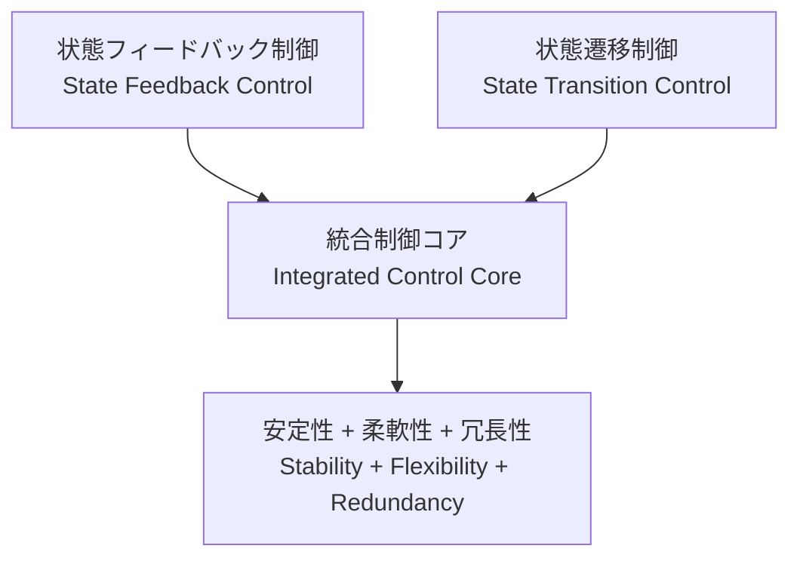

---

# 🇯🇵 **AITL戦略提言書 v4.2 完成版**  
# 🇺🇸 **AITL Strategy Proposal v4.2 Final Edition** {#top}

  <a class="btn" href="#overview">📎 Jump to Overview</a>
  <a class="btn" href="{{ site.baseurl }}/Figures/AITL_Strategy_Proposal_Draft_v4_2.pdf">⬇️ Download PDF</a>

---

## 📑 目次 / Table of Contents {#toc}

- [0. 概要 / Overview](#overview)
- [1. 統合制御の価値 / Value of Feedback–Transition Integration](#feedback-transition)
- [2. LLM融合によるAITLの価値 / Value of AITL with LLM](#aitl-llm-value)
- [3. PoC具体例 / Real-World PoC Examples](#poc-examples)
- [4. AITL実装とSystemDKの必要性 / Need for SystemDK in AITL Implementation](#systemdk)
  - [4.1 技術的課題とリスク / Technical Challenges and Risks](#risks)
- [5. 政策提言 / Policy Recommendations](#policy)
  - [5.1 導入効果試算 / Expected Benefits (Model Case)](#benefits)
  - [5.2 政策ロードマップ / Policy Roadmap](#roadmap)
  - [5.3 学術化と人材育成 / Academic Systematization & HR Development](#hrd)
  - [5.4 産業化モデル / Industrialization Model](#industry-model)
- [6. おわりに / Conclusion](#conclusion)
- [🔙 戻る / Back](#back)

---

## 0. 概要 / Overview {#overview}

本提案は、**状態フィードバック制御**と**状態遷移制御**を統合し、  
さらに **LLM（大規模言語モデル）** および **SystemDK（System Design Kit）** を組み合わせることで、  
リアルタイム〜準リアルタイムにおける **仕様変更対応**・**故障時再設計**・**物理制約を考慮した設計** を可能とする  
「**AITL戦略（AI-Integrated Transition & Loop）**」を提示するものである。  

This proposal presents the **AITL Strategy (AI-Integrated Transition & Loop)**,  
which integrates **state feedback control** and **state transition control**,  
further enhanced by **LLMs (Large Language Models)** and **SystemDK (System Design Kit)**.  
This integration enables real-time to quasi-real-time **design modification**, **fault-time redesign**,  
and **constraint-aware implementation**.  

従来、**制御・解析・物理実装**はそれぞれ **独立したプロセス** として扱われてきた。  
しかし、先端ノード半導体や次世代自律システムの分野では、  
**これらを単一の設計基盤上で統合的に運用することが国際競争力確保の必須条件** となっている。  
本提案はそのための **具体的枠組み** を提示する。  

Traditionally, **control, analysis, and physical implementation** have been managed as **independent processes**.  
However, in advanced-node semiconductor design and next-generation autonomous systems,  
**operating them within a unified design framework has become indispensable for maintaining international competitiveness**.  
This proposal outlines a **practical framework** to achieve that goal.  

本提案が統合する技術群は、  
- **制御（状態フィードバック＋状態遷移）**  
- **解析・設計（LLM）**  
- **物理実装最適化（SystemDK）**  

である。これらは成果物と制約条件を直接共有できる相補的要素であり、  
部分的改善では到達できない、**リアルタイムかつ物理制約を考慮した統合的最適化**を実現する。  

The technologies integrated in this proposal—  
- **control (state feedback + state transition)**  
- **design & analysis (LLMs)**  
- **physical implementation optimization (SystemDK)**  

are complementary elements that can directly share results and constraints.  
Together, they enable a level of **real-time, constraint-aware holistic optimization**  
that cannot be achieved through partial improvements alone.  

さらに、世界の半導体市場と制御系産業はいま急速な変革期にある。  
これら3つの技術を **今** 統合しなければ、EUV世代の半導体設計や  
産業用自律システム制御といった分野で国家的な技術競争において  
致命的な遅れを招く可能性が高い。  

特に、SystemDKはAITLの専用技術にとどまらず、  
**あらゆる先端ノード半導体設計に不可欠な基盤** である。  

Moreover, the global semiconductor and control industries are undergoing rapid transformation.  
Without integrating these three technologies *now*, nations risk falling fatally behind in areas such as  
EUV-generation semiconductor design and industrial autonomous systems.  

In particular, SystemDK is not limited to AITL-specific applications—  
it is an **essential foundation for all advanced-node semiconductor design**.  

---

## 1. 統合制御の価値 / Value of Feedback–Transition Integration {#feedback-transition}

統合制御は、従来型制御の課題（局所最適化・仕様変更耐性不足・故障時脆弱性）を解消し、  
安定性・柔軟性・冗長性を兼ね備えた次世代制御基盤を実現する。  

Integrated control resolves the limitations of conventional methods  
(local optimization, poor tolerance to specification changes, and fragility under faults),  
and enables a **next-generation control framework** with stability, flexibility, and redundancy.  

---

### 📌 統合制御がもたらす効果 / Effects of Integrated Control

| 項目 / Item | 効果 / Effect |
|---|---|
| **安定性 / Stability** | 異なるモード間でも連続的で安定した動作を維持 *Maintains continuous and stable operation even across different modes* |
| **柔軟性 / Flexibility** | 設計時点および運用中の要求変更に柔軟対応 *Adapts flexibly to design-time and runtime requirement changes* |
| **冗長性 / Redundancy** | 一部機能喪失時にも安全かつ効率的に動作継続 *Continues safe and efficient operation even when some functions fail* |

---

### 🖼️ 統合制御の模式図 / Conceptual Diagram

---

## 2. LLM融合によるAITLの価値 / Value of AITL with LLM {#aitl-llm-value}

AITLは **統合制御** に **LLM（大規模言語モデル）** を加えることで、  
従来の制御・設計の枠を超えた新しい価値を創出する。  

By incorporating **LLMs (Large Language Models)** into **integrated control**,  
AITL creates **new value** that goes beyond conventional control and design paradigms.  

---

### 📌 LLMがもたらす新しい価値 / New Value of LLM Integration

| LLM活用領域 / LLM Role | 新しい価値 / New Value |
|---|---|
| **状況解析 / Situation Analysis** | ログやセンサーデータから異常検知・原因推定を自動化 *Automates anomaly detection and root-cause estimation from logs and sensor data* |
| **準リアルタイム設計 / Quasi-Real-Time Design** | 数分単位で仕様変更に対応し、制御アルゴリズムやFSM構造を再設計 *Adapts to specification changes within minutes, redesigning control algorithms and FSM structures* |
| **統合アーキ設計 / Integrated Architecture Design** | 仕様書から直接、統合制御を含む全体設計図を生成 *Generates complete system architectures, including integrated control, directly from specifications* |
| **故障時再設計 / Fault-Time Redesign** | 残存機能を活用して動作モードを再構築 *Reconstructs operation modes by leveraging remaining functional modules during faults* |
| **SystemDK連携 / SystemDK Collaboration** | 物理制約・ノード特性を設計初期から反映し、最適な実装形態を選択 *Integrates physical constraints and node characteristics from the early design stage to select the optimal implementation form* |

---

## 3. PoC具体例 / Real-World PoC Examples {#poc-examples}

### 3.1 ロボット制御統合 / Integrated Robotic Control
- **課題 / Challenge:**  
  従来は各関節やアームの制御が個別で、1つのアクチュエータが故障すると全体を停止せざるを得なかった。  
  *In conventional systems, each joint or arm is controlled separately, and a failure in one actuator forces the entire system to shut down.*  

- **AITL解決 / AITL Solution:**  
  統合制御＋LLMにより、片腕故障時でも残存アームで作業を続行できる制御系を自動生成。  
  *With integrated control and LLM support, AITL can automatically generate a control system that allows remaining arms to continue operation even if one arm fails.*  

---

### 3.2 スマート工場ライン最適化 / Smart Factory Line Optimization
- **課題 / Challenge:**  
  従来は故障時に代替ライン構成を人手で調整する必要があり、再稼働まで数日を要した。  
  *Traditionally, reconfiguring production lines after failures required manual intervention, taking several days before resuming operations.*  

- **AITL解決 / AITL Solution:**  
  統合制御でライン全体を最適化し、LLMが設備状態解析から数分で代替ラインを編成。  
  *AITL enables integrated optimization of the entire production line, with LLMs analyzing equipment status and reconfiguring substitute lines within minutes.*  

---

### 3.3 自律移動ロボット群制御 / Autonomous Mobile Robot Fleet Control
- **課題 / Challenge:**  
  複数ロボット間での経路調整に遅延が生じ、全体効率が低下していた。  
  *Delays in coordinating paths among multiple robots caused overall efficiency to drop.*  

- **AITL解決 / AITL Solution:**  
  統合制御により全体動作を同期し、LLMが交通状況解析に基づいてリアルタイムで経路を最適化。  
  *AITL synchronizes overall fleet operations through integrated control, while LLMs optimize routing in real time based on traffic and situational analysis.*

---

## 4. AITL実装とSystemDKの必要性 / Need for SystemDK in AITL Implementation {#systemdk}

AITLを実システムに実装する際には、**物理制約（熱・応力・電源・EMIなど）**を初期段階から設計に反映する必要がある。  
When implementing AITL into real systems, it is essential to reflect **physical constraints (thermal, stress, power, EMI, etc.)** at the earliest design stage.  

**SystemDK（System Design Kit）**は、これを可能にする設計基盤である。  
**SystemDK (System Design Kit)** provides the foundational design framework that makes this possible.  

SystemDKの適用範囲はAITLに限らず、**半導体チップ全般**に及ぶ。  
The application scope of SystemDK extends beyond AITL, encompassing **semiconductor chip design as a whole**.  

特に、今後の**先端ノード半導体チップ**においては、物理制約を設計初期段階で統合的に扱う**SystemDKによる設計手法は必須**となる。  
In particular, for **future advanced-node semiconductor chips**, design methodologies based on SystemDK—which integrate physical constraints at the earliest stages—will be **indispensable**.  

- 高密度実装環境での熱・信号干渉の早期対策が可能  
  *Enables early countermeasures against thermal and signal interference in high-density environments.*  
- FEM解析を設計段階に組み込み、回路・パッケージ・基板の統合最適化を実現  
  *Integrates FEM analysis directly into the design phase, achieving co-optimization across circuits, packages, and substrates.*  
- 長期的には設計効率・製品信頼性・量産歩留まりの向上につながる  
  *Ultimately improves design efficiency, product reliability, and mass-production yield.*

---

