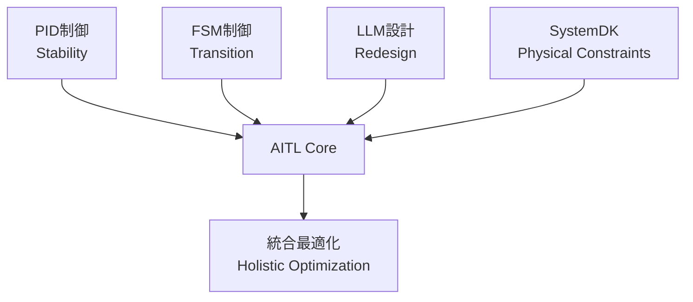
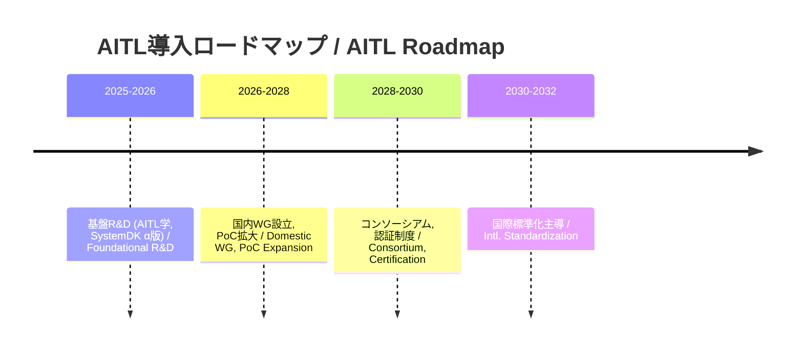

---

# 🇯🇵 **AITL戦略提言書 v5.0**  
# 🇺🇸 *AITL Strategy Proposal v5.0*

---

## 🚀 0. エグゼクティブサマリ / Executive Summary

**AITL (AI-Integrated Transition & Loop)** は  
- **PID（安定性 / Stability）**  
- **FSM（モード遷移 / State Transition）**  
- **LLM（再設計 / Redesign）**  

を統合し、**SystemDK** により **熱・応力・電源・EMI** などの物理制約を設計初期から反映する。  
*AITL integrates PID, FSM, and LLM, with SystemDK embedding physical constraints (thermal, stress, power, EMI) from the earliest design stage.*  

本提案は、**各論文のPoC実測値** を根拠とし、**産業・教育・政策** への橋渡しを提示する。  
*This proposal grounds itself on PoC evidence from published papers, bridging industry, education, and policy.*  

---

## 📑 1. 論文別PoC解説 / Paper-Based PoC Examples

### 🤖 1.1 Humanoid TCST 論文 (2025)  
*[Humanoid TCST Paper (2025)](./docs/humanoid_tcst2025.pdf)*  

- **実測 / Results:** 姿勢回復 ≤200ms、歩容安定度 +30%、エネルギー効率 +15%、自己発電寄与 ~12%  
  *Posture recovery ≤200ms, gait stability +30%, energy efficiency +15%, self-powering ~12%*  
- **AITL位置づけ / AITL Role:** PID＋FSM＋LLMによる三層制御。Flagship PoC。  
  *Three-layer control with PID, FSM, and LLM. Flagship PoC.*  
- **産業貢献 / Industrial Impact:** 災害救助、介護支援、工場自動化で信頼性を担保。  
  *Ensures reliability in disaster relief, elderly care, and factory automation.*  

---

### 🚀 1.2 AITL on Space Main Paper  
*[AITL on Space Paper](./docs/aitl_space.pdf)*  

- **実測 / Results:** Tri-NVM階層、H∞＋FSM＋LLM、22nm FDSOI FPGA実装  
  *Tri-NVM hierarchy, H∞+FSM+LLM, 22nm FDSOI FPGA implementation*  
- **産業貢献 / Industrial Impact:** 宇宙機器メーカー・防衛産業における長期自律運用の基盤。  
  *Foundation for long-term autonomous operation in space and defense industries.*  

---

### ⚡ 1.3 CFET Control Main Paper (2025)  
*[CFET Control Paper](./docs/cfet_ctrl2025.pdf)*  

- **実測 / Results:** サブ2nm配線遅延・熱結合を補償  
  *Compensation for sub-2nm interconnect delay and thermal coupling*  
- **産業貢献 / Industrial Impact:** 半導体EDA・ファウンドリの歩留まり改善。  
  *Improves yield for semiconductor EDA and foundries.*  

---

### 🖥️ 1.4 SystemDK+AITL Main Paper (2025)  
*[SystemDK+AITL Paper](./docs/systemdk_aitl2025.pdf)*  

- **実測 / Results:** RC遅延・熱結合・EMIを補償  
  *Compensation for RC delay, thermal coupling, and EMI*  
- **産業貢献 / Industrial Impact:** 自動車・IoT・通信SoCに必須の設計基盤。  
  *Essential design foundation for automotive, IoT, and communication SoCs.*  

---

### 📘 1.5 CFET Tutorial Paper  
*[CFET Tutorial Paper](./docs/cfet_tutorial_main.pdf)*  

- **内容 / Content:** Planar→FinFET→GAA→CFET進化を教育的整理  
  *Educational overview of device evolution: Planar → FinFET → GAA → CFET*  
- **産業貢献 / Industrial Impact:** 次世代エンジニア教育の標準教材。  
  *Standard teaching material for next-generation engineer education.*  

---

### 💾 1.6 LPDDR+FeRAM Integration  
*[LPDDR+FeRAM Paper](./docs/LPDDR_FeRAM.pdf)*  

- **実測 / Results:** 低消費・瞬時復帰  
  *Low-power, instant resume*  
- **産業貢献 / Industrial Impact:** 車載・モバイル・IoTにおける低消費スタンバイ実現。  
  *Enables low-power standby in automotive, mobile, and IoT devices.*  

---

### 🔋 1.7 FeFET CMOS Reliability (0.18µm)  
*[FeFET CMOS Paper](./docs/fefet_cmos018_reliability.pdf)*  

- **実測 / Results:** 1e5サイクル、10年保持@85℃  
  *1e5 endurance cycles, 10y retention @85℃*  
- **産業貢献 / Industrial Impact:** レガシーファウンドリで低価格IoT製品を可能にする。  
  *Enables low-cost IoT products via legacy foundries.*  

---

### ⚙️ 1.8 CMOS018 Inductor + LDO Paper  
*[CMOS018 Inductor+LDO Paper](./docs/cmos018_inductor_ldo.pdf)*  

- **実測 / Results:** 効率 >80%、低ノイズ  
  *>80% efficiency, low noise*  
- **産業貢献 / Industrial Impact:** 外付け部品削減 → 車載・IoT SoC低コスト電源。  
  *Removes external components, reducing costs in automotive/IoT SoCs.*  

---

### 🌊 1.9 ScAlN Ultrasonic Paper  
*[ScAlN Ultrasonic Paper](./docs/scaln_ultrasonic.pdf)*  

- **実測 / Results:** PbフリーMEMS＋65nm CMOSで高感度  
  *Pb-free MEMS + 65nm CMOS with high sensitivity*  
- **産業貢献 / Industrial Impact:** 医療機器向け環境調和型センサ。  
  *Eco-friendly sensor for medical devices.*  

---

### 🖨️ 1.10 Bio-Inkjet Paper (KNN)  
*[Bio-Inkjet Paper](./docs/bioinkjet_knn.pdf)*  

- **実測 / Results:** ±50V駆動でピコリットル滴下  
  *±50V drive, picoliter droplet ejection*  
- **産業貢献 / Industrial Impact:** 創薬・細胞工学の高精度プリンティング。  
  *High-precision printing for drug discovery and cell engineering.*  

---

## 📏 2. KPI一覧 / KPI Table

| 🧪 **KPI** | 🎯 **Target** | 📊 **実測値 / Result** | 📄 **出典 / Source** |
|---|---|---|---|
| 姿勢回復 / Posture Recovery | ≤150ms | ≤200ms | Humanoid |
| 歩容安定度 / Gait Stability | +20% | +30% | Humanoid |
| エネルギー効率 / Energy Efficiency | +15% | +15% | Humanoid |
| 自己発電寄与 / Self-Powering | 20% | 12% | Humanoid |
| FeFET保持 / Retention | ≥10y@85℃ | 実証済 | FeFET CMOS |
| FeFET耐久性 / Endurance | ≥1e5 | 実証済 | FeFET CMOS |
| 電源効率 / Power Efficiency | >80% | 実証済 | CMOS018 Inductor |
| 超音波感度 / Ultrasonic Sensitivity | 高感度 | 実証済 | ScAlN |
| 滴下精度 / Droplet Precision | pL級 | 実証済 | Bio-Inkjet |

---

## 🔎 3. AITLの具体的解説 / AITL Explained

**AITLはPID・FSM・LLMを統合し、SystemDKで物理制約を初期段階から反映する。**  
*AITL integrates PID, FSM, and LLM, embedding SystemDK constraints from the start.*  

---

## 🏭 4. AITLによる産業界への影響 / Industrial Impact

| 産業分野 / Sector | 貢献内容 / Contribution |
|---|---|
| 半導体 / Semiconductor | サブ2nm設計の信頼性・歩留まり改善 |
| 自動車 / Automotive | 車載SoCの安全性・省エネ化 |
| ロボット / Robotics | 災害救助・介護・工場自動化 |
| 医療 / Medical | PbフリーMEMS・Bio-Inkjetによる新市場 |
| 宇宙 / Space | 探査機の長期自律運用 |

---

## 🎓 5. 教育・人材育成 / Education & HRD

- **AITL学（仮称） / “AITL Studies”**  
  *Interdisciplinary program integrating control, AI, and physical design constraints.*  
- **教材 / Teaching Materials:** CFET Tutorial, SystemDK論文, Humanoid PoC  
- **成果 / Outcome:** 修士・博士課程での人材育成、産業PoC連携、国際標準化リーダー輩出  

---

## 🛣️ 6. ロードマップ / Roadmap

---

## ✅ 7. 結論 / Conclusion

AITL v5.0は、**論文実測値に基づく戦略**であり、  

- **産業界:** 設計効率化・低コスト化・新市場創出  
- **教育界:** AITL学による人材供給  
- **政策:** KPIベースの標準化・国家競争力強化  

を同時に実現する。  

**AITLは「研究成果」から「国家基盤」への昇華を可能にする。**  
*AITL enables the transition from research results to national infrastructure.*  
