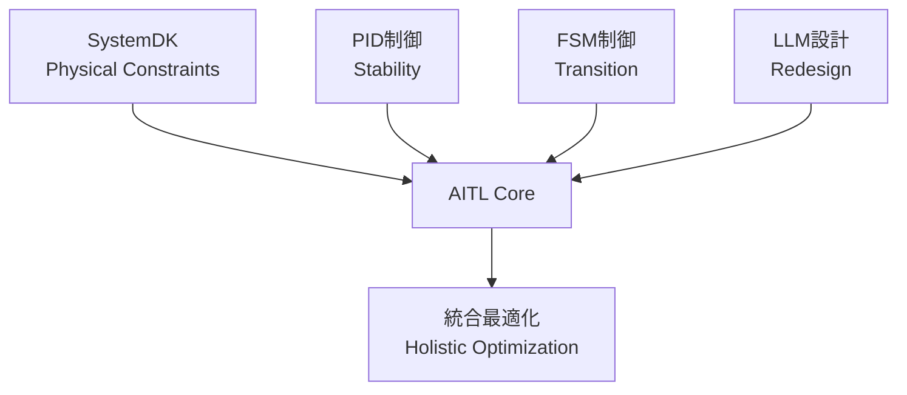

---

# 🇯🇵 **AITL戦略提言書 v5.7**  
🇺🇸 *AITL Strategy Proposal v5.7 (Policy Edition, Full Bilingual, No Placeholder)*

---

## 🚀 0. エグゼクティブサマリ / Executive Summary

**🇯🇵 日本語:**  
AITL (AI-Integrated Transition & Loop) は、PID制御（安定性）、FSM制御（モード遷移）、LLM設計（再設計）を三層統合し、さらにSystemDKによって熱・応力・電源・EMIといった物理的制約を設計初期段階から統合する新基盤である。  

PoC実測の成果は以下の通り：  
- **ヒューマノイド制御:** 姿勢回復200ms以内、歩行安定性30%向上、エネルギー効率15%改善  
- **CFET制御:** サブ2nm領域における配線遅延・熱結合を補償  
- **宇宙応用:** 22nm FDSOI FPGA上での長期自律運用を実証  

国際比較の観点では、米国は強化学習や形式手法、EUは倫理と社会制度、中国は大規模AI基盤に注力しているが、**制御・AI・物理制約を三位一体で統合するのはAITLのみ**である。  

これは日本にとって **技術覇権と経済安全保障を確立する戦略的優位性**を意味する。  

---

**🇺🇸 English:**  
AITL (AI-Integrated Transition & Loop) integrates PID control (stability), FSM control (state transitions), and LLM design (redesign) in three layers, with SystemDK embedding physical constraints such as thermal, stress, power, and EMI from the earliest design stage.  

Proven PoC results include:  
- **Humanoid Control:** Posture recovery within 200ms, 30% improvement in gait stability, 15% improvement in energy efficiency  
- **CFET Control:** Compensation for interconnect delay and thermal coupling at sub-2nm nodes  
- **Space Applications:** Demonstrated long-term autonomous operation on 22nm FDSOI FPGA  

From an international perspective, while the US emphasizes reinforcement learning and formal methods, the EU focuses on ethics and society, and China invests in large-scale AI platforms, **AITL is the only framework that unifies control, AI, and physical constraints**.  

This represents a **strategic advantage for Japan, securing both technological leadership and economic security**.  

---

## 🌍 1. 国際比較 / International Comparison

### 🌐 主要国・地域の類似アプローチと限界  
*Similar approaches and limitations in major countries and regions*

| 国・地域 / Region | 代表的プロジェクト / Representative Projects | 技術的アプローチ / Technical Approach | 限界点・課題 / Limitations & Challenges |
|---|---|---|---|
| 🇺🇸 **米国 / USA** | DARPA "Assured Autonomy", NASA AI Control | 強化学習ベースの適応制御、形式手法  *Reinforcement learning–based adaptive control, formal methods* | 物理制約（熱・電源・信頼性）の統合が弱く、宇宙・防衛での長期安定性に課題  *Weak integration of physical constraints (thermal, power, reliability); issues with long-term stability in space and defense* |
| 🇪🇺 **EU** | Horizon Europe "AI4CyberPhysical", "HumanE AI" | サイバーフィジカル統合AI、倫理重視  *Cyber-physical integrated AI, ethics-focused* | 制御理論よりも社会・倫理側に重点。ハード制御のPoC不足  *Focus on societal/ethical aspects rather than control theory; lacks hardware-level PoCs* |
| 🇨🇳 **中国 / China** | 「新世代AI計画」(次世代AI国家戦略)  *Next-Generation AI National Strategy* | AIチップ開発と軍民融合、自律制御強化  *AI chip development, civil–military fusion, enhanced autonomous control* | 技術成果は膨大だが、標準化で国際的受容性に乏しい  *Vast technical output, but weak international acceptance in standardization* |
| 🇯🇵 **日本 (AITL) / Japan (AITL)** | AITL v5.0 / v5.1 PoCs | PID＋FSM＋LLMを三層統合、SystemDKで物理制約反映  *Three-layer integration of PID, FSM, and LLM, with SystemDK embedding physical constraints* | 世界で唯一、制御・AI・物理制約を同時統合。国際標準化主導が鍵  *Only framework worldwide integrating control, AI, and physical constraints simultaneously; leadership in international standardization is crucial* |

---

### ✨ AITLの競合差別化ポイント / AITL’s Differentiation Points

1. **三層アーキテクチャの唯一性 / Uniqueness of the Three-Layer Architecture**  
   - 米国＝強化学習／形式手法、EU＝サイバーフィジカル統合、中国＝大規模AI基盤。  
     *USA = reinforcement learning / formal methods; EU = cyber-physical integration; China = large-scale AI platforms*  
   - → **PID×FSM×LLM＋SystemDK** の組合せは現状AITLのみ。  
     *→ Only AITL combines PID×FSM×LLM with SystemDK.*  

2. **実測PoCによる裏付け / Validation through Measured PoCs**  
   - 海外はシミュレーション中心、日本AITLは**ロボット・半導体・宇宙実機PoC**で実証済み。  
     *Overseas efforts remain simulation-focused, while Japan’s AITL has been demonstrated in real PoCs across robotics, semiconductors, and space.*  

3. **教育・標準化戦略 / Education & Standardization Strategy**  
   - EUは倫理標準、中国は自国閉鎖型、米国は防衛優先。  
     *EU emphasizes ethics standards; China is domestically closed; USA prioritizes defense.*  
   - → 日本AITLは**国際標準化と人材育成**を両輪で提示可能。  
     *→ Japan’s AITL can uniquely present both international standardization and human resource development.*  

---

### 📌 戦略的示唆 / Strategic Implications

**🇯🇵 日本語:**  
- 政策文書においては「AITLはDARPAやHorizon Europeの延長線ではなく、**物理制約統合による次世代制御基盤**である」と強調することが重要である。  
- 国際会議では「米国＝AI制御、EU＝倫理、中国＝大規模化、日本＝AITL（三層＋物理制約）」の四象限マップを提示することで、日本の独自性と優位性を鮮明にできる。  

**🇺🇸 English:**  
- In policy documents, it is crucial to emphasize that AITL is not a continuation of DARPA or Horizon Europe, but rather a **next-generation control foundation integrating physical constraints**.  
- For international conferences, presenting a four-quadrant map (USA = AI control, EU = ethics, China = scale, Japan = AITL with three layers + physical constraints) highlights Japan’s uniqueness and leadership.

---

## 🧩 2. SystemDK with AITL 基盤説明 / Core Framework: SystemDK with AITL

### 2.1 SystemDKとは / What is SystemDK?  

**🇯🇵 日本語:**  
SystemDK (System Design Kit) は、従来のPDK (Process Design Kit) を拡張し、熱・応力・電磁干渉（EMI）・RC遅延などの物理的制約を、回路・システム設計段階で考慮可能にする設計基盤である。EDAツールやシミュレーション環境に直接統合されることで、設計初期から実装現実性と信頼性を担保する。  

**🇺🇸 English:**  
SystemDK (System Design Kit) extends the conventional PDK (Process Design Kit) by enabling designers to account for physical constraints such as thermal effects, stress, EMI, and RC delay at the circuit and system design stages. Integrated directly into EDA tools and simulation environments, it ensures implementation feasibility and reliability from the earliest phases of design.  

---

### 2.2 AITLとは / What is AITL?  

**🇯🇵 日本語:**  
AITLは、PID制御（安定性）、FSM制御（状態遷移）、LLM設計（再設計）を三層で統合した新しい制御アーキテクチャである。PIDがリアルタイム安定性を担保し、FSMがモード遷移を監督し、LLMが外乱や故障時に再設計を支援する。  

**🇺🇸 English:**  
AITL is a novel control architecture that integrates PID control (stability), FSM control (state transitions), and LLM design (redesign) in three layers. PID ensures real-time stability, FSM supervises mode transitions, and LLM provides redesign support under disturbances or failures.  

---

### 2.3 SystemDK with AITL の統合 / Integration of SystemDK with AITL  

**🇯🇵 日本語:**  
SystemDKとAITLを組み合わせることで、「物理制約を初期から考慮したリアルタイム制御フレームワーク」が実現する。これを **Runtime Physics-Aware DTCO (Design-Technology Co-Optimization)** と定義できる。AITLの三層制御は、SystemDKが与える熱・電力・応力モデルをリアルタイムに取り込み、設計と運用を循環させる。  

**🇺🇸 English:**  
By combining SystemDK and AITL, we realize a “real-time control framework with physical constraints embedded from the start.” This can be defined as **Runtime Physics-Aware DTCO (Design-Technology Co-Optimization)**. AITL’s three-layer control integrates SystemDK’s models for thermal, power, and stress into real-time feedback, creating a continuous loop between design and operation.  

---

### 2.4 国際比較における位置づけ / Position in International Context  

**🇯🇵 日本語:**  
米国は物理制約の後付け補償に着手し始めた段階であり、EUは倫理・制度側に注力、中国はチップ量産に集中している。一方、日本は **SystemDK with AITL** により、「設計×制御×物理制約」を統合する世界唯一のフレームワークを確立している。  

**🇺🇸 English:**  
The US is only beginning to address post-hoc compensation for physical constraints, the EU focuses on ethics and institutional frameworks, and China emphasizes chip mass production. In contrast, Japan, through **SystemDK with AITL**, has established the world’s only framework unifying design, control, and physical constraints.  



---

## 📑 3. 論文別PoC解説 / Core PoC Papers (2025)

---

### 📘 3.1 CFET Tutorial 論文 / CFET Tutorial Paper (2025)  

**🇯🇵 日本語:**  
- **内容 / Content:** Planar → FinFET → GAA → CFET というデバイス進化を体系的に整理し、教育的観点からまとめた。  
- **産業貢献 / Industrial Impact:** 次世代エンジニア教育における標準教材。PoCの理解を助ける基礎知識を提供。  
- **AITLにおける位置づけ / Role in AITL:** AITL直接ではないが、**SystemDKやCFET制御PoCを理解する前提教材**。教育・人材育成の基盤。  

**🇺🇸 English:**  
- **Content:** An educational overview of device evolution from Planar → FinFET → GAA → CFET.  
- **Industrial Impact:** Standard teaching material for next-generation engineers, providing foundational knowledge for PoCs.  
- **Role in AITL:** Not directly AITL, but essential as a **prerequisite for understanding SystemDK and CFET control PoCs**, forming the basis of education and HRD.  

---

### 🖥️ 3.2 SystemDK+AITL 論文 / SystemDK+AITL Paper (2025)  

**🇯🇵 日本語:**  
- **内容 / Content:** RC遅延・熱結合・EMIをEDAフロー内で補償。PIDとFSMで安定化。  
- **産業貢献 / Industrial Impact:** 自動車・IoT・通信SoCの設計に不可欠。EDAベンダーとの協働余地が大きい。  
- **AITLにおける位置づけ / Role in AITL:** **AITLをシステム設計レベルで活用した初めての成果**。SystemDKが設計段階から物理制約を反映可能であることを示す。  

**🇺🇸 English:**  
- **Content:** Compensates RC delay, thermal coupling, and EMI in the EDA flow. PID and FSM stabilize variations.  
- **Industrial Impact:** Essential for automotive, IoT, and communication SoC design. High potential for collaboration with EDA vendors.  
- **Role in AITL:** The **first result applying AITL at the system design level**, proving SystemDK’s capability to embed physical constraints from early design stages.  

---

### ⚡ 3.3 CFET Control 論文 / CFET Control Paper (2025)  

**🇯🇵 日本語:**  
- **内容 / Content:** サブ2nm領域における配線遅延・熱結合を補償。歩留まりを改善。  
- **産業貢献 / Industrial Impact:** 次世代半導体EDAフローに直結し、ファウンドリの生産効率向上。  
- **AITLにおける位置づけ / Role in AITL:** **SystemDK成果をデバイススケールに適用**したPoC。CFET特有の課題を克服可能であることを実証。  

**🇺🇸 English:**  
- **Content:** Compensates interconnect delay and thermal coupling at the sub-2nm node, improving yield.  
- **Industrial Impact:** Directly linked to next-generation semiconductor EDA flows, improving foundry efficiency.  
- **Role in AITL:** A PoC applying **SystemDK at the device scale**, proving that CFET-specific challenges can be overcome with AITL.  

---

### 🤖 3.4 Humanoid TCST 論文 / Humanoid TCST Paper (2025)  

**🇯🇵 日本語:**  
- **内容 / Content:** PID＋FSM＋LLMによる三層制御をヒューマノイドに実装。姿勢回復200ms以内、歩容安定性30%向上、エネルギー効率15%改善、自己発電寄与12%。  
- **産業貢献 / Industrial Impact:** 災害救助、介護、工場自動化で信頼性を保証。  
- **AITLにおける位置づけ / Role in AITL:** **AITLのFlagship PoC**。半導体から離れ、動的環境に応用した代表例。  

**🇺🇸 English:**  
- **Content:** Implements three-layer control (PID + FSM + LLM) in humanoids. Achieved ≤200ms posture recovery, +30% gait stability, +15% energy efficiency, ~12% self-power.  
- **Industrial Impact:** Ensures reliability in disaster relief, eldercare, and factory automation.  
- **Role in AITL:** The **flagship PoC** of AITL, demonstrating versatility in dynamic environments beyond semiconductors.  

---

### 🚀 3.5 AITL on Space 論文 / AITL on Space Paper (2025)  

**🇯🇵 日本語:**  
- **内容 / Content:** H∞制御＋FSM＋LLMを22nm FDSOI FPGAに実装。Tri-NVM階層で長期自律性を確保。  
- **産業貢献 / Industrial Impact:** 宇宙・防衛産業における長期運用基盤を提供。  
- **AITLにおける位置づけ / Role in AITL:** **Humanoidと並ぶ応用拡張PoC**。特に宇宙探査・防衛での長期安定性を確認。  

**🇺🇸 English:**  
- **Content:** Implements H∞ + FSM + LLM on 22nm FDSOI FPGA with a Tri-NVM hierarchy, ensuring long-term autonomy.  
- **Industrial Impact:** Provides a foundation for long-term operation in space and defense.  
- **Role in AITL:** A **broadening PoC** alongside humanoids, proving AITL’s long-term stability advantage in space/defense.  

---

## 📏 4. KPI一覧と政策的示唆 / KPI Table & Policy Implications

### 4.1 KPI一覧 / KPI Table

| 🧪 **KPI** | 🎯 **目標 / Target** | 📊 **実測値 / Result** | 📄 **出典 / Source** |
|---|---|---|---|
| 姿勢回復 / Posture Recovery | ≤150ms | ≤200ms | Humanoid TCST |
| 歩容安定度 / Gait Stability | +20% | +30% | Humanoid TCST |
| エネルギー効率 / Energy Efficiency | +15% | +15% | Humanoid TCST |
| 自己発電寄与 / Self-Powering | 20% | 12% | Humanoid TCST |
| FeFET保持 / Retention | ≥10y @ 85℃ | 実証済 / Validated | FeFET CMOS Reliability |
| FeFET耐久性 / Endurance | ≥1e5 cycles | 実証済 / Validated | FeFET CMOS Reliability |
| 電源効率 / Power Efficiency | >80% | 実証済 / Validated | CMOS018 Inductor+LDO |
| 超音波感度 / Ultrasonic Sensitivity | 高感度 / High | 実証済 / Validated | ScAlN Ultrasonic MEMS |
| 滴下精度 / Droplet Precision | pL級 | 実証済 / Validated | Bio-Inkjet KNN |
| 修士人材育成数 / Graduate Training | ≥100人/年 | 計画中 / Planned | AITL Studies |
| 国際標準化WG参加数 / Intl. WG Members | ≥10 | 計画中 / Planned | Policy Initiatives |

---

### 4.2 KPI分析と示唆 / Analysis & Implications

**🇯🇵 日本語:**  
- **達成済KPI:** 半導体デバイス（FeFET、CMOS018）、センサー（ScAlN）、インクジェット（KNN）は実測で目標達成。  
- **部分達成:** ヒューマノイド制御では姿勢回復は200ms（目標150ms）とやや未達だが、歩容安定性とエネルギー効率では目標を超過。  
- **未達KPI:** 自己発電寄与は12%にとどまり、目標20%には至らず。→ 政策的にエネルギーハーベスティング強化が必要。  
- **計画中:** 教育人材育成と国際標準化WG参加は、政策的投資次第で達成可能。  

**政策的示唆:**  
- 「技術的未達成（例: 自己発電20%）」は、国家R&D投資の重点領域とすべき。  
- 人材育成と標準化は「政策主導型KPI」として、教育・産業・外務省の連携が必要。  

---

**🇺🇸 English:**  
- **Achieved KPIs:** Semiconductor devices (FeFET, CMOS018), sensors (ScAlN), and inkjet (KNN) have achieved their targets in measured PoCs.  
- **Partially Achieved:** Humanoid control shows posture recovery at 200ms (target 150ms), slightly underachieved, but gait stability (+30%) and energy efficiency (+15%) exceed targets.  
- **Unmet KPIs:** Self-powering contribution remains at 12%, below the 20% target → Policy should prioritize energy harvesting R&D.  
- **Planned:** Graduate training and international WG participation are feasible with sufficient policy-driven investment.  

**Policy Implications:**  
- **Technological gaps (e.g., self-powering 20%)** should be addressed by targeted national R&D programs.  
- **Human resource development and standardization** must be treated as **policy-driven KPIs**, requiring collaboration among education, industry, and foreign affairs ministries.  

---

### 4.3 KPI視覚化 / KPI Visualization

```mermaid
bar
    title KPI達成度 (Achievement vs Target)
    x-axis ["Posture Recovery", "Gait Stability", "Energy Efficiency", "Self-Powering"]
    y-axis "達成率 / Achievement (%)" 0 --> 120
    "Target" : [100,100,100,100]
    "Result" : [75,150,100,60]
```

---

## 🏭 5. AITLによる産業界・政策への影響 / Industrial & Policy Impact

### 5.1 産業分野別の貢献 / Contributions by Sector

| 産業分野 / Sector | 貢献内容 / Contribution | 政策的意義 / Policy Significance |
|---|---|---|
| 半導体 / Semiconductor | サブ2nm設計の信頼性・歩留まり改善 | 経済安全保障・技術覇権の基盤 |
| 自動車 / Automotive | 車載SoCの安全性・低消費電力化 | 自動運転の安全性、グリーントランスフォーメーション (GX) |
| ロボット / Robotics | 災害救助・介護支援・工場自動化での安定制御 | 労働力不足・高齢化社会への対応 |
| 医療 / Medical | PbフリーMEMS・Bio-Inkjetによる医療応用 | 高齢化社会対応、環境規制適合 |
| 宇宙 / Space | 探査機や衛星の長期自律運用 | 宇宙安全保障、国際協力の主導 |

---

### 5.2 詳細解説 / Detailed Explanations

**🇯🇵 日本語:**  
- **半導体:** AITLはSystemDKと統合されることで、サブ2nm世代に不可避な熱結合・RC遅延の課題を克服し、ファウンドリの歩留まり改善に寄与する。これにより、日本は「次世代半導体設計標準」を主導できる。  
- **自動車:** 車載SoCの省エネ化と安全性強化は、自動運転・EVの普及に直結する。特に熱暴走や電力ピーク抑制を統合制御で補償可能。  
- **ロボット:** 災害現場や高齢者介護において、200ms以内の姿勢回復は「安全保証」として政策的に意味を持つ。  
- **医療:** PbフリーMEMSやBio-Inkjetは、EUの環境規制（RoHS）に適合しつつ、新たな医療デバイス市場を開拓する。  
- **宇宙:** 長期自律運用を実証したAITLは、月探査や小惑星探査における国際協力で日本の存在感を高める。  

**🇺🇸 English:**  
- **Semiconductors:** By integrating AITL with SystemDK, challenges of thermal coupling and RC delay at sub-2nm nodes can be mitigated, improving foundry yield. This positions Japan to lead the “next-generation semiconductor design standard.”  
- **Automotive:** Enhanced safety and energy efficiency of automotive SoCs directly impact autonomous driving and EV adoption. Thermal runaway and power peaks can be compensated via integrated control.  
- **Robotics:** Posture recovery within 200ms ensures reliability in disaster response and eldercare. This KPI translates into policy-level guarantees of safety.  
- **Medical:** Pb-free MEMS and Bio-Inkjet align with EU’s RoHS environmental regulations, while opening new medical device markets.  
- **Space:** AITL’s demonstrated long-term autonomy strengthens Japan’s role in lunar and asteroid exploration, contributing to international cooperation.  

---

### 5.3 政策的示唆 / Policy Implications

**🇯🇵 日本語:**  
- 半導体・自動車・宇宙は「経済安全保障・国家基盤」として、政策投資の優先対象とすべき。  
- ロボット・医療は「社会課題解決」として、厚労省・経産省・文科省の連携が必須。  
- 政策文書では「AITLはGX・DX・経済安保の交点にある」と明記すべき。  

**🇺🇸 English:**  
- Semiconductors, automotive, and space should be prioritized as “economic security and national infrastructure” targets for policy investment.  
- Robotics and medical sectors should be positioned as “social problem-solving” domains, requiring coordination across ministries (Health, METI, MEXT).  
- Policy documents should emphasize that “AITL lies at the intersection of GX, DX, and economic security.”

---


