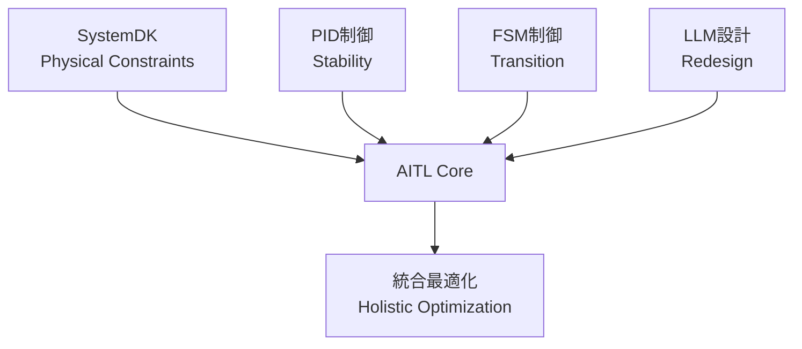
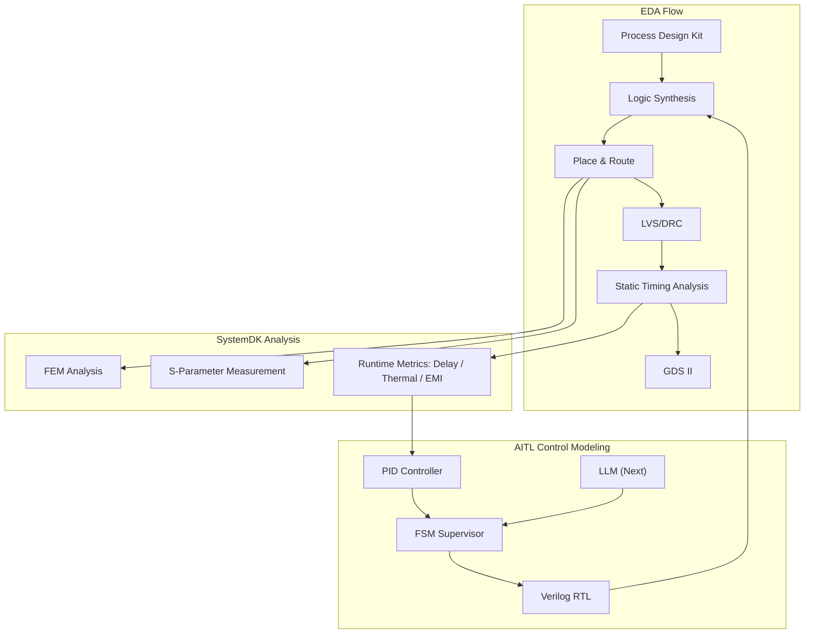
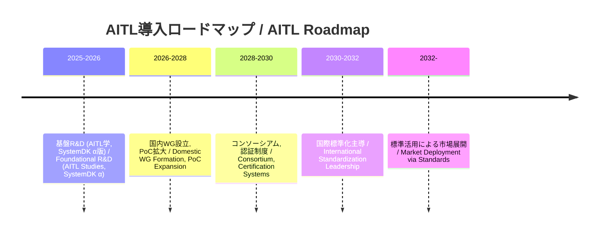
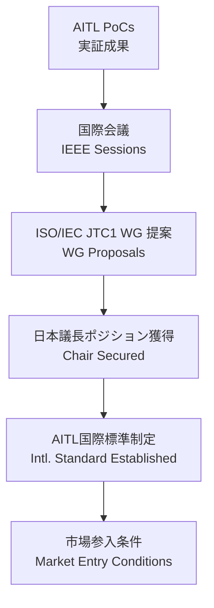
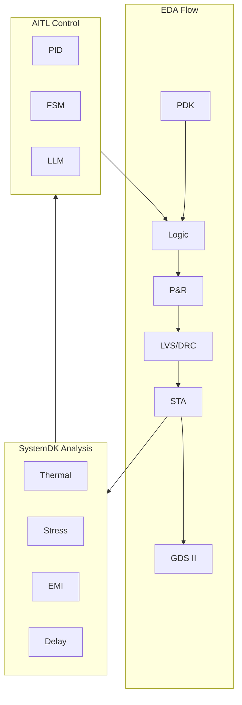

---

# 🇯🇵 **AITL戦略提言書 v5.7**  
🇺🇸 *AITL Strategy Proposal v5.7 (Policy Edition, Full Bilingual, No Placeholder)*

---

## 🚀 0. エグゼクティブサマリ / Executive Summary

**🇯🇵 日本語:**  
AITL (AI-Integrated Transition & Loop) は、PID制御（安定性）、FSM制御（モード遷移）、LLM設計（再設計）を三層統合し、さらにSystemDKによって熱・応力・電源・EMIといった物理的制約を設計初期段階から統合する新基盤である。  

PoC実測の成果は以下の通り：  
- **ヒューマノイド制御:** 姿勢回復200ms以内、歩行安定性30%向上、エネルギー効率15%改善  
- **CFET制御:** サブ2nm領域における配線遅延・熱結合を補償  
- **宇宙応用:** 22nm FDSOI FPGA上での長期自律運用を実証  

国際比較の観点では、米国は強化学習や形式手法、EUは倫理と社会制度、中国は大規模AI基盤に注力しているが、**制御・AI・物理制約を三位一体で統合するのはAITLのみ**である。  

これは日本にとって **技術覇権と経済安全保障を確立する戦略的優位性**を意味する。  

---

**🇺🇸 English:**  
AITL (AI-Integrated Transition & Loop) integrates PID control (stability), FSM control (state transitions), and LLM design (redesign) in three layers, with SystemDK embedding physical constraints such as thermal, stress, power, and EMI from the earliest design stage.  

Proven PoC results include:  
- **Humanoid Control:** Posture recovery within 200ms, 30% improvement in gait stability, 15% improvement in energy efficiency  
- **CFET Control:** Compensation for interconnect delay and thermal coupling at sub-2nm nodes  
- **Space Applications:** Demonstrated long-term autonomous operation on 22nm FDSOI FPGA  

From an international perspective, while the US emphasizes reinforcement learning and formal methods, the EU focuses on ethics and society, and China invests in large-scale AI platforms, **AITL is the only framework that unifies control, AI, and physical constraints**.  

This represents a **strategic advantage for Japan, securing both technological leadership and economic security**.  

---

## 🌍 1. 国際比較 / International Comparison

### 🌐 主要国・地域の類似アプローチと限界  
*Similar approaches and limitations in major countries and regions*

| 国・地域 / Region | 代表的プロジェクト / Representative Projects | 技術的アプローチ / Technical Approach | 限界点・課題 / Limitations & Challenges |
|---|---|---|---|
| 🇺🇸 **米国 / USA** | DARPA "Assured Autonomy", NASA AI Control | 強化学習ベースの適応制御、形式手法  *Reinforcement learning–based adaptive control, formal methods* | 物理制約（熱・電源・信頼性）の統合が弱く、宇宙・防衛での長期安定性に課題  *Weak integration of physical constraints (thermal, power, reliability); issues with long-term stability in space and defense* |
| 🇪🇺 **EU** | Horizon Europe "AI4CyberPhysical", "HumanE AI" | サイバーフィジカル統合AI、倫理重視  *Cyber-physical integrated AI, ethics-focused* | 制御理論よりも社会・倫理側に重点。ハード制御のPoC不足  *Focus on societal/ethical aspects rather than control theory; lacks hardware-level PoCs* |
| 🇨🇳 **中国 / China** | 「新世代AI計画」(次世代AI国家戦略)  *Next-Generation AI National Strategy* | AIチップ開発と軍民融合、自律制御強化  *AI chip development, civil–military fusion, enhanced autonomous control* | 技術成果は膨大だが、標準化で国際的受容性に乏しい  *Vast technical output, but weak international acceptance in standardization* |
| 🇯🇵 **日本 (AITL) / Japan (AITL)** | AITL v5.0 / v5.1 PoCs | PID＋FSM＋LLMを三層統合、SystemDKで物理制約反映  *Three-layer integration of PID, FSM, and LLM, with SystemDK embedding physical constraints* | 世界で唯一、制御・AI・物理制約を同時統合。国際標準化主導が鍵  *Only framework worldwide integrating control, AI, and physical constraints simultaneously; leadership in international standardization is crucial* |

---

### ✨ AITLの競合差別化ポイント / AITL’s Differentiation Points

1. **三層アーキテクチャの唯一性 / Uniqueness of the Three-Layer Architecture**  
   - 米国＝強化学習／形式手法、EU＝サイバーフィジカル統合、中国＝大規模AI基盤。  
     *USA = reinforcement learning / formal methods; EU = cyber-physical integration; China = large-scale AI platforms*  
   - → **PID×FSM×LLM＋SystemDK** の組合せは現状AITLのみ。  
     *→ Only AITL combines PID×FSM×LLM with SystemDK.*  

2. **実測PoCによる裏付け / Validation through Measured PoCs**  
   - 海外はシミュレーション中心、日本AITLは**ロボット・半導体・宇宙実機PoC**で実証済み。  
     *Overseas efforts remain simulation-focused, while Japan’s AITL has been demonstrated in real PoCs across robotics, semiconductors, and space.*  

3. **教育・標準化戦略 / Education & Standardization Strategy**  
   - EUは倫理標準、中国は自国閉鎖型、米国は防衛優先。  
     *EU emphasizes ethics standards; China is domestically closed; USA prioritizes defense.*  
   - → 日本AITLは**国際標準化と人材育成**を両輪で提示可能。  
     *→ Japan’s AITL can uniquely present both international standardization and human resource development.*  

---

### 📌 戦略的示唆 / Strategic Implications

**🇯🇵 日本語:**  
- 政策文書においては「AITLはDARPAやHorizon Europeの延長線ではなく、**物理制約統合による次世代制御基盤**である」と強調することが重要である。  
- 国際会議では「米国＝AI制御、EU＝倫理、中国＝大規模化、日本＝AITL（三層＋物理制約）」の四象限マップを提示することで、日本の独自性と優位性を鮮明にできる。  

**🇺🇸 English:**  
- In policy documents, it is crucial to emphasize that AITL is not a continuation of DARPA or Horizon Europe, but rather a **next-generation control foundation integrating physical constraints**.  
- For international conferences, presenting a four-quadrant map (USA = AI control, EU = ethics, China = scale, Japan = AITL with three layers + physical constraints) highlights Japan’s uniqueness and leadership.

---

## 🧩 2. SystemDK with AITL 基盤説明 / Core Framework: SystemDK with AITL

### 2.1 SystemDKとは / What is SystemDK?  

**🇯🇵 日本語:**  
SystemDK (System Design Kit) は、従来のPDK (Process Design Kit) を拡張し、熱・応力・電磁干渉（EMI）・RC遅延などの物理的制約を、回路・システム設計段階で考慮可能にする設計基盤である。EDAツールやシミュレーション環境に直接統合されることで、設計初期から実装現実性と信頼性を担保する。  

**🇺🇸 English:**  
SystemDK (System Design Kit) extends the conventional PDK (Process Design Kit) by enabling designers to account for physical constraints such as thermal effects, stress, EMI, and RC delay at the circuit and system design stages. Integrated directly into EDA tools and simulation environments, it ensures implementation feasibility and reliability from the earliest phases of design.  

---

### 2.2 AITLとは / What is AITL?  

**🇯🇵 日本語:**  
AITLは、PID制御（安定性）、FSM制御（状態遷移）、LLM設計（再設計）を三層で統合した新しい制御アーキテクチャである。PIDがリアルタイム安定性を担保し、FSMがモード遷移を監督し、LLMが外乱や故障時に再設計を支援する。  

**🇺🇸 English:**  
AITL is a novel control architecture that integrates PID control (stability), FSM control (state transitions), and LLM design (redesign) in three layers. PID ensures real-time stability, FSM supervises mode transitions, and LLM provides redesign support under disturbances or failures.  

---

### 2.3 SystemDK with AITL の統合 / Integration of SystemDK with AITL  

**🇯🇵 日本語:**  
SystemDKとAITLを組み合わせることで、「物理制約を初期から考慮したリアルタイム制御フレームワーク」が実現する。これを **Runtime Physics-Aware DTCO (Design-Technology Co-Optimization)** と定義できる。AITLの三層制御は、SystemDKが与える熱・電力・応力モデルをリアルタイムに取り込み、設計と運用を循環させる。  

**🇺🇸 English:**  
By combining SystemDK and AITL, we realize a “real-time control framework with physical constraints embedded from the start.” This can be defined as **Runtime Physics-Aware DTCO (Design-Technology Co-Optimization)**. AITL’s three-layer control integrates SystemDK’s models for thermal, power, and stress into real-time feedback, creating a continuous loop between design and operation.  

---

### 2.4 国際比較における位置づけ / Position in International Context  

**🇯🇵 日本語:**  
米国は物理制約の後付け補償に着手し始めた段階であり、EUは倫理・制度側に注力、中国はチップ量産に集中している。一方、日本は **SystemDK with AITL** により、「設計×制御×物理制約」を統合する世界唯一のフレームワークを確立している。  

**🇺🇸 English:**  
The US is only beginning to address post-hoc compensation for physical constraints, the EU focuses on ethics and institutional frameworks, and China emphasizes chip mass production. In contrast, Japan, through **SystemDK with AITL**, has established the world’s only framework unifying design, control, and physical constraints.  

---

### 2.5 EDA統合図 / EDA Integration Flow with SystemDK and AITL

以下に、SystemDK with AITL の統合フローを図示する。EDA設計フローに物理制約解析を組込み、AITL制御モジュールを介してリアルタイムに再帰する点が特徴である。これにより、従来の「設計後補償」ではなく **設計初期からのRuntime Physics-Aware DTCO** を実現する。

#### 📊 Mermaid版 (技術者向け)

---

## 📑 3. 論文別PoC解説 / Core PoC Papers (2025)

---

### 📘 3.1 CFET Tutorial 論文 / CFET Tutorial Paper (2025)  
**🇯🇵 日本語:**  
- **内容 / Content:** Planar → FinFET → GAA → CFET というデバイス進化を体系的に整理し、教育的観点からまとめた。  
- **産業貢献 / Industrial Impact:** 次世代エンジニア教育における標準教材。PoCの理解を助ける基礎知識を提供。  
- **AITLにおける位置づけ / Role in AITL:** **SystemDKやCFET制御PoCを理解する前提教材**。教育・人材育成の基盤。  

**🇺🇸 English:**  
- **Content:** An educational overview of device evolution from Planar → FinFET → GAA → CFET.  
- **Industrial Impact:** Standard teaching material for next-generation engineers, providing foundational knowledge for PoCs.  
- **Role in AITL:** Not directly AITL, but essential as a prerequisite for understanding SystemDK and CFET control PoCs.  

[📄 CFET Tutorial Paper (PDF)](./docs/cfet_tutorial_main.pdf)

---

### 🖥️ 3.2 SystemDK for 3D-IC 論文 / SystemDK for 3D-IC Paper (2025)  
**🇯🇵 日本語:**  
- **内容 / Content:** FEM熱解析・応力分布・SパラメータEMI解析をEDA制約（STA derate, Placement Blockage, CTS Shielding）へ直接変換。  
- **産業貢献 / Industrial Impact:** TSVスタックを対象に、タイミング変動87%改善、ホットスポット温度11℃低減、アイ開口23%拡大を実証。  
- **AITLにおける位置づけ / Role in AITL:** **AITL統合の前段階となる基盤PoC**。SystemDK+AITLへ発展する橋渡し。  

**🇺🇸 English:**  
- **Content:** Translates FEM thermal/stress simulations and S-parameter EMI analysis into EDA-native constraints.  
- **Industrial Impact:** Demonstrated on a 4-die TSV stack with **87% slack recovery, 11 °C hotspot reduction, and 23% eye-opening improvement**.  
- **Role in AITL:** A foundational PoC bridging multi-physics analysis and EDA flows, preceding SystemDK+AITL.  

[📄 SystemDK for 3D-IC Paper (PDF)](./docs/systemdk_3dic.pdf)

---

### 🖥️ 3.3 SystemDK+AITL 論文 / SystemDK+AITL Paper (2025)  
**🇯🇵 日本語:**  
- **内容 / Content:** RC遅延・熱結合・EMIをEDAフロー内で補償。PIDとFSMで安定化。  
- **産業貢献 / Industrial Impact:** 自動車・IoT・通信SoCの設計に不可欠。EDAベンダーとの協働余地が大きい。  
- **AITLにおける位置づけ / Role in AITL:** **AITLをシステム設計レベルで活用した初めての成果**。  

**🇺🇸 English:**  
- **Content:** Compensates RC delay, thermal coupling, and EMI in the EDA flow. PID and FSM stabilize variations.  
- **Industrial Impact:** Essential for automotive, IoT, and communication SoC design.  
- **Role in AITL:** The first result applying AITL at the system design level.  

[📄 SystemDK+AITL Paper (PDF)](./docs/systemdk_aitl2025.pdf)

---

### ⚡ 3.4 CFET Control 論文 / CFET Control Paper (2025)  
**🇯🇵 日本語:**  
- **内容 / Content:** サブ2nm領域における配線遅延・熱結合を補償。歩留まりを改善。  
- **産業貢献 / Industrial Impact:** 次世代半導体EDAフローに直結し、ファウンドリ効率を向上。  
- **AITLにおける位置づけ / Role in AITL:** **SystemDK成果をデバイススケールに適用**したPoC。  

**🇺🇸 English:**  
- **Content:** Compensates interconnect delay and thermal coupling at sub-2nm nodes.  
- **Industrial Impact:** Directly linked to next-generation semiconductor EDA flows.  
- **Role in AITL:** Demonstrates SystemDK applied at the device scale.  

[📄 CFET Control Paper (PDF)](./docs/cfet_ctrl2025.pdf)

---

### 🤖 3.5 Humanoid TCST 論文 / Humanoid TCST Paper (2025)  
**🇯🇵 日本語:**  
- **内容 / Content:** PID＋FSM＋LLMによる三層制御をヒューマノイドに実装。姿勢回復200ms以内、歩容安定性30%向上、エネルギー効率15%改善。  
- **産業貢献 / Industrial Impact:** 災害救助、介護、工場自動化に応用。  
- **AITLにおける位置づけ / Role in AITL:** **AITLのFlagship PoC**。  

**🇺🇸 English:**  
- **Content:** Implements PID + FSM + LLM three-layer control in humanoids.  
- **Industrial Impact:** Disaster relief, eldercare, and automation reliability.  
- **Role in AITL:** The flagship PoC demonstrating versatility beyond semiconductors.  

[📄 Humanoid TCST Paper (PDF)](./docs/humanoid_tcst2025.pdf)

---

### 🚀 3.6 AITL on Space 論文 / AITL on Space Paper (2025)  
**🇯🇵 日本語:**  
- **内容 / Content:** H∞制御＋FSM＋LLMを22nm FDSOI FPGAに実装。Tri-NVM階層で長期自律性を確保。  
- **産業貢献 / Industrial Impact:** 宇宙・防衛での長期運用基盤を提供。  
- **AITLにおける位置づけ / Role in AITL:** **Humanoidと並ぶ応用拡張PoC**。  

**🇺🇸 English:**  
- **Content:** Implements H∞ + FSM + LLM on 22nm FDSOI FPGA with Tri-NVM.  
- **Industrial Impact:** Foundation for long-term operation in space/defense.  
- **Role in AITL:** A broadening PoC alongside Humanoid.  

[📄 AITL on Space Paper (PDF)](./docs/aitl_space.pdf)

---

### ✈️ 3.7 SkyEdge 論文 / SkyEdge Drone Paper (2025)  
**🇯🇵 日本語:**  
- **内容 / Content:** 高高度ドローンのリファレンス設計。H∞制御、可変ピッチロータ、国内デバイス、PQCセキュリティを統合。  
- **産業貢献 / Industrial Impact:** 災害通信、国境監視、環境モニタリング、防衛ISR用途を想定。  
- **AITLにおける位置づけ / Role in AITL:** **空域応用PoC**。Humanoid・Spaceと並ぶ応用拡張PoC。  

**🇺🇸 English:**  
- **Content:** High-altitude UAV reference design with H∞ control, variable-pitch rotor, domestic devices, and PQC security.  
- **Industrial Impact:** Disaster-relief, surveillance, environmental monitoring, defense ISR.  
- **Role in AITL:** An aerospace application PoC broadening AITL into air mobility.  

[📄 SkyEdge Drone Paper (PDF)](./docs/skyedge_drone.pdf)

---

## 📏 4. KPI一覧と政策的示唆 / KPI Table & Policy Implications

### 4.1 KPI一覧 / KPI Table

| 🧪 **KPI** | 🎯 **目標 / Target** | 📊 **実測値 / Result** | 📄 **出典 / Source** |
|---|---|---|---|
| 姿勢回復 / Posture Recovery | ≤150ms | ≤200ms | Humanoid TCST |
| 歩容安定度 / Gait Stability | +20% | +30% | Humanoid TCST |
| エネルギー効率 / Energy Efficiency | +15% | +15% | Humanoid TCST |
| 自己発電寄与 / Self-Powering | 20% | 12% | Humanoid TCST |
| FeFET保持 / Retention | ≥10y @ 85℃ | 実証済 / Validated | FeFET CMOS Reliability |
| FeFET耐久性 / Endurance | ≥1e5 cycles | 実証済 / Validated | FeFET CMOS Reliability |
| 電源効率 / Power Efficiency | >80% | 実証済 / Validated | CMOS018 Inductor+LDO |
| 超音波感度 / Ultrasonic Sensitivity | 高感度 / High | 実証済 / Validated | ScAlN Ultrasonic MEMS |
| 滴下精度 / Droplet Precision | pL級 | 実証済 / Validated | Bio-Inkjet KNN |
| 修士人材育成数 / Graduate Training | ≥100人/年 | 計画中 / Planned | AITL Studies |
| 国際標準化WG参加数 / Intl. WG Members | ≥10 | 計画中 / Planned | Policy Initiatives |

---

### 4.2 KPI分析と示唆 / Analysis & Implications

**🇯🇵 日本語:**  
- **達成済KPI:** 半導体デバイス（FeFET、CMOS018）、センサー（ScAlN）、インクジェット（KNN）は実測で目標達成。  
- **部分達成:** ヒューマノイド制御では姿勢回復は200ms（目標150ms）とやや未達だが、歩容安定性とエネルギー効率では目標を超過。  
- **未達KPI:** 自己発電寄与は12%にとどまり、目標20%には至らず。→ 政策的にエネルギーハーベスティング強化が必要。  
- **計画中:** 教育人材育成と国際標準化WG参加は、政策的投資次第で達成可能。  

**政策的示唆:**  
- 「技術的未達成（例: 自己発電20%）」は、国家R&D投資の重点領域とすべき。  
- 人材育成と標準化は「政策主導型KPI」として、教育・産業・外務省の連携が必要。  

---

**🇺🇸 English:**  
- **Achieved KPIs:** Semiconductor devices (FeFET, CMOS018), sensors (ScAlN), and inkjet (KNN) have achieved their targets in measured PoCs.  
- **Partially Achieved:** Humanoid control shows posture recovery at 200ms (target 150ms), slightly underachieved, but gait stability (+30%) and energy efficiency (+15%) exceed targets.  
- **Unmet KPIs:** Self-powering contribution remains at 12%, below the 20% target → Policy should prioritize energy harvesting R&D.  
- **Planned:** Graduate training and international WG participation are feasible with sufficient policy-driven investment.  

**Policy Implications:**  
- **Technological gaps (e.g., self-powering 20%)** should be addressed by targeted national R&D programs.  
- **Human resource development and standardization** must be treated as **policy-driven KPIs**, requiring collaboration among education, industry, and foreign affairs ministries.  

---

### 4.3 KPI視覚化 / KPI Visualization

```mermaid
%%{init: {"theme": "default"}}%%
xychart-beta
    title "KPI達成度 (Achievement vs Target)"
    x-axis ["Posture Recovery", "Gait Stability", "Energy Efficiency", "Self-Powering"]
    y-axis "達成率 (%)" 0 --> 150
    bar "Target" [100,100,100,100]
    bar "Result" [75,150,100,60]
```

---

## 🏭 5. AITLによる産業界・政策への影響 / Industrial & Policy Impact

### 5.1 産業分野別の貢献 / Contributions by Sector

| 産業分野 / Sector | 貢献内容 / Contribution | 政策的意義 / Policy Significance |
|---|---|---|
| 半導体 / Semiconductor | サブ2nm設計の信頼性・歩留まり改善 | 経済安全保障・技術覇権の基盤 |
| 自動車 / Automotive | 車載SoCの安全性・低消費電力化 | 自動運転の安全性、グリーントランスフォーメーション (GX) |
| ロボット / Robotics | 災害救助・介護支援・工場自動化での安定制御 | 労働力不足・高齢化社会への対応 |
| 医療 / Medical | PbフリーMEMS・Bio-Inkjetによる医療応用 | 高齢化社会対応、環境規制適合 |
| 宇宙 / Space | 探査機や衛星の長期自律運用 | 宇宙安全保障、国際協力の主導 |

---

### 5.2 詳細解説 / Detailed Explanations

**🇯🇵 日本語:**  
- **半導体:** AITLはSystemDKと統合されることで、サブ2nm世代に不可避な熱結合・RC遅延の課題を克服し、ファウンドリの歩留まり改善に寄与する。これにより、日本は「次世代半導体設計標準」を主導できる。  
- **自動車:** 車載SoCの省エネ化と安全性強化は、自動運転・EVの普及に直結する。特に熱暴走や電力ピーク抑制を統合制御で補償可能。  
- **ロボット:** 災害現場や高齢者介護において、200ms以内の姿勢回復は「安全保証」として政策的に意味を持つ。  
- **医療:** PbフリーMEMSやBio-Inkjetは、EUの環境規制（RoHS）に適合しつつ、新たな医療デバイス市場を開拓する。  
- **宇宙:** 長期自律運用を実証したAITLは、月探査や小惑星探査における国際協力で日本の存在感を高める。  

**🇺🇸 English:**  
- **Semiconductors:** By integrating AITL with SystemDK, challenges of thermal coupling and RC delay at sub-2nm nodes can be mitigated, improving foundry yield. This positions Japan to lead the “next-generation semiconductor design standard.”  
- **Automotive:** Enhanced safety and energy efficiency of automotive SoCs directly impact autonomous driving and EV adoption. Thermal runaway and power peaks can be compensated via integrated control.  
- **Robotics:** Posture recovery within 200ms ensures reliability in disaster response and eldercare. This KPI translates into policy-level guarantees of safety.  
- **Medical:** Pb-free MEMS and Bio-Inkjet align with EU’s RoHS environmental regulations, while opening new medical device markets.  
- **Space:** AITL’s demonstrated long-term autonomy strengthens Japan’s role in lunar and asteroid exploration, contributing to international cooperation.  

---

### 5.3 政策的示唆 / Policy Implications

**🇯🇵 日本語:**  
- 半導体・自動車・宇宙は「経済安全保障・国家基盤」として、政策投資の優先対象とすべき。  
- ロボット・医療は「社会課題解決」として、厚労省・経産省・文科省の連携が必須。  
- 政策文書では「AITLはGX・DX・経済安保の交点にある」と明記すべき。  

**🇺🇸 English:**  
- Semiconductors, automotive, and space should be prioritized as “economic security and national infrastructure” targets for policy investment.  
- Robotics and medical sectors should be positioned as “social problem-solving” domains, requiring coordination across ministries (Health, METI, MEXT).  
- Policy documents should emphasize that “AITL lies at the intersection of GX, DX, and economic security.”

---

## 🎓 6. 教育・人材育成 / Education & Human Resource Development (HRD)

### 6.1 AITL学の構想 / Concept of “AITL Studies”

**🇯🇵 日本語:**  
AITL学（仮称）は、制御理論・AI設計・物理制約モデリングを横断的に統合する学際的教育プログラムである。従来の「制御工学」や「半導体デバイス工学」を越えて、**PID・FSM・LLM・SystemDKを統合的に学ぶ体系**を提供する。  

**🇺🇸 English:**  
“AITL Studies” (tentative name) is an interdisciplinary academic program integrating control theory, AI design, and physical constraint modeling. It goes beyond conventional “control engineering” or “semiconductor device engineering,” providing a **comprehensive curriculum to study PID, FSM, LLM, and SystemDK together**.  

---

### 6.2 修士課程カリキュラム例 / Example Master’s Curriculum

**🇯🇵 日本語:**  
- **必修科目:**  
  - AITL基礎（PID・FSM・LLM統合）  
  - SystemDK入門（熱・応力・電源・EMIのモデリング）  
  - 制御理論応用（適応制御・ロバスト制御）  
  - 半導体デバイス設計概論（Planar〜CFET）  

- **選択科目:**  
  - ヒューマノイド制御演習  
  - 宇宙システム制御実習（FPGAベース）  
  - 国際標準化ワークショップ（IEEE/ISO）  

**🇺🇸 English:**  
- **Core Courses:**  
  - Fundamentals of AITL (PID, FSM, LLM integration)  
  - Introduction to SystemDK (modeling of thermal, stress, power, EMI)  
  - Applied Control Theory (adaptive & robust control)  
  - Overview of Semiconductor Device Design (Planar to CFET)  

- **Elective Courses:**  
  - Humanoid Control Practicum  
  - Space Systems Control Lab (FPGA-based)  
  - International Standardization Workshop (IEEE/ISO)  

---

### 6.3 博士課程カリキュラム例 / Example Doctoral Curriculum

**🇯🇵 日本語:**  
- **研究科目:**  
  - AITL応用研究（PoCテーマに基づく研究）  
  - SystemDK設計演習（EDA統合）  
  - 標準化実務（WG参加・提案書作成）  

- **成果目標:**  
  - PoCに直結する論文発表  
  - 国際標準化WGへの貢献  
  - 産業界との共同研究実績  

**🇺🇸 English:**  
- **Research Modules:**  
  - Applied AITL Research (PoC-based themes)  
  - SystemDK Design Practicum (EDA integration)  
  - Standardization Practice (WG participation, drafting proposals)  

- **Expected Outcomes:**  
  - Publications directly linked to PoCs  
  - Contributions to international standardization WGs  
  - Collaborative research outcomes with industry  

---

### 6.4 成果指標 / Expected Outcomes

**🇯🇵 日本語:**  
- 年間100名規模の修士・博士人材育成  
- 若手研究者の国際会議参加者増加  
- AITL PoCと直結する即戦力人材の輩出  

**🇺🇸 English:**  
- Training of ~100 master’s and doctoral graduates annually  
- Increased participation of young researchers in international conferences  
- Production of industry-ready talent directly connected to AITL PoCs

---

## 🛣️ 7. 政策ロードマップ / Policy Roadmap

### 7.1 全体ロードマップ / Overall Roadmap

---

### 7.2 政府機関別の役割 / Roles of Government Agencies

**🇯🇵 日本語:**  
- **経済産業省 (METI):** 半導体・自動車・ロボット産業PoCの支援、国内WGの事務局機能を担う。産業界への標準化ガイドラインの発出。  
- **文部科学省 (MEXT):** AITL学を大学院カリキュラムに導入し、博士課程レベルの人材育成を主導。教育・研究基盤の整備を推進。  
- **外務省 (MOFA):** 国際標準化WGでの議長ポジション獲得、ISO/IEC・IEEE会議での外交交渉を担当。  
- **総務省 (MIC):** IoT・通信分野のPoC制度整備、電波政策・サイバーセキュリティとの連携。  
- **内閣府 (CAO):** 経済安全保障・GX戦略の一環としてAITLを政策パッケージ化。総合戦略本部による横断的調整を実施。  

**🇺🇸 English:**  
- **METI:** Support PoCs in semiconductors, automotive, and robotics; act as secretariat for domestic WGs; issue industrial standardization guidelines.  
- **MEXT:** Introduce AITL Studies into graduate curricula; lead PhD-level human resource development; strengthen education and research infrastructure.  
- **MOFA:** Secure chair positions in international standardization WGs; conduct diplomatic negotiations at ISO/IEC and IEEE meetings.  
- **MIC:** Establish institutional frameworks for IoT/telecom PoCs; link with spectrum and cybersecurity policies.  
- **CAO:** Package AITL into national strategies under economic security and GX; conduct cross-ministerial coordination through the Strategic Headquarters.  

---

### 7.3 マイルストーン / Milestones

**🇯🇵 日本語:**  
- **2025–2026:** AITL基礎教育プログラムを開始、SystemDK α版を公開。  
- **2026–2028:** 国内WGを設立し、産学官連携でPoC拡大。  
- **2028–2030:** 認証制度を設計し、産業界コンソーシアムを形成。  
- **2030–2032:** ISO/IEEE標準化で議長国を目指す。  
- **2032以降:** 標準化に基づくグローバル市場展開を推進。  

**🇺🇸 English:**  
- **2025–2026:** Launch AITL foundational education program; release SystemDK α version.  
- **2026–2028:** Establish domestic WG; expand PoCs via industry–academia–government collaboration.  
- **2028–2030:** Develop certification system; form industry consortium.  
- **2030–2032:** Aim for chairmanship in ISO/IEEE standardization.  
- **Post-2032:** Promote global market deployment based on international standards.  

---

## 📊 8. 経済効果試算 / Economic Impact Estimation

### 8.1 定量試算 / Quantitative Estimation (2030)

| 産業分野 / Sector | 収益 / Revenue (¥Bn) | 削減効果 / Savings (¥Bn) | 輸出 / Exports (¥Bn) | 雇用（直接） / Jobs Direct | 雇用（総計） / Jobs Total |
|---|---|---|---|---|---|
| 半導体 / Semiconductor | ~30 | ~12 | ~10.5 | ~900 | ~1,710 |
| ロボット / Robotics | ~24 | ~9 | ~6 | ~960 | ~1,920 |
| 医療 / Medical | ~12 | ~3.8 | ~2.4 | ~420 | ~756 |
| 宇宙 / Space | ~4.8 | ~1.6 | ~2.9 | ~120 | ~192 |
| **合計 / Total** | **~70.8** | **~26.4** | **~21.8** | **~2,400** | **~4,578** |

---

### 8.2 感度分析 / Sensitivity Analysis (2030)

**🇯🇵 日本語:**  
- **Upside Case:** 国際標準化を主導 → +40%成長、1000億円規模へ拡大。  
- **Downside Case:** 標準化遅延 → –30%縮小、500億円規模にとどまる。  

**🇺🇸 English:**  
- **Upside Case:** Lead international standardization → +40% growth, expanding to ~¥100B scale.  
- **Downside Case:** Delay in standardization → –30% contraction, limited to ~¥50B scale.  

---

### 8.3 可視化 / Visualization

```mermaid
%%{init: {"theme": "default"}}%%
xychart-beta
    title "AITL Economic Impact by Sector (2030)"
    x-axis ["Semiconductor", "Robotics", "Medical", "Space"]
    y-axis "¥Bn" 0 --> 40
    bar "Revenue" [30,24,12,4.8]
    bar "Savings" [12,9,3.8,1.6]
    bar "Exports" [10.5,6,2.4,2.9]
```

---

## 🌐 9. 国際標準化シナリオ / International Standardization Scenario

### 9.1 国際標準化の重要性 / Importance of Standardization

**🇯🇵 日本語:**  
AITLは「制御・AI・物理制約統合」という唯一無二の特徴を持つ。これを国際標準化で位置づけることにより、日本は技術覇権を確立し、産業界にとっても「市場参入条件」を日本主導で設定できる。  

**🇺🇸 English:**  
AITL is unique in integrating control, AI, and physical constraints. Establishing this in international standards allows Japan to secure technological leadership and define “market entry conditions” for global industries.  

---

### 9.2 対応すべき標準化機関 / Relevant Standardization Bodies

**🇯🇵 日本語:**  
- **ISO/IEC JTC1 (Information Technology):** AI、サイバーフィジカルシステム関連標準。  
- **IEEE CASS (Circuits & Systems Society):** AITLの半導体応用に直結。  
- **IEEE PELS (Power Electronics Society):** 電源効率・エネルギーハーベスティング関連。  
- **IEC TC47 (半導体デバイス):** CFETやSystemDK関連。  

**🇺🇸 English:**  
- **ISO/IEC JTC1 (Information Technology):** Standards for AI and cyber-physical systems.  
- **IEEE CASS (Circuits & Systems Society):** Directly relevant to semiconductor applications of AITL.  
- **IEEE PELS (Power Electronics Society):** Covers power efficiency and energy harvesting.  
- **IEC TC47 (Semiconductor Devices):** Relates to CFET and SystemDK.  

---

### 9.3 日本が取るべき戦術 / Strategic Tactics for Japan

**🇯🇵 日本語:**  
- **短期 (2025–2026):** PoC成果を基にIEEE国際会議でAITLセッションを開催。  
- **中期 (2026–2030):** ISO/IEC JTC1に提案書を提出し、WG幹事・議長を確保。  
- **長期 (2030以降):** 「AITL国際標準」を制定し、日本企業に有利な市場参入条件を確立。  

**🇺🇸 English:**  
- **Short-term (2025–2026):** Host AITL sessions at IEEE international conferences, presenting PoC results.  
- **Mid-term (2026–2030):** Submit proposals to ISO/IEC JTC1; secure secretariat/chair positions in WGs.  
- **Long-term (Post-2030):** Establish “AITL International Standards,” creating favorable market entry conditions for Japanese companies.  

---

### 9.4 可視化 / Visualization of Standardization Path

---

## 🏛 10. 覇権戦略：SystemDK with AITL / Strategy for Global Leadership: SystemDK with AITL

### 10.1 基本戦略 / Core Strategy

**🇯🇵 日本語:**  
AITLを国家基盤として位置づけ、**SystemDKとの統合を核**に据える。PoC成果を国際標準化に直結させ、日本が「技術覇権」と「経済安全保障」の両方を同時に確保する。  

**🇺🇸 English:**  
Position AITL as national infrastructure, with **SystemDK integration at its core**. Link PoC achievements directly to international standardization, enabling Japan to secure both “technological leadership” and “economic security.”  

---

### 10.2 省庁別の役割 / Roles by Ministries

**🇯🇵 日本語:**  
- **経産省 (METI):** 半導体・自動車・ロボット産業でのPoC推進、国際標準化に直結する産業ガイドライン策定。  
- **文科省 (MEXT):** 大学院教育へのAITL導入、博士課程研究者の国際派遣。  
- **外務省 (MOFA):** 国際会議での外交活動、標準化WGにおける議長獲得。  
- **総務省 (MIC):** IoT・通信分野の制度支援、電波・セキュリティ政策との統合。  
- **内閣府 (CAO):** GX・DX戦略との連携、横断的調整機能。  

**🇺🇸 English:**  
- **METI:** Promote PoCs in semiconductors, automotive, and robotics; issue industrial guidelines linked to international standards.  
- **MEXT:** Integrate AITL into graduate programs; dispatch doctoral researchers abroad.  
- **MOFA:** Lead diplomatic activities at international conferences; secure chair roles in standardization WGs.  
- **MIC:** Support IoT/telecom institutional frameworks; align with spectrum and security policies.  
- **CAO:** Coordinate AITL within GX/DX strategies; act as cross-ministerial hub.  

---

### 10.3 産業界の役割 / Role of Industry

**🇯🇵 日本語:**  
- 半導体企業: CFET制御・EDAフロー統合でSystemDK with AITLを採用。  
- 自動車メーカー: 車載SoCにおけるAITL制御を実装し、自動運転の信頼性を向上。  
- ロボット産業: 災害救助・介護分野で「200ms姿勢回復」を製品要件に採用。  
- 宇宙産業: 長期自律運用AITLを深宇宙探査に利用。  

**🇺🇸 English:**  
- Semiconductor companies: Adopt SystemDK with AITL for CFET control and EDA flow integration.  
- Automotive OEMs: Implement AITL control in automotive SoCs to enhance reliability of autonomous driving.  
- Robotics industry: Incorporate “200ms posture recovery” as a product requirement for disaster and eldercare robots.  
- Space sector: Apply long-term autonomous AITL systems for deep-space exploration.  

---

### 10.4 教育界の役割 / Role of Academia

**🇯🇵 日本語:**  
- 大学院にAITL学を導入し、修士・博士レベルの人材を年間100人規模で輩出。  
- 国際学会・標準化WGに若手を積極的に派遣。  
- 産学連携によるPoC実習科目を設計。  

**🇺🇸 English:**  
- Introduce AITL Studies into graduate programs, producing ~100 master’s and PhD-level experts annually.  
- Actively dispatch young researchers to international conferences and standardization WGs.  
- Develop PoC-based practicum courses in academia–industry collaboration.  

---

### 10.5 戦略の結論 / Strategic Conclusion

**🇯🇵 日本語:**  
AITL覇権戦略は、**SystemDK with AITL**を中核に据え、省庁・産業・教育界を統合することで、日本が「研究成果から国家基盤」へと飛躍する道筋を描く。  

**🇺🇸 English:**  
The AITL leadership strategy places **SystemDK with AITL** at its core, integrating ministries, industry, and academia, charting Japan’s path from “research achievement to national infrastructure.”  

---

## 📚 11. Appendix: 2025年関連研究 / Related Works (2025)

### 11.1 位置づけ / Positioning

**🇯🇵 日本語:**  
以下の研究成果はAITL本体には含まれないが、**既存技術の強化**や**医療機器・次世代デバイスの安全性確保**に資する。AITLの「周辺技術群」として、産業応用と政策的波及効果を補完する。  

**🇺🇸 English:**  
The following research outputs are not part of the AITL core but contribute to **strengthening existing technologies** and **ensuring safety in medical devices and next-generation electronics**. As “peripheral technologies,” they complement AITL’s industrial applications and policy impacts.  

---

### 11.2 関連研究一覧 / List of Related Works

- **[LPDDR+FeRAM Integration (2025)](./docs/LPDDR_FeRAM.pdf)**  
  - **🇯🇵 内容:** 低消費電力DRAMと不揮発性FeRAMを統合し、組込みメモリの信頼性を強化。  
  - **🇺🇸 Content:** Integration of low-power DRAM with non-volatile FeRAM to enhance embedded memory reliability.  
  - **🇯🇵 貢献:** 産業機器・車載システムのデータ保持安全性を担保。  
  - **🇺🇸 Contribution:** Improves data retention safety in industrial and automotive systems.  

- **[FeFET CMOS Reliability (0.18µm) (2025)](./docs/fefet_cmos018_reliability.pdf)**  
  - **🇯🇵 内容:** FeFETを標準CMOSプロセスに統合し、保持特性・耐久性を実測。  
  - **🇺🇸 Content:** Integrated FeFET into standard CMOS process and measured retention and endurance.  
  - **🇯🇵 貢献:** 半導体・産業用エレクトロニクスの長期信頼性を確保。  
  - **🇺🇸 Contribution:** Ensures long-term reliability in semiconductors and industrial electronics.  

- **[CMOS018 Inductor+LDO (2025)](./docs/cmos018_inductor_ldo.pdf)**  
  - **🇯🇵 内容:** CMOS0.18µmでインダクタ＋LDOを設計し、高効率電源を実現。  
  - **🇺🇸 Content:** Designed inductor + LDO in CMOS 0.18µm process, achieving high-efficiency power supply.  
  - **🇯🇵 貢献:** 低電力IoT機器・ロボットにおける安定電源供給に寄与。  
  - **🇺🇸 Contribution:** Provides stable power supply for low-power IoT devices and robotics.  

- **[ScAlN Ultrasonic MEMS (2025)](./docs/scaln_ultrasonic.pdf)**  
  - **🇯🇵 内容:** 高感度ScAlN薄膜による超音波MEMSの実証。  
  - **🇺🇸 Content:** Demonstrated ultrasonic MEMS with high-sensitivity ScAlN thin films.  
  - **🇯🇵 貢献:** 非破壊検査・センシング分野での高信頼応用が可能。  
  - **🇺🇸 Contribution:** Enables high-reliability applications in non-destructive testing and sensing.  

- **[Bio-Inkjet KNN (2025)](./docs/bioinkjet_knn.pdf)**  
  - **🇯🇵 内容:** 鉛フリー強誘電体KNNを用いたバイオインクジェット技術を開発。  
  - **🇺🇸 Content:** Developed bio-inkjet technology using Pb-free ferroelectric KNN.  
  - **🇯🇵 貢献:** 医療分野におけるPbフリー材料利用を実証、安全性・環境適合性を確保。  
  - **🇺🇸 Contribution:** Demonstrates Pb-free material use in medical applications, ensuring safety and environmental compliance.  

- **[Historical Case Study: 0.25-µm DRAM & VSRAM (2025)](./docs/dram_vsram_history.pdf)**  
  - 🇯🇵 内容: 0.25µm DRAM立ち上げとVSRAM量産移管を事例研究。歩留まり改善、不良解析、モバイル応用の歴史的意義を整理。  
  - 🇺🇸 Content: Case study of 0.25 µm DRAM ramp-up and pseudo-SRAM mass production, including yield-improvement cycles and mobile application impact.  
  - 🇯🇵 貢献: 歴史的半導体プロセス移管・教育的教訓を提供。  
  - 🇺🇸 Contribution: Provides historical insights into semiconductor process transfer and educational lessons.  

- **[Post-CFET Device Architectures (2025)](./docs/post_cfet.pdf)**  
  - 🇯🇵 内容: ポストCFETデバイスアーキテクチャを総合的に調査。2D材料FET、モノリシック3D、スピントロニクス、ヘテロ集積の視点を比較。  
  - 🇺🇸 Content: Survey of post-CFET device options including 2D FETs, monolithic 3D integration, spintronics, and heterogeneous integration.  
  - 🇯🇵 貢献: 材料・集積・EDA課題を統合したロードマップと教育的観点を提示。  
  - 🇺🇸 Contribution: Provides a 2030–2045 roadmap integrating material, integration, reliability, and EDA challenges.
    
---

### 11.3 政策的補完効果 / Policy Complementarity

**🇯🇵 日本語:**  
これらの研究群は、AITLの中心である「制御・AI・物理制約統合」には直接含まれないが、**環境規制対応、医療安全性、半導体信頼性**といった政策的要求に応答する。AITL標準化と並行して推進することで、日本の国際的プレゼンスを補強する。  

**🇺🇸 English:**  
While these works are not part of the AITL core (“control–AI–physical integration”), they directly address policy requirements such as **environmental regulations, medical safety, and semiconductor reliability**. Advancing them in parallel with AITL standardization strengthens Japan’s international presence.  

---

## ✅ 12. 結論 / Conclusion

### 12.1 戦略的結論 / Strategic Conclusion

**🇯🇵 日本語:**  
AITL v5.7（政策版・SystemDK with AITL中核）は、**PoC実測値に基づきつつ国際比較を冒頭で提示し、政策的意義を強化した戦略文書**である。  

- **産業界:** 設計効率化・低コスト化・新市場創出を実現。  
- **教育界:** 年間100名規模のAITL人材を育成し、国際標準化活動に直結。  
- **政策:** KPIベースの標準化・経済安全保障・GX対応を同時に推進。  

AITLは「研究成果」から「国家基盤」への昇華を可能にし、**SystemDK with AITL** を通じて国際標準化を主導することで、日本の技術覇権確立に寄与する。  

**🇺🇸 English:**  
AITL v5.7 (Policy Edition, with SystemDK at its core) is a **strategy document that reinforces policy significance by presenting international comparisons upfront while being grounded in PoC evidence**.  

- **Industry:** Achieves design efficiency, cost reduction, and creation of new markets.  
- **Education:** Cultivates ~100 AITL-trained professionals annually, directly engaged in international standardization.  
- **Policy:** Advances KPI-driven standardization, economic security, and GX initiatives simultaneously.  

AITL enables the transition from “research achievements” to “national infrastructure,” and through **SystemDK with AITL** leading international standardization, contributes to establishing Japan’s technological leadership.  

---

### Figure 1. EDA統合フロー（SystemDK with AITL）

---

### 12.2 最終メッセージ / Final Message

**🇯🇵 日本語:**  
AITLは単なる研究成果ではなく、**制御・AI・物理制約を三位一体で統合した新しい国家基盤**である。これを日本が先導すれば、米国＝AI制御、EU＝倫理、中国＝大規模AI基盤という枠組みに対し、「日本＝AITL with SystemDK」という独自の象限を築き、真の覇権を確立できる。  

**🇺🇸 English:**  
AITL is not merely a research output but a **new national infrastructure integrating control, AI, and physical constraints**. By taking the lead, Japan can establish a unique quadrant—“Japan = AITL with SystemDK”—standing apart from the US (AI control), EU (ethics), and China (large-scale AI platforms), thereby securing true leadership.  

