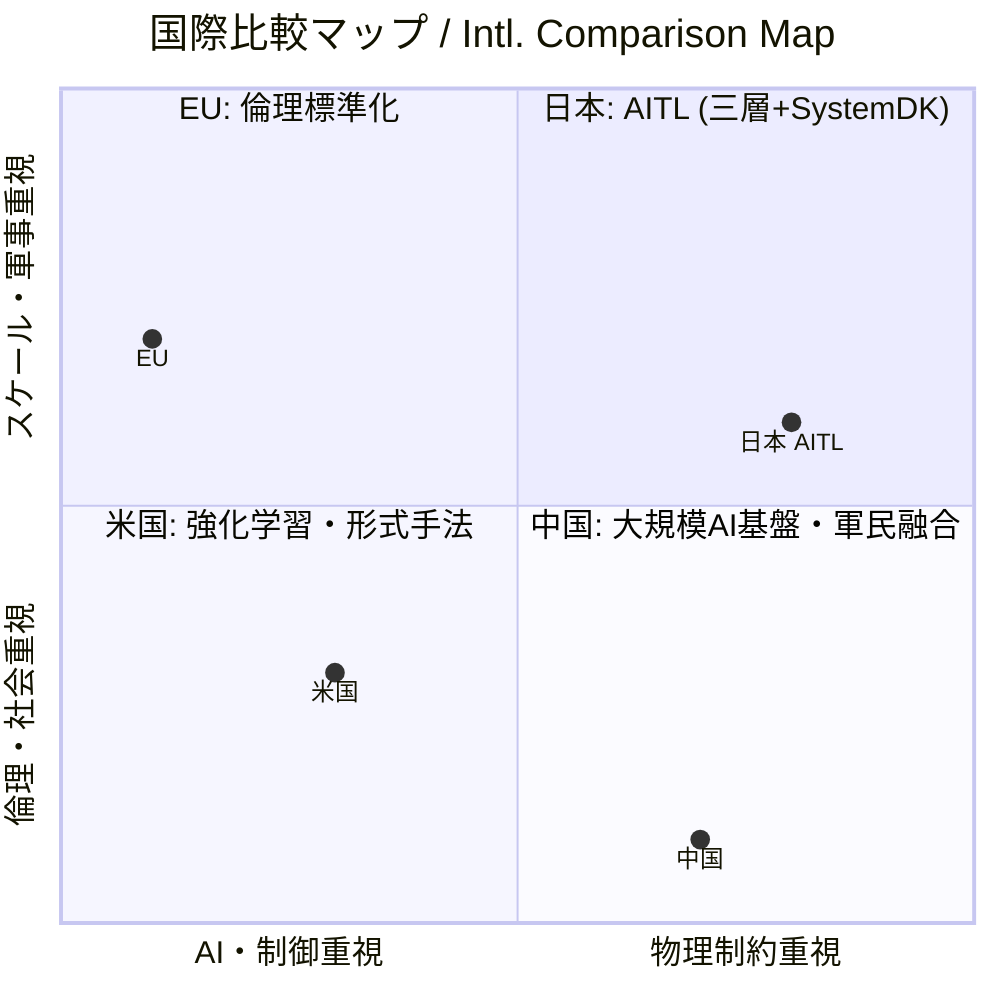
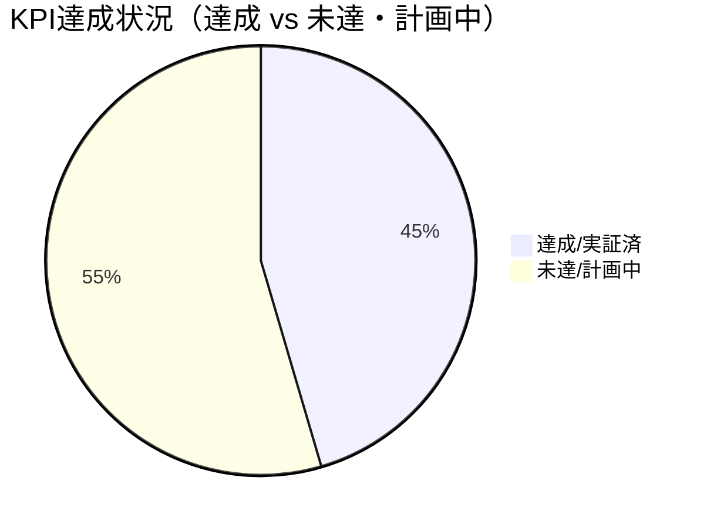
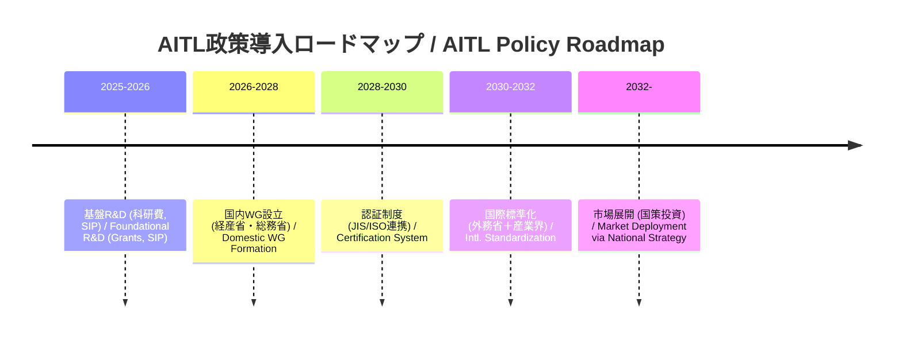

---

# 🇯🇵 **AITL戦略提言書 v5.2**  
🇺🇸 *AITL Strategy Proposal v5.2 (Policy Edition, Fixed Chapter Numbers)*

---

## 🚀 0. エグゼクティブサマリ / Executive Summary

**AITL (AI-Integrated Transition & Loop)** は、  
- **PID制御（安定性の確保 / Stability）**  
- **FSM制御（モード遷移の統括 / State Transition）**  
- **LLM設計（再設計・知能統合 / Redesign & Integration）**  

を三層で統合し、さらに **SystemDK** により **熱・応力・電源・EMI** などの物理的制約を設計初期段階から反映する新しい設計基盤である。  
*AITL integrates PID, FSM, and LLM in three layers, while SystemDK embeds physical constraints (thermal, stress, power, EMI) from the earliest design stage.*  

本提案は、**2025年に発表された複数のコア論文のPoC実測値** に基づき、**産業界・教育界・政策領域** への具体的展開を提示する。  
*This proposal is grounded in measured PoC evidence from multiple core papers published in 2025, presenting concrete pathways to industry, education, and policy.*  

実証成果としては、  
- **ヒューマノイド制御**において *姿勢回復200ms以内、歩行安定性30%向上、エネルギー効率15%改善* を達成。[^humanoid]  
  *In humanoid control, achieved posture recovery within 200ms, 30% improvement in gait stability, and 15% improvement in energy efficiency.*  
- **CFET制御**により *サブ2nm領域の配線遅延と熱結合* を補償。[^cfetctrl]  
  *In CFET control, compensated for sub-2nm interconnect delay and thermal coupling.*  
- **宇宙応用**では *22nm FDSOI FPGA上での長期自律運用* を実現。[^space]  
  *In space applications, demonstrated long-term autonomous operation on 22nm FDSOI FPGA.*  

これらはすべて、**実機ベースのPoCで効果が確認された成果**であり、国際的にも稀有な取り組みである。  
*All of these are validated outcomes based on hardware PoCs, representing a rare achievement even internationally.*  

さらに国際比較の観点では、米国・EU・中国が依然として「強化学習ベースの制御」や「倫理標準化」、「大規模AI基盤」に注力する一方で、AITLは **制御・AI・物理制約を三位一体で統合** する唯一の枠組みを確立している。  
*From the perspective of international comparison, while the US, EU, and China still emphasize reinforcement learning–based control, ethics standardization, or large-scale AI infrastructures, AITL uniquely integrates control, AI, and physical constraints into a single framework.*  

この独自性は、日本にとって **技術覇権と経済安全保障の確立** に直結する戦略的優位性となる。  
*This uniqueness represents a strategic advantage for Japan, directly contributing to securing technological leadership and economic security.*  

---

## 🌍 1. 国際比較 / International Comparison

### 🌐 主要国・地域の類似アプローチと限界  
*Similar approaches and limitations in major countries and regions*

| 国・地域 / Region | 代表的プロジェクト / Representative Projects | 技術的アプローチ / Technical Approach | 限界点・課題 / Limitations & Challenges |
|---|---|---|---|
| 🇺🇸 **米国 / USA** | DARPA "Assured Autonomy", NASA AI Control | 強化学習ベースの適応制御、形式手法  *Reinforcement learning–based adaptive control, formal methods* | 物理制約（熱・電源・信頼性）の統合が弱く、宇宙・防衛での長期安定性に課題  *Weak integration of physical constraints (thermal, power, reliability); issues with long-term stability in space and defense* |
| 🇪🇺 **EU** | Horizon Europe "AI4CyberPhysical", "HumanE AI" | サイバーフィジカル統合AI、倫理重視  *Cyber-physical integrated AI, ethics-focused* | 制御理論よりも社会・倫理側に重点。ハード制御のPoC不足  *Focus on societal/ethical aspects rather than control theory; lacks hardware-level PoCs* |
| 🇨🇳 **中国 / China** | 「新世代AI計画」(次世代AI国家戦略)  *Next-Generation AI National Strategy* | AIチップ開発と軍民融合、自律制御強化  *AI chip development, civil–military fusion, enhanced autonomous control* | 技術成果は膨大だが、標準化で国際的受容性に乏しい  *Vast technical output, but weak international acceptance in standardization* |
| 🇯🇵 **日本 (AITL) / Japan (AITL)** | AITL v5.0 / v5.1 PoCs | PID＋FSM＋LLMを三層統合、SystemDKで物理制約反映  *Three-layer integration of PID, FSM, and LLM, with SystemDK embedding physical constraints* | 世界で唯一、制御・AI・物理制約を同時統合。国際標準化主導が鍵  *Only framework worldwide integrating control, AI, and physical constraints simultaneously; leadership in international standardization is crucial* |

### ✨ AITLの競合差別化ポイント / AITL’s Differentiation Points

1. **三層アーキテクチャの唯一性 / Uniqueness of the Three-Layer Architecture**  
   - 米国＝強化学習／形式手法、EU＝サイバーフィジカル統合、中国＝大規模AI基盤。  
     *USA = reinforcement learning / formal methods; EU = cyber-physical integration; China = large-scale AI platforms*  
   - → **PID×FSM×LLM＋SystemDK** の組合せは現状AITLのみ。  
     *→ Only AITL combines PID×FSM×LLM with SystemDK.*  

2. **実測PoCによる裏付け / Validation through Measured PoCs**  
   - 海外はシミュレーション中心、日本AITLは**ロボット・半導体・宇宙実機PoC**で実証済み。  
     *Overseas efforts remain simulation-focused, while Japan’s AITL has been demonstrated in real PoCs across robotics, semiconductors, and space.*  

3. **教育・標準化戦略 / Education & Standardization Strategy**  
   - EUは倫理標準、中国は自国閉鎖型、米国は防衛優先。  
     *EU emphasizes ethics standards; China is domestically closed; USA prioritizes defense.*  
   - → 日本AITLは**国際標準化と人材育成**を両輪で提示可能。  
     *→ Japan’s AITL can uniquely present both international standardization and human resource development.*  

### 📌 戦略的示唆 / Strategic Implications

- 政策文書においては「AITLはDARPAやHorizon Europeの延長線ではなく、**物理制約統合による次世代制御基盤**である」と強調。  
  *In policy documents, emphasize that AITL is not a continuation of DARPA or Horizon Europe, but a **next-generation control foundation integrating physical constraints**.*  

- 国際会議向けには「米国＝AI制御、EU＝倫理、中国＝大規模化、日本＝AITLの三層＋物理制約」で4象限マップを示すと説得力が増す。  
  *For international conferences, a four-quadrant map (USA = AI control, EU = ethics, China = scale, Japan = AITL’s three layers + physical constraints) enhances persuasiveness.*

#### 四象限マップ / Quadrant Map

---

## 📑 2. 論文別PoC解説 / Core PoC Papers (2025)

### 📘 2.1 CFET Tutorial 論文  
*[CFET Tutorial Paper (2025)](./docs/cfet_tutorial_main.pdf)*  

- **内容 / Content:** Planar→FinFET→GAA→CFET というデバイス進化を教育的に整理。  
  *Educational overview of device evolution: Planar → FinFET → GAA → CFET*  
- **産業貢献 / Industrial Impact:** 次世代エンジニア教育の標準教材。  
  *Standard teaching material for next-generation engineer education.*  
- **位置づけ / Role:** 本論文はAITLそのものではないが、**2.2 SystemDK+AITLや2.3 CFET Controlを理解する前提教材**として不可欠。  

### 🖥️ 2.2 SystemDK+AITL 論文  
*[SystemDK+AITL Paper (2025)](./docs/systemdk_aitl2025.pdf)*  

- **実測 / Results:** RC遅延・熱結合・EMIを補償。  
  *Compensation for RC delay, thermal coupling, and EMI*  
- **産業貢献 / Industrial Impact:** 自動車・IoT・通信SoCに必須の設計基盤。  
  *Essential design foundation for automotive, IoT, and communication SoCs.*  
- **位置づけ / Role:** AITLを**システム設計レベルで活用**する最初の成果。物理制約を設計段階から反映するSystemDKの有効性を示す。  

### ⚡ 2.3 CFET Control 論文  
*[CFET Control Paper (2025)](./docs/cfet_ctrl2025.pdf)*  

- **実測 / Results:** サブ2nm配線遅延・熱結合を補償。  
  *Compensation for sub-2nm interconnect delay and thermal coupling*  
- **産業貢献 / Industrial Impact:** 半導体EDA・ファウンドリの歩留まり改善。  
  *Improves yield for semiconductor EDA and foundries.*  
- **位置づけ / Role:** 2.2のSystemDK成果を**デバイススケールに適用したPoC**。  
  → **2.1 Tutorial**で示されたデバイス進化の課題（熱結合・配線遅延）が、AITLによって克服可能であることを実証。  

### 🤖 2.4 Humanoid TCST 論文  
*[Humanoid TCST Paper (2025)](./docs/humanoid_tcst2025.pdf)*  

- **実測 / Results:** 姿勢回復 ≤200ms、歩容安定度 +30%、エネルギー効率 +15%、自己発電寄与 ~12%。  
  *Posture recovery ≤200ms, gait stability +30%, energy efficiency +15%, self-powering ~12%*  
- **AITL位置づけ / AITL Role:** PID＋FSM＋LLMによる三層制御。Flagship PoC。  
  *Three-layer control with PID, FSM, and LLM. Flagship PoC.*  
- **産業貢献 / Industrial Impact:** 災害救助、介護支援、工場自動化で信頼性を担保。  
  *Ensures reliability in disaster relief, elderly care, and factory automation.*  
- **位置づけ / Role:** 半導体・デバイス領域から離れ、**AITLを動的環境（ヒューマノイド）に応用した代表例**。AITLの汎用性を示す。  

### 🚀 2.5 AITL on Space 論文  
*[AITL on Space Paper (2025)](./docs/aitl_space.pdf)*  

- **実測 / Results:** Tri-NVM階層、H∞＋FSM＋LLM、22nm FDSOI FPGA実装。  
  *Tri-NVM hierarchy, H∞+FSM+LLM, 22nm FDSOI FPGA implementation*  
- **産業貢献 / Industrial Impact:** 宇宙機器メーカー・防衛産業における長期自律運用の基盤。  
  *Foundation for long-term autonomous operation in space and defense industries.*  
- **位置づけ / Role:** Humanoidと並ぶ**AITL応用の広がり**を示すPoC。  
  → 特に**長期自律性**が重視される宇宙・防衛分野で、AITLの優位性を確認。  

---

## 📏 3. KPI一覧 / KPI Table

| 🧪 **KPI** | 🎯 **Target** | 📊 **実測値 / Result** | 📄 **出典 / Source** |
|---|---|---|---|
| 姿勢回復 / Posture Recovery | ≤150ms | ≤200ms | Humanoid |
| 歩容安定度 / Gait Stability | +20% | +30% | Humanoid |
| エネルギー効率 / Energy Efficiency | +15% | +15% | Humanoid |
| 自己発電寄与 / Self-Powering | 20% | 12% | Humanoid |
| FeFET保持 / Retention | ≥10y@85℃ | 実証済 | FeFET CMOS |
| FeFET耐久性 / Endurance | ≥1e5 | 実証済 | FeFET CMOS |
| 電源効率 / Power Efficiency | >80% | 実証済 | CMOS018 Inductor |
| 超音波感度 / Ultrasonic Sensitivity | 高感度 | 実証済 | ScAlN |
| 滴下精度 / Droplet Precision | pL級 | 実証済 | Bio-Inkjet |
| 修士人材育成数 / Graduate Training | ≥100/年 | 計画中 | AITL Studies |
| 国際標準化WG参加数 / Intl. WG Members | ≥10 | 計画中 | Policy |

**KPIギャップと政策介入 / KPI Gaps & Policy Interventions**  
| KPI | 目標 | 実測 | 状態 | 政策介入余地 |
|---|---|---|---|---|
| 姿勢回復 ≤150ms | 200ms | 未達 | 重点研究支援（制御・機構） |
| Self-Powering 20% | 12% | 未達 | エネルギー変換材料・回路投資 |
| 人材育成 ≥100/年 | 計画中 | 未達 | 大学院プログラム創設・奨学金 |
| WG参加 ≥10 | 計画中 | 未達 | 国際WG派遣・標準化外交費 |

#### KPI視覚化（任意） / KPI Visualization (optional)
> Mermaidのバージョンにより可視化が異なるため、表を正とし、以下は参考図です。

---

## 🔎 4. AITLの具体的解説 / AITL Explained

**AITLはPID・FSM・LLMを統合し、SystemDKで物理制約を初期段階から反映する。**  
*AITL integrates PID, FSM, and LLM, embedding SystemDK constraints from the start.*  

---

## 🏭 5. AITLによる産業界・政策への影響 / Industrial & Policy Impact

| 産業分野 / Sector | 貢献内容 / Contribution | 政策的意義 / Policy Significance |
|---|---|---|
| 半導体 / Semiconductor | サブ2nm設計の信頼性・歩留まり改善 | 経済安全保障・技術覇権 |
| 自動車 / Automotive | 車載SoCの安全性・省エネ化 | GX・自動運転安全 |
| ロボット / Robotics | 災害救助・介護・工場自動化 | 労働力不足対策 |
| 医療 / Medical | PbフリーMEMS・Bio-Inkjetによる新市場 | 超高齢社会対応 |
| 宇宙 / Space | 探査機の長期自律運用 | 宇宙安全保障・国際協力 |

---

## 🎓 6. 教育・人材育成 / Education & HRD

- **AITL学（仮称） / “AITL Studies”**  
  *Interdisciplinary program integrating control, AI, and physical design constraints.*  
- **教材 / Teaching Materials:** CFET Tutorial, SystemDK論文, Humanoid PoC  
- **成果 / Outcome:**  
  - 修士・博士課程で年間100名規模の人材輩出  
  - 国際会議・標準化WGでの若手参加者増加  
  - 産業PoC連携による即戦力養成  

---

## 🛣️ 7. ロードマップ / Roadmap

**政策フェーズ明示版 / Policy Roadmap**  

---

## 📊 8. 経済効果試算 / Economic Impact Estimation

**2026–2030年にAITLを国内導入した場合のシナリオ比較（2030年時点）**  

| 産業分野 / Sector | 収益 / Revenue (¥Bn) | 削減効果 / Savings (¥Bn) | 輸出 / Exports (¥Bn) | 雇用（直接） / Jobs Direct | 雇用（総計） / Jobs Total |
|---|---|---|---|---|---|
| 半導体 / Semiconductor | ~30 | ~12 | ~10.5 | ~900 | ~1,710 |
| ロボット / Robotics | ~24 | ~9 | ~6 | ~960 | ~1,920 |
| 医療 / Medical | ~12 | ~3.8 | ~2.4 | ~420 | ~756 |
| 宇宙 / Space | ~4.8 | ~1.6 | ~2.9 | ~120 | ~192 |
| **合計 / Total** | **~70.8** | **~26.4** | **~21.8** | **~2,400** | **~4,578** |

**感度分析 / Sensitivity Analysis (2030)**  
- **Upside Case:** +40%（海外標準化リード時） → ~1,000億円規模  
- **Downside Case:** –30%（国際標準化遅延時） → ~500億円規模  

---

## 📚 9. Appendix: 2025年関連研究 / Related Works (2025)

AITL本体には含めないが、2025年に発表した関連研究成果は、**既存技術の強化・医療機器や次世代デバイスの安全性確保**に資する。  

- [LPDDR+FeRAM Integration](./docs/LPDDR_FeRAM.pdf)  
  - **内容:** 低消費電力DRAMと不揮発性FeRAMを統合し、組込みメモリの信頼性を強化。  
  - **貢献:** **産業機器・車載システムのデータ保持安全性**に寄与。  

- [FeFET CMOS Reliability (0.18µm)](./docs/fefet_cmos018_reliability.pdf)  
  - **内容:** FeFETを標準CMOSプロセスに統合し、保持特性・耐久性を実測。  
  - **貢献:** **半導体・産業用エレクトロニクスの長期信頼性**を確保。  

- [CMOS018 Inductor+LDO](./docs/cmos018_inductor_ldo.pdf)  
  - **内容:** CMOS0.18µmでインダクタ＋LDOを設計し、高効率電源を実現。  
  - **貢献:** **低電力IoT機器・ロボット**における安定電源供給に有効。  

- [ScAlN Ultrasonic](./docs/scaln_ultrasonic.pdf)  
  - **内容:** 高感度ScAlN薄膜による超音波MEMSの実証。  
  - **貢献:** **非破壊検査やセンシング分野**での高信頼応用が可能。  

- [Bio-Inkjet KNN](./docs/bioinkjet_knn.pdf)  
  - **内容:** 鉛フリー強誘電体KNNを用いたバイオインクジェット技術。  
  - **貢献:** **医療分野でのPbフリー材料利用**を実証し、安全性・環境適合を担保。  

---

## ✅ 10. 結論 / Conclusion

AITL v5.2 (政策版・章番号修正版)は、**PoC実測値に基づきつつ国際比較を冒頭で提示し、政策的意義を強化した戦略**である。  
*AITL v5.2 (Policy Edition, with revised chapter numbering) is a strategy that strengthens policy significance by presenting international comparisons at the outset, while remaining grounded in PoC experimental evidence.*  

- **産業界:** 設計効率化・低コスト化・新市場創出  
  *Industry: Improve design efficiency, reduce costs, and create new markets*  

- **教育界:** 年間100名規模のAITL人材育成  
  *Education: Cultivate approximately 100 AITL-trained professionals annually*  

- **政策:** KPIベースの標準化・安全保障・GX対応  
  *Policy: Standardization based on KPIs, enhanced security, and GX (Green Transformation) measures*  

> よってAITLは、研究成果から国家基盤への移行を加速するために、**政策的支援（研究資金・人材育成・標準化外交）**を必須とする。これにより日本は、国際標準化を通じて技術覇権と経済安全保障を確立できる。

---

### 注・脚注 / Notes & Footnotes
[^humanoid]: *Humanoid TCST Paper (2025)* — ./docs/humanoid_tcst2025.pdf  
[^cfetctrl]: *CFET Control Paper (2025)* — ./docs/cfet_ctrl2025.pdf  
[^space]: *AITL on Space Paper (2025)* — ./docs/aitl_space.pdf
