---

# 🇯🇵 **AITL戦略提言書 v5.2 (政策版・章番号修正版)**  
# 🇺🇸 *AITL Strategy Proposal v5.2 (Policy Edition, Fixed Chapter Numbers)*

---

## 🚀 0. エグゼクティブサマリ / Executive Summary

**AITL (AI-Integrated Transition & Loop)** は 
- **PID制御（安定性 / Stability）**  
- **FSM制御（モード遷移 / State Transition）**  
- **LLM設計（再設計 / Redesign）**  

を統合し、**SystemDK** により **熱・応力・電源・EMI** などの物理制約を設計初期から反映する。  
*AITL integrates PID, FSM, and LLM, with SystemDK embedding physical constraints (thermal, stress, power, EMI) from the earliest design stage.*  

本提案は、**2025年に発表されたコア論文のPoC実測値** を根拠とし、**産業・教育・政策** への橋渡しを提示する。  
*This proposal is grounded in PoC evidence from 2025 core papers, bridging industry, education, and policy.*  

さらに、国際比較では、欧米の「AI×制御」研究が未だ**PID拡張や強化学習レベル**に留まる一方で、AITLは**三層統合＋物理制約反映**という先行優位性を持つ。  
これは日本発の国家競争力強化の切り札となる。  

---

## 🌍 1. 国際比較 / International Comparison

### 🌐 主要国・地域の類似アプローチと限界

| 国・地域 | 代表的プロジェクト | 技術的アプローチ | 限界点 / 課題 |
|---|---|---|---|
| 🇺🇸 **米国** | DARPA "Assured Autonomy", NASA AI制御 | 強化学習ベースの適応制御、形式手法 | 物理制約（熱・電源・信頼性）の統合が弱く、宇宙・防衛での長期安定性に課題 |
| 🇪🇺 **EU** | Horizon Europe "AI4CyberPhysical", "HumanE AI" | サイバーフィジカル統合AI、倫理重視 | 制御理論よりも社会・倫理側に重点。ハード制御のPoC不足 |
| 🇨🇳 **中国** | 「新世代AI計画」(次世代AI国家戦略) | AIチップ開発と軍民融合、自律制御強化 | 技術成果は膨大だが、標準化で国際的受容性に乏しい |
| 🇯🇵 **日本 (AITL)** | AITL v5.0 / v5.1 PoC群 | PID＋FSM＋LLMを三層統合、SystemDKで物理制約反映 | 世界で唯一、制御・AI・物理制約を同時統合。国際標準化主導が鍵 |

### ✨ AITLの競合差別化ポイント
1. **三層アーキテクチャの唯一性**  
   - 米国＝強化学習／形式手法、EU＝サイバーフィジカル統合、中国＝大規模AI基盤。  
   - → **PID×FSM×LLM＋SystemDK** の組合せは現状AITLのみ。  

2. **実測PoCによる裏付け**  
   - 海外はシミュレーション中心、日本AITLは**ロボット・半導体・宇宙実機PoC**で実証済み。  

3. **教育・標準化戦略**  
   - EUは倫理標準、中国は自国閉鎖型、米国は防衛優先。  
   - → 日本AITLは**国際標準化と人材育成**を両輪で提示可能。  

### 📌 戦略的示唆
- 政策文書においては「AITLはDARPAやHorizon Europeの延長線ではなく、**物理制約統合による次世代制御基盤**である」と強調。  
- 国際会議向けには「米国＝AI制御、EU＝倫理、中国＝大規模化、日本＝AITLの三層＋物理制約」で4象限マップを示すと説得力が増す。  

---

## 📑 2. 論文別PoC解説 / Core PoC Papers (2025)

### 🤖 2.1 Humanoid TCST 論文  
*[Humanoid TCST Paper (2025)](./docs/humanoid_tcst2025.pdf)*  

- **実測 / Results:** 姿勢回復 ≤200ms、歩容安定度 +30%、エネルギー効率 +15%、自己発電寄与 ~12%  
  *Posture recovery ≤200ms, gait stability +30%, energy efficiency +15%, self-powering ~12%*  
- **AITL位置づけ / AITL Role:** PID＋FSM＋LLMによる三層制御。Flagship PoC。  
  *Three-layer control with PID, FSM, and LLM. Flagship PoC.*  
- **産業貢献 / Industrial Impact:** 災害救助、介護支援、工場自動化で信頼性を担保。  
  *Ensures reliability in disaster relief, elderly care, and factory automation.*  

---

### 🚀 2.2 AITL on Space 論文  
*[AITL on Space Paper (2025)](./docs/aitl_space.pdf)*  

- **実測 / Results:** Tri-NVM階層、H∞＋FSM＋LLM、22nm FDSOI FPGA実装  
  *Tri-NVM hierarchy, H∞+FSM+LLM, 22nm FDSOI FPGA implementation*  
- **産業貢献 / Industrial Impact:** 宇宙機器メーカー・防衛産業における長期自律運用の基盤。  
  *Foundation for long-term autonomous operation in space and defense industries.*  

---

### ⚡ 2.3 CFET Control 論文  
*[CFET Control Paper (2025)](./docs/cfet_ctrl2025.pdf)*  

- **実測 / Results:** サブ2nm配線遅延・熱結合を補償  
  *Compensation for sub-2nm interconnect delay and thermal coupling*  
- **産業貢献 / Industrial Impact:** 半導体EDA・ファウンドリの歩留まり改善。  
  *Improves yield for semiconductor EDA and foundries.*  

---

### 🖥️ 2.4 SystemDK+AITL 論文  
*[SystemDK+AITL Paper (2025)](./docs/systemdk_aitl2025.pdf)*  

- **実測 / Results:** RC遅延・熱結合・EMIを補償  
  *Compensation for RC delay, thermal coupling, and EMI*  
- **産業貢献 / Industrial Impact:** 自動車・IoT・通信SoCに必須の設計基盤。  
  *Essential design foundation for automotive, IoT, and communication SoCs.*  

---

### 📘 2.5 CFET Tutorial 論文  
*[CFET Tutorial Paper (2025)](./docs/cfet_tutorial_main.pdf)*  

- **内容 / Content:** Planar→FinFET→GAA→CFET進化を教育的整理  
  *Educational overview of device evolution: Planar → FinFET → GAA → CFET*  
- **産業貢献 / Industrial Impact:** 次世代エンジニア教育の標準教材。  
  *Standard teaching material for next-generation engineer education.*  

---

## 📏 3. KPI一覧 / KPI Table

| 🧪 **KPI** | 🎯 **Target** | 📊 **実測値 / Result** | 📄 **出典 / Source** |
|---|---|---|---|
| 姿勢回復 / Posture Recovery | ≤150ms | ≤200ms | Humanoid |
| 歩容安定度 / Gait Stability | +20% | +30% | Humanoid |
| エネルギー効率 / Energy Efficiency | +15% | +15% | Humanoid |
| 自己発電寄与 / Self-Powering | 20% | 12% | Humanoid |
| FeFET保持 / Retention | ≥10y@85℃ | 実証済 | FeFET CMOS |
| FeFET耐久性 / Endurance | ≥1e5 | 実証済 | FeFET CMOS |
| 電源効率 / Power Efficiency | >80% | 実証済 | CMOS018 Inductor |
| 超音波感度 / Ultrasonic Sensitivity | 高感度 | 実証済 | ScAlN |
| 滴下精度 / Droplet Precision | pL級 | 実証済 | Bio-Inkjet |
| 修士人材育成数 / Graduate Training | ≥100/年 | 計画中 | AITL Studies |
| 国際標準化WG参加数 / Intl. WG Members | ≥10 | 計画中 | Policy |

---

## 🔎 4. AITLの具体的解説 / AITL Explained

```mermaid
flowchart TB
    PID["PID制御<br/>Stability"] --> CORE["AITL Core"]
    FSM["FSM制御<br/>Transition"] --> CORE
    LLM["LLM設計<br/>Redesign"] --> CORE
    CORE --> OPT["統合最適化<br/>Holistic Optimization"]
    SYS["SystemDK<br/>Physical Constraints"] --> CORE
```

**AITLはPID・FSM・LLMを統合し、SystemDKで物理制約を初期段階から反映する。**  
*AITL integrates PID, FSM, and LLM, embedding SystemDK constraints from the start.*  

---

## 🏭 5. AITLによる産業界・政策への影響 / Industrial & Policy Impact

| 産業分野 / Sector | 貢献内容 / Contribution | 政策的意義 / Policy Significance |
|---|---|---|
| 半導体 / Semiconductor | サブ2nm設計の信頼性・歩留まり改善 | 経済安全保障・技術覇権 |
| 自動車 / Automotive | 車載SoCの安全性・省エネ化 | GX・自動運転安全 |
| ロボット / Robotics | 災害救助・介護・工場自動化 | 労働力不足対策 |
| 医療 / Medical | PbフリーMEMS・Bio-Inkjetによる新市場 | 超高齢社会対応 |
| 宇宙 / Space | 探査機の長期自律運用 | 宇宙安全保障・国際協力 |

---

## 🎓 6. 教育・人材育成 / Education & HRD

- **AITL学（仮称） / “AITL Studies”**  
  *Interdisciplinary program integrating control, AI, and physical design constraints.*  
- **教材 / Teaching Materials:** CFET Tutorial, SystemDK論文, Humanoid PoC  
- **成果 / Outcome:**  
  - 修士・博士課程で年間100名規模の人材輩出  
  - 国際会議・標準化WGでの若手参加者増加  
  - 産業PoC連携による即戦力養成  

---

## 🛣️ 7. ロードマップ / Roadmap

```mermaid
timeline
    title AITL導入ロードマップ / AITL Roadmap
    2025-2026 : 基盤R&D (AITL学, SystemDK α版) / Foundational R&D
    2026-2028 : 国内WG設立, PoC拡大 / Domestic WG, PoC Expansion
    2028-2030 : コンソーシアム, 認証制度 / Consortium, Certification
    2030-2032 : 国際標準化主導 / Intl. Standardization
    2032- : 標準活用による市場展開 / Market Deployment via Standards
```

---

## 📊 8. 経済効果試算 / Economic Impact Estimation

**2026–2030年にAITLを国内導入した場合のシナリオ比較（2030年時点）**  

| 産業分野 / Sector | 収益 / Revenue (¥Bn) | 削減効果 / Savings (¥Bn) | 輸出 / Exports (¥Bn) | 雇用（直接） / Jobs Direct | 雇用（総計） / Jobs Total |
|---|---|---|---|---|---|
| 半導体 / Semiconductor | ~30 | ~12 | ~10.5 | ~900 | ~1,710 |
| ロボット / Robotics | ~24 | ~9 | ~6 | ~960 | ~1,920 |
| 医療 / Medical | ~12 | ~3.8 | ~2.4 | ~420 | ~756 |
| 宇宙 / Space | ~4.8 | ~1.6 | ~2.9 | ~120 | ~192 |
| **合計 / Total** | **~70.8** | **~26.4** | **~21.8** | **~2,400** | **~4,578** |

**感度分析 / Sensitivity Analysis (2030)**  
- **Upside Case:** +40%（海外標準化リード時） → ~1000億円規模  
- **Downside Case:** –30%（国際標準化遅延時） → ~500億円規模  

---

## 📚 9. Appendix: 2025年関連研究 / Related Works (2025)

AITL本体には含めないが、2025年に発表した関連研究成果は、  
**既存技術の強化・医療機器や次世代デバイスの安全性確保**に資する。  

- [LPDDR+FeRAM Integration](./docs/LPDDR_FeRAM.pdf)  
  - **内容:** 低消費電力DRAMと不揮発性FeRAMを統合し、組込みメモリの信頼性を強化。  
  - **貢献:** **産業機器・車載システムのデータ保持安全性**に寄与。  

- [FeFET CMOS Reliability (0.18µm)](./docs/fefet_cmos018_reliability.pdf)  
  - **内容:** FeFETを標準CMOSプロセスに統合し、保持特性・耐久性を実測。  
  - **貢献:** **半導体・産業用エレクトロニクスの長期信頼性**を確保。  

- [CMOS018 Inductor+LDO](./docs/cmos018_inductor_ldo.pdf)  
  - **内容:** CMOS0.18µmでインダクタ＋LDOを設計し、高効率電源を実現。  
  - **貢献:** **低電力IoT機器・ロボット**における安定電源供給に有効。  

- [ScAlN Ultrasonic](./docs/scaln_ultrasonic.pdf)  
  - **内容:** 高感度ScAlN薄膜による超音波MEMSの実証。  
  - **貢献:** **非破壊検査やセンシング分野**での高信頼応用が可能。  

- [Bio-Inkjet KNN](./docs/bioinkjet_knn.pdf)  
  - **内容:** 鉛フリー強誘電体KNNを用いたバイオインクジェット技術。  
  - **貢献:** **医療分野でのPbフリー材料利用**を実証し、安全性・環境適合を担保。  

---

## ✅ 10. 結論 / Conclusion

AITL v5.2 (政策版・章番号修正版)は、**PoC実測値に基づきつつ国際比較を冒頭で提示し、政策的意義を強化した戦略**である。  
*AITL v5.2 (Policy Edition, with revised chapter numbering) is a strategy that strengthens policy significance by presenting international comparisons at the outset, while remaining grounded in PoC experimental evidence.*  

- **産業界:** 設計効率化・低コスト化・新市場創出  
  *Industry: Improve design efficiency, reduce costs, and create new markets*  

- **教育界:** 年間100名規模のAITL人材育成  
  *Education: Cultivate approximately 100 AITL-trained professionals annually*  

- **政策:** KPIベースの標準化・安全保障・GX対応  
  *Policy: Standardization based on KPIs, enhanced security, and GX (Green Transformation) measures*  

AITLは「研究成果」から「国家基盤」への昇華を可能にし、国際標準化を通じて日本の技術覇権確立に寄与する。  
*AITL enables the transition from research achievements to national infrastructure, contributing to Japan’s technological leadership through international standardization.*  
