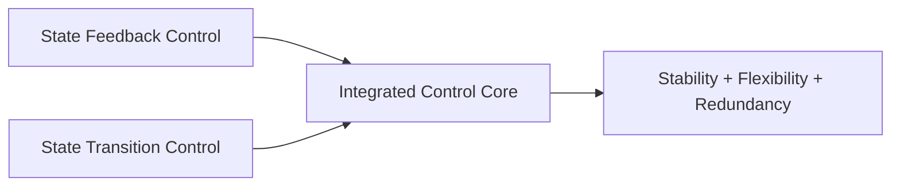
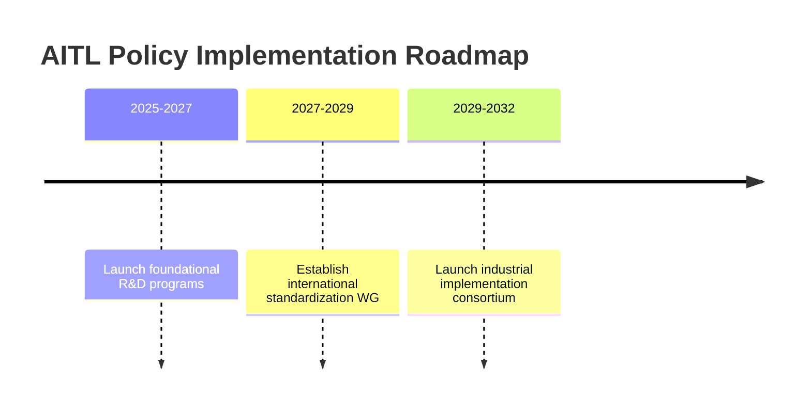

---

# 🇺🇸 **AITL Strategy Proposal v4.1 (Policy-Oriented, Improved)** {#top}

> ⚠️ **Note:**  
> This proposal is **v4.1 revised edition (policy-oriented, improved)**, and its contents are under review.  
> The detailed execution plan and policy roadmap will be updated based on future discussions.

  <a class="btn" href="#overview">📎 Jump to Overview</a>
  <a class="btn" href="./Figures/AITL_Strategy_Proposal_Draft_v4_1_Improved.pdf">⬇️ Download PDF</a>

---

## 📑 Table of Contents {#toc}

- [0. Overview](#overview)  
- [1. Value of Feedback–Transition Integration](#feedback-transition)  
- [2. Value of AITL with LLM](#aitl-llm-value)  
- [3. Real-World PoC Examples](#poc-examples)  
- [4. Need for SystemDK in AITL Implementation](#systemdk)  
- [4.1 Technical Challenges and Risks](#risks)  
- [5. Policy Recommendations](#policy)  
- [6. Conclusion](#conclusion)

---

## 0. Overview {#overview}

This proposal presents the **AITL Strategy (AI-Integrated Transition & Loop)**, which integrates **state feedback control** and **state transition control**, further combined with **LLM (Large Language Model)** and **SystemDK (System Design Kit)**, enabling real-time to quasi-real-time specification changes, fault-time redesign, and design considering physical constraints.

Traditionally, control, analysis, and physical implementation have been operated independently. In advanced-node semiconductors and next-generation autonomous systems, **integrated operation of these on the same design platform is essential for securing international competitiveness**. This proposal outlines a concrete framework to achieve that.

> **==The technologies integrated in this proposal—control (state feedback + state transition), analysis/design (LLM), and physical implementation optimization (SystemDK)—are complementary elements that directly share outputs and constraints.==**  
> **==This enables real-time, physically constrained integrated optimization that partial improvements cannot achieve.==**

**==Moreover, both the global semiconductor market and control industries are undergoing rapid change. Failure to integrate these three technologies “now” risks severe delays in national-level technology competition (e.g., EUV-era semiconductor design, industrial autonomous system control).==**  
**==Especially, SystemDK is not limited to AITL-specific elements, but is a fundamental technology required for all advanced-node semiconductor design.==**

---

## 1. Value of Feedback–Transition Integration {#feedback-transition}

Integrated control eliminates the limitations of conventional control (local optimization, poor tolerance for specification changes, vulnerability to faults) and delivers the following benefits:

| Item | Effect |
|---|---|
| **Stability** | Maintains continuous and stable operation even across different modes |
| **Flexibility** | Responds flexibly to changing requirements during design and operation |
| **Redundancy** | Continues safe and efficient operation even with partial functionality loss |

📎 **Mermaid Reference**: [View on GitHub](https://github.com/Samizo-AITL/AITL-Strategy-Proposal/blob/main/AITL_Strategy_Proposal_Draft_v4_0.md)

---

## 2. Value of AITL with LLM {#aitl-llm-value}

AITL adds **LLM (Large Language Model)** to **integrated control**, creating new value.

| LLM Role | New Value |
|---|---|
| **Situation Analysis** | Automates anomaly detection and cause estimation from logs and sensor data |
| **Quasi-Real-Time Design** | Redesigns control algorithms and FSM structures within minutes to meet spec changes |
| **Integrated Architecture Design** | Generates complete designs—including integrated control—from specifications |
| **Fault-Time Redesign** | Rebuilds operating modes using remaining functions |
| **SystemDK Collaboration** | Reflects physical constraints and node characteristics from the design stage, selecting optimal implementation forms |

---

## 3. Real-World PoC Examples {#poc-examples}

1. **Robotic Control Integration**  
   - **Challenge:** Conventional systems control each joint or arm separately, requiring total shutdown on failure  
   - **AITL Solution:** Integrated control + LLM generates control systems that allow continued operation with remaining arms even if one fails  

2. **Smart Factory Line Optimization**  
   - **Challenge:** Manual reconfiguration of alternative lines after failure takes days before restart  
   - **AITL Solution:** Integrated control optimizes the entire line; LLM analyzes equipment status and reconfigures alternative lines in minutes  

3. **Autonomous Mobile Robot Fleet Control**  
   - **Challenge:** Delays in path coordination reduce overall efficiency  
   - **AITL Solution:** Integrated control synchronizes global operation; LLM optimizes routes in real time based on traffic conditions  

---

## 4. Need for SystemDK in AITL Implementation {#systemdk}

When implementing AITL in real systems, **physical constraints** (thermal, stress, power, EMI, etc.) must be reflected from the earliest design stages.  
**SystemDK (System Design Kit)** provides the platform to make this possible.

The scope of SystemDK extends beyond AITL to **all semiconductor chips**.  
In particular, for **future advanced-node semiconductor chips**, **design methodologies using SystemDK for integrated handling of physical constraints from the outset are essential**.

- Enables early countermeasures for thermal and signal interference in high-density environments  
- Integrates FEM analysis into design, achieving optimal co-design of circuits, packages, and boards  
- Improves design efficiency, product reliability, and mass production yield in the long term  

---

## 4.1 Technical Challenges and Risks {#risks}

| Category | Challenge | Risk |
|---|---|---|
| **AI Reliability** | Guaranteeing LLM response accuracy and consistency | Control errors from misjudgment or hallucination |
| **Security** | Cyberattack resistance of integrated control systems | Production stoppages, reduced safety |
| **Physical Model Integration** | Combining FEM and other physical constraint models with real-time control | Design delays, performance degradation |
| **Standardization & IP** | IP and license adjustments accompanying standardization | Reduced international competitiveness |

---

## 5. Policy Recommendations {#policy}

### 5.1 Expected Benefits (Model Case)

> **Assumption:** AITL introduced in domestic manufacturing lines, estimates based on PoC evaluation data

| Item | Conventional | With AITL | Impact |
|---|---|---|---|
| Fault Response Time | 8 hours | 30 minutes | 94% reduction in downtime |
| Line Reconfiguration Time | 2 days | 2 hours | 8× productivity increase |
| Design Change Cost | 100 | 60 | 40% reduction |

---

### 5.2 Policy Roadmap

---

## 6. Conclusion {#conclusion}

The AITL strategy integrates previously siloed control technologies and AI-based design to create new industrial systems capable of immediate response to specification changes and failures.  
In combination with SystemDK, it enables optimal implementations—whether single-chip or multi-chip—while considering physical constraints,  
accelerating efficiency improvements and value creation across industries and society.

---

## 🔙 Back {#back}

**Repository Home**: <https://github.com/Samizo-AITL/AITL-Strategy-Proposal>  
**Contact**: ✉️ <mailto:shin3t72@gmail.com> ｜ 🐦 <https://x.com/shin3t72>
