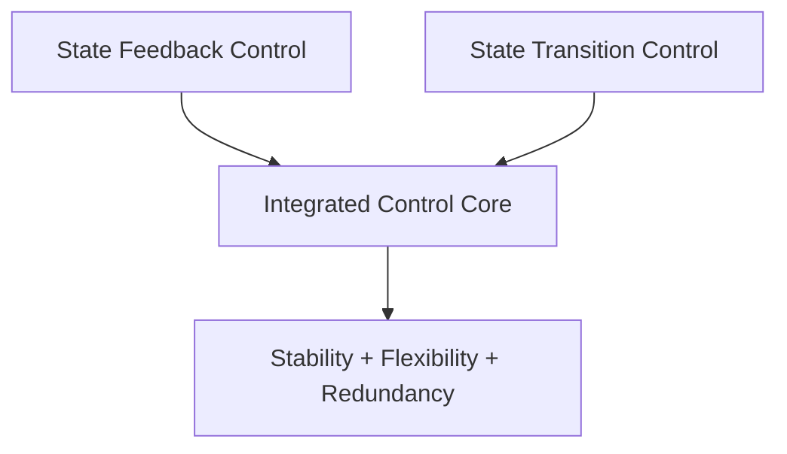
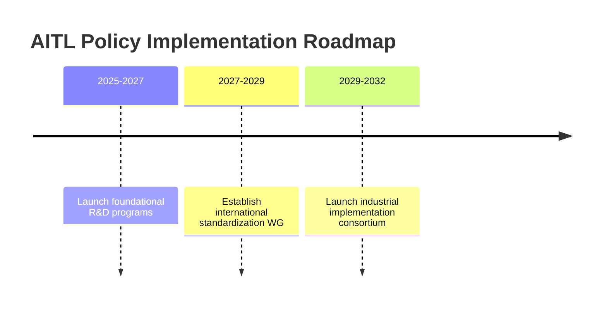
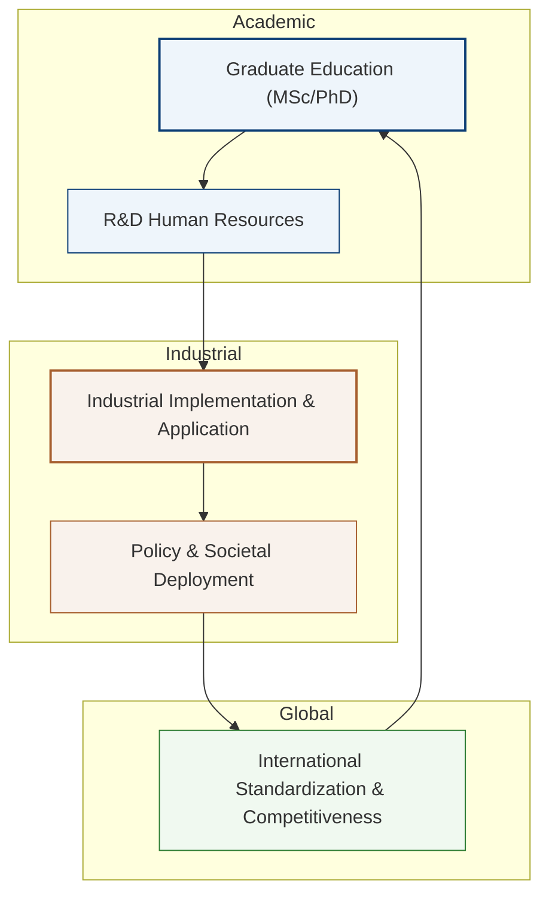

---

# 🇺🇸 **AITL Strategy Proposal v4.1 Final Edition** {#top}

  <a class="btn" href="#overview">📎 Jump to Overview</a>
  <a class="btn" href="./Figures/AITL_Strategy_Proposal_Draft_v4_1_Improved.pdf">⬇️ Download PDF</a>

---
## 📑 Table of Contents {#toc}

-   [0. Overview](#overview)\
-   [1. Value of Feedback--Transition
    Integration](#feedback-transition)\
-   [2. Value of AITL with LLM](#aitl-llm-value)\
-   [3. Real-World PoC Examples](#poc-examples)\
-   [4. Need for SystemDK in AITL Implementation](#systemdk)\
-   [4.1 Technical Challenges and Risks](#risks)\
-   [5. Policy Recommendations](#policy)\
-   [6. Conclusion](#conclusion)

---

## 0. Overview

This proposal presents the **AITL Strategy (AI-Integrated Transition &
Loop)**, which integrates **state feedback control** and **state
transition control**, further enhanced by **LLMs (Large Language
Models)** and **SystemDK (System Design Kit)**.\
This integration enables real-time to quasi-real-time **design
modification**, **fault-time redesign**, and **constraint-aware
implementation**.

Traditionally, **control, analysis, and physical implementation** have
been managed as **independent processes**. However, in advanced-node
semiconductor design and next-generation autonomous systems, **operating
them within a unified design framework has become indispensable for
maintaining international competitiveness**. This proposal outlines a
**practical framework** to achieve that goal.

> **==The technologies integrated in this proposal---control (state
> feedback + state transition), design & analysis (LLMs), and physical
> implementation optimization (SystemDK)---are complementary elements
> that can directly share results and constraints. Together, they enable
> a level of real-time, constraint-aware holistic optimization that
> cannot be achieved through partial improvements alone.==**

**==Moreover, the global semiconductor and control industries are
undergoing rapid transformation. Without integrating these three
technologies *now*, nations risk falling fatally behind in areas such as
EUV-generation semiconductor design and industrial autonomous
systems.==**\
**==In particular, SystemDK is not limited to AITL-specific
applications---it is an essential foundation for all advanced-node
semiconductor design.==**

---

## 1. Value of Integrated Feedback and Transition Control {#feedback-transition}

Integrated control resolves the limitations of conventional methods\
(local optimization, poor tolerance to specification changes, and
fragility under faults),\
and enables a **next-generation control framework** with stability,
flexibility, and redundancy.

| Item          | Effect |
|---------------|--------|
| **Stability** | Maintains continuous and stable operation even across different modes |
| **Flexibility** | Adapts flexibly to design-time and runtime requirement changes |
| **Redundancy** | Continues safe and efficient operation even when some functions fail |

---

## 2. **Value of AITL with LLM** {#aitl-llm-value}

By incorporating **LLMs (Large Language Models)** into **integrated control**,  
AITL creates **new value** that goes beyond conventional control and design paradigms.  

| **LLM Role** | **New Value** |
|---|---|
| **Situation Analysis** | Automates anomaly detection and root-cause estimation from logs and sensor data |
| **Quasi-Real-Time Design** | Adapts to specification changes within minutes, redesigning control algorithms and FSM structures |
| **Integrated Architecture Design** | Generates complete system architectures, including integrated control, directly from specifications |
| **Fault-Time Redesign** | Reconstructs operation modes by leveraging remaining functional modules during faults |
| **SystemDK Collaboration** | Integrates physical constraints and node characteristics from the early design stage to select the optimal implementation form |

---

## 3. **Real-World PoC Examples** {#poc-examples}

### 3.1 **Integrated Robotic Control**
- **Challenge:**  
  In conventional systems, each joint or arm is controlled separately, and a failure in one actuator forces the entire system to shut down.  

- **AITL Solution:**  
  With integrated control and LLM support, AITL can automatically generate a control system that allows remaining arms to continue operation even if one arm fails.  

### 3.2 **Smart Factory Line Optimization**
- **Challenge:**  
  Traditionally, reconfiguring production lines after failures required manual intervention, taking several days before resuming operations.  

- **AITL Solution:**  
  AITL enables integrated optimization of the entire production line, with LLMs analyzing equipment status and reconfiguring substitute lines within minutes.  

### 3.3 **Autonomous Mobile Robot Fleet Control**
- **Challenge:**  
  Delays in coordinating paths among multiple robots caused overall efficiency to drop.  

- **AITL Solution:**  
  AITL synchronizes overall fleet operations through integrated control, while LLMs optimize routing in real time based on traffic and situational analysis.

---

## 4. **Need for SystemDK in AITL Implementation** {#systemdk}

When implementing AITL into real systems, it is essential to incorporate **physical constraints (thermal, stress, power, EMI, etc.)** at the earliest design stage.  

**SystemDK (System Design Kit)** provides the foundational design framework that enables this integration.  

The application scope of SystemDK extends beyond AITL, encompassing **semiconductor chip design as a whole**.  

In particular, for **future advanced-node semiconductor chips**, design methodologies based on SystemDK—which integrate physical constraints from the very beginning—will be **indispensable**.  

- *Enables early countermeasures against thermal and signal interference in high-density environments*  
- *Integrates FEM analysis directly into the design phase, achieving co-optimization across circuits, packages, and substrates*  
- *Ultimately improves design efficiency, product reliability, and mass-production yield*  

---

### 4.1 **Technical Challenges and Risks** {#risks}

| **Category** | **Challenge** | **Risk** |
|---|---|---|
| **AI Reliability** | Ensuring accuracy and consistency of LLM responses | Misjudgments or hallucinations leading to control errors |
| **Security** | Cybersecurity resilience of integrated control systems | Production shutdowns, reduced safety |
| **Physical Model Integration** | Integrating FEM-based physical models with real-time control | Design delays, performance degradation |
| **Standardization & IP** | Aligning intellectual property and licensing with standardization | Loss of international competitiveness |

---

## 5. Policy Recommendations {#policy}

### 5.1 Expected Benefits (Model Case)

> **Assumption:** Introduction of AITL into a domestic production line, based on PoC evaluation data.

| Item | Conventional | With AITL | Impact |
|---|---|---|---|
| Fault Response Time | 8h | 30min | *94% reduction in downtime* |
| Line Reconfiguration | 2 days | 2h | *8× productivity improvement* |
| Design Change Cost | 100 | 60 | *40% cost reduction* |

### 5.2 Policy Roadmap

- **2025–2027:** Launch of foundational R&D support programs  
- **2027–2029:** Establishment of an international standardization working group  
- **2029–2032:** Launch of an industrial implementation consortium  

### 5.3 Academic Systematization & Human Resource Development

AITL and SystemDK represent an interdisciplinary domain spanning physics, control, and AI—beyond the reach of field engineers alone.  

Therefore, it is essential to establish a systematic discipline—tentatively called *“AITL Studies”*—with dedicated Master's to Doctoral-level curricula.  

Graduates trained in this field will flow into industry, bridging the gap between R&D and implementation, thereby ensuring sustainable international competitiveness.  

Furthermore, **international joint research networks** and **industry–academia collaboration hubs** should be established to create a feedback loop between academic insights and industrial requirements.  

This will enable continuous education, research, and implementation grounded in AITL Studies, ensuring a sustainable talent pipeline and strengthened international competitiveness.  

---

## 6. Conclusion {#conclusion}

The **AITL Strategy** integrates traditionally siloed **control technologies** and **AI-driven design**,  
realizing a **new class of industrial systems** capable of swiftly responding to **design modifications** and **unexpected failures**.  
In combination with **SystemDK**, it enables the selection of **optimal implementation architectures**—whether single-chip or multi-chip—while fully accounting for physical constraints.  
This synergy will accelerate both **industrial efficiency** and the **creation of new societal value**.  

---

## 🔙 Back {#back}

**Repository Home**: <https://github.com/Samizo-AITL/AITL-Strategy-Proposal>  
**Contact**: ✉️ <mailto:shin3t72@gmail.com> ｜ 🐦 <https://x.com/shin3t72>
