---

# 🇺🇸 **AITL Strategy Proposal v4.1 Final Edition** {#top}

  <a class="btn" href="#overview">📎 Jump to Overview</a>
  <a class="btn" href="./Figures/AITL_Strategy_Proposal_Draft_v4_1_Improved.pdf">⬇️ Download PDF</a>

---
## 📑 Table of Contents {#toc}

-   [0. Overview](#overview)\
-   [1. Value of Feedback--Transition
    Integration](#feedback-transition)\
-   [2. Value of AITL with LLM](#aitl-llm-value)\
-   [3. Real-World PoC Examples](#poc-examples)\
-   [4. Need for SystemDK in AITL Implementation](#systemdk)\
-   [4.1 Technical Challenges and Risks](#risks)\
-   [5. Policy Recommendations](#policy)\
-   [6. Conclusion](#conclusion)

------------------------------------------------------------------------

## 0. Overview

This proposal presents the **AITL Strategy (AI-Integrated Transition &
Loop)**, which integrates **state feedback control** and **state
transition control**, further enhanced by **LLMs (Large Language
Models)** and **SystemDK (System Design Kit)**.\
This integration enables real-time to quasi-real-time **design
modification**, **fault-time redesign**, and **constraint-aware
implementation**.

Traditionally, **control, analysis, and physical implementation** have
been managed as **independent processes**. However, in advanced-node
semiconductor design and next-generation autonomous systems, **operating
them within a unified design framework has become indispensable for
maintaining international competitiveness**. This proposal outlines a
**practical framework** to achieve that goal.

> **==The technologies integrated in this proposal---control (state
> feedback + state transition), design & analysis (LLMs), and physical
> implementation optimization (SystemDK)---are complementary elements
> that can directly share results and constraints. Together, they enable
> a level of real-time, constraint-aware holistic optimization that
> cannot be achieved through partial improvements alone.==**

**==Moreover, the global semiconductor and control industries are
undergoing rapid transformation. Without integrating these three
technologies *now*, nations risk falling fatally behind in areas such as
EUV-generation semiconductor design and industrial autonomous
systems.==**\
**==In particular, SystemDK is not limited to AITL-specific
applications---it is an essential foundation for all advanced-node
semiconductor design.==**

------------------------------------------------------------------------

## 1. Value of Integrated Feedback and Transition Control {#feedback-transition}

Integrated control resolves the limitations of conventional methods\
(local optimization, poor tolerance to specification changes, and
fragility under faults),\
and enables a **next-generation control framework** with stability,
flexibility, and redundancy.

  -----------------------------------------------------------------------
  Item                                Effect
  ----------------------------------- -----------------------------------
  **Stability**                       Maintains continuous and stable
                                      operation even across different
                                      modes

  **Flexibility**                     Adapts flexibly to design-time and
                                      runtime requirement changes

  **Redundancy**                      Continues safe and efficient
                                      operation even when some functions
                                      fail
  -----------------------------------------------------------------------

---

## 2. **LLM融合によるAITLの価値 / Value of AITL with LLM** {#aitl-llm-value}

AITLは**統合制御**に**LLM（大規模言語モデル）**を加えることで、  
従来の制御・設計の枠を超えた新しい価値を創出する。  

By incorporating **LLMs (Large Language Models)** into **integrated control**,  
AITL creates **new value** that goes beyond conventional control and design paradigms.  

---

| LLM活用領域 / LLM Role | 新しい価値 / New Value |
|---|---|
| **状況解析 / Situation Analysis** | ログやセンサーデータから異常検知・原因推定を自動化 Automates anomaly detection and root-cause estimation from logs and sensor data |
| **準リアルタイム設計 / Quasi-Real-Time Design** | 数分単位で仕様変更に対応し、制御アルゴリズムやFSM構造を再設計 Adapts to specification changes within minutes, redesigning control algorithms and FSM structures |
| **統合アーキ設計 / Integrated Architecture Design** | 仕様書から直接、統合制御を含む全体設計図を生成 Generates complete system architectures, including integrated control, directly from specifications |
| **故障時再設計 / Fault-Time Redesign** | 残存機能を活用して動作モードを再構築 Reconstructs operation modes by leveraging remaining functional modules during faults |
| **SystemDK連携 / SystemDK Collaboration** | 物理制約・ノード特性を設計初期から反映し、最適な実装形態を選択 Integrates physical constraints and node characteristics from the early design stage to select the optimal implementation form |

---

## 3. **PoC具体例 / Real-World PoC Examples** {#poc-examples}

### 3.1 **ロボット制御統合 / Integrated Robotic Control**
- **課題 / Challenge:**  
  従来は各関節やアームの制御が個別で、1つのアクチュエータが故障すると全体を停止せざるを得なかった。  
  *In conventional systems, each joint or arm is controlled separately, and a failure in one actuator forces the entire system to shut down.*  

- **AITL解決 / AITL Solution:**  
  統合制御＋LLMにより、片腕故障時でも残存アームで作業を続行できる制御系を自動生成。  
  *With integrated control and LLM support, AITL can automatically generate a control system that allows remaining arms to continue operation even if one arm fails.*  

### 3.2 **スマート工場ライン最適化 / Smart Factory Line Optimization**
- **課題 / Challenge:**  
  従来は故障時に代替ライン構成を人手で調整する必要があり、再稼働まで数日を要した。  
  *Traditionally, reconfiguring production lines after failures required manual intervention, taking several days before resuming operations.*  

- **AITL解決 / AITL Solution:**  
  統合制御でライン全体を最適化し、LLMが設備状態解析から数分で代替ラインを編成。  
  *AITL enables integrated optimization of the entire production line, with LLMs analyzing equipment status and reconfiguring substitute lines within minutes.*  

### 3.3 **自律移動ロボット群制御 / Autonomous Mobile Robot Fleet Control**
- **課題 / Challenge:**  
  複数ロボット間での経路調整に遅延が生じ、全体効率が低下していた。  
  *Delays in coordinating paths among multiple robots caused overall efficiency to drop.*  

- **AITL解決 / AITL Solution:**  
  統合制御により全体動作を同期し、LLMが交通状況解析に基づいてリアルタイムで経路を最適化。  
  *AITL synchronizes overall fleet operations through integrated control, while LLMs optimize routing in real time based on traffic and situational analysis.*
  
---

## 4. **AITL実装とSystemDKの必要性 / Need for SystemDK in AITL Implementation** {#systemdk}

AITLを実システムに実装する際には、**物理制約（熱・応力・電源・EMIなど）**を初期段階から設計に反映する必要がある。  
When implementing AITL into real systems, it is essential to reflect **physical constraints (thermal, stress, power, EMI, etc.)** at the earliest design stage.  

**SystemDK（System Design Kit）**は、これを可能にする設計基盤である。  
**SystemDK (System Design Kit)** provides the foundational design framework that makes this possible.  

SystemDKの適用範囲はAITLに限らず、**半導体チップ全般**に及ぶ。  
The application scope of SystemDK extends beyond AITL, encompassing **semiconductor chip design as a whole**.  

特に、今後の**先端ノード半導体チップ**においては、物理制約を設計初期段階で統合的に扱う**SystemDKによる設計手法は必須**となる。  
In particular, for **future advanced-node semiconductor chips**, design methodologies based on SystemDK—which integrate physical constraints at the earliest stages—will be **indispensable**.  

- 高密度実装環境での熱・信号干渉の早期対策が可能  
  *Enables early countermeasures against thermal and signal interference in high-density environments.*  
- FEM解析を設計段階に組み込み、回路・パッケージ・基板の統合最適化を実現  
  *Integrates FEM analysis directly into the design phase, achieving co-optimization across circuits, packages, and substrates.*  
- 長期的には設計効率・製品信頼性・量産歩留まりの向上につながる  
  *Ultimately improves design efficiency, product reliability, and mass-production yield.*  

## 4.1 **技術的課題とリスク / Technical Challenges and Risks** {#risks}

| 分類 / Category | 課題 / Challenge | リスク / Risk |
|---|---|---|
| **AI信頼性 / AI Reliability** | LLM応答の精度・一貫性の保証 *Ensuring accuracy and consistency of LLM responses* | 誤判断・幻覚応答による制御ミス *Misjudgments or hallucinations leading to control errors* |
| **セキュリティ / Security** | 統合制御系のサイバー攻撃耐性 *Cybersecurity resilience of integrated control systems* | 生産停止・安全性低下 *Production shutdowns, reduced safety* |
| **物理モデル融合 / Physical Model Integration** | FEM等の物理制約モデルとリアルタイム制御の融合 *Integrating FEM-based physical models with real-time control* | 設計遅延・性能劣化 *Design delays, performance degradation* |
| **標準化とIP / Standardization & IP** | 標準化に伴う知財・ライセンス調整 *Aligning intellectual property and licensing with standardization* | 国際競争力低下 *Loss of international competitiveness* |

---

## 5. **政策提言 / Policy Recommendations** {#policy}

### 5.1 **導入効果試算 / Expected Benefits (Model Case)**

> **前提条件:** 国内製造ラインにAITL導入、PoC評価データに基づく試算値  
> **Assumption:** Introduction of AITL into a domestic production line, based on PoC evaluation data.

| 項目 / Item | 従来型 / Conventional | AITL導入後 / With AITL | 効果 / Impact |
|---|---|---|---|
| 故障対応時間 / Fault Response Time | 8時間 / 8h | 30分 / 30min | ダウンタイム94%削減 *94% reduction in downtime* |
| 生産ライン再構成時間 / Line Reconfiguration | 2日 / 2 days | 2時間 / 2h | 生産性向上8倍 *8× productivity improvement* |
| 設計変更対応コスト / Design Change Cost | 100 | 60 | 40%削減 *40% cost reduction* |

### 5.2 **政策ロードマップ / Policy Roadmap**

```mermaid
timeline
    title AITL Policy Implementation Roadmap
    2025-2027 : 基盤研究支援開始 / Launch foundational R&D programs
    2027-2029 : 国際標準化WG設立 / Establish international standardization WG
    2029-2032 : 産業実装コンソーシアム発足 / Launch industrial implementation consortium
```

- **2025–2027:** 基盤研究支援の開始 / Launch of foundational R&D support programs  
- **2027–2029:** 国際標準化ワーキンググループ設立 / Establishment of an international standardization working group  
- **2029–2032:** 産業実装コンソーシアム発足 / Launch of an industrial implementation consortium  

### 5.3 **学術化と人材育成 / Academic Systematization & Human Resource Development**

AITLおよびSystemDKは、物理・制御・AIを横断する学際的領域であり、現場実装者のみでの吸収は困難である。  
AITL and SystemDK represent an interdisciplinary domain spanning physics, control, and AI—beyond the reach of field engineers alone.  

従って「AITL学（仮称）」を体系化し、修士〜博士レベルでの教育カリキュラムを整備することが不可欠である。  
Therefore, it is essential to establish a systematic discipline—tentatively called *“AITL Studies”*—with dedicated Master's to Doctoral-level curricula.  

この分野で育成された人材が産業界に流入することで、研究開発と実装現場の分断を解消し、持続的な国際競争力を確保できる。  
Graduates trained in this field will flow into industry, bridging the gap between R&D and implementation, thereby ensuring sustainable international competitiveness.  

さらに、**国際共同研究ネットワーク**や**産学連携拠点**を設置し、 
学術的知見と産業界の実装要求を相互循環させる仕組みを構築すべきである。  
Furthermore, **international joint research networks** and **industry–academia collaboration hubs** should be established to create a feedback loop between academic insights and industrial requirements.  

これにより、AITL学を基盤とした教育・研究・実装が連続的に展開され、  
持続的な人材供給と国際競争力強化につながる。  
This will enable continuous education, research, and implementation grounded in AITL Studies, ensuring a sustainable talent pipeline and strengthened international competitiveness.  

```mermaid
flowchart TB
    A["大学院教育（修士・博士）<br/>Graduate Education (MSc/PhD)"] --> B["研究開発人材<br/>R&D Human Resources"]
    B --> C["産業界での実装・応用<br/>Industrial Implementation & Application"]
    C --> D["政策・社会実装<br/>Policy & Societal Deployment"]
    D --> E["国際標準化・競争力<br/>International Standardization & Competitiveness"]
    E --> A

    subgraph Academic
        A
        B
    end

    subgraph Industrial
        C
        D
    end

    subgraph Global
        E
    end

    style A fill:#eef5fb,stroke:#0b3d75,stroke-width:1px
    style B fill:#eef5fb,stroke:#0b3d75,stroke-width:1px
    style C fill:#f9f2ec,stroke:#a65e2e,stroke-width:1px
    style D fill:#f9f2ec,stroke:#a65e2e,stroke-width:1px
    style E fill:#f0f9f0,stroke:#2e7d32,stroke-width:1px

    style A stroke-width:2px
    style C stroke-width:2px
```

---

## 6. **おわりに / Conclusion** {#conclusion}

AITL戦略は、これまで分断されてきた**制御技術**と**AI設計**を統合し、 
仕様変更や故障にも即応できる**新しい産業システム**を実現する。  
さらに**SystemDK**との組み合わせにより、物理制約を考慮した最適な実装形態（ワンチップ・マルチチップ）が可能となり、  
産業・社会全体の効率化と新たな価値創造を加速する。  

The **AITL strategy** unifies traditionally fragmented **control technologies** and **AI-driven design**,  
enabling industrial systems that can swiftly adapt to **design changes** and **unexpected failures**.  
Combined with **SystemDK**, it allows the implementation of optimally tailored architectures—whether single-chip or multi-chip—while accounting for physical constraints.  
This synergy accelerates both **industrial efficiency** and the **creation of new societal value**.  

---

## 🔙 戻る / Back {#back}

**Repository Home**: <https://github.com/Samizo-AITL/AITL-Strategy-Proposal>  
**Contact**: ✉️ <mailto:shin3t72@gmail.com> ｜ 🐦 <https://x.com/shin3t72>
