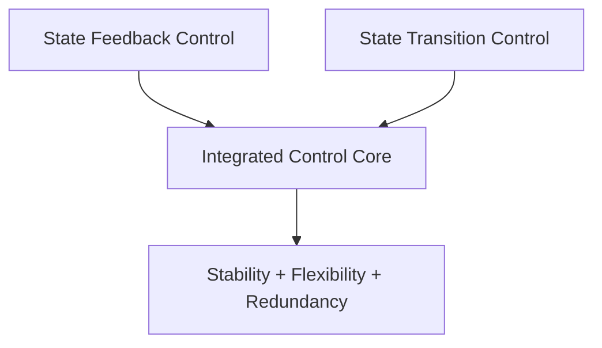
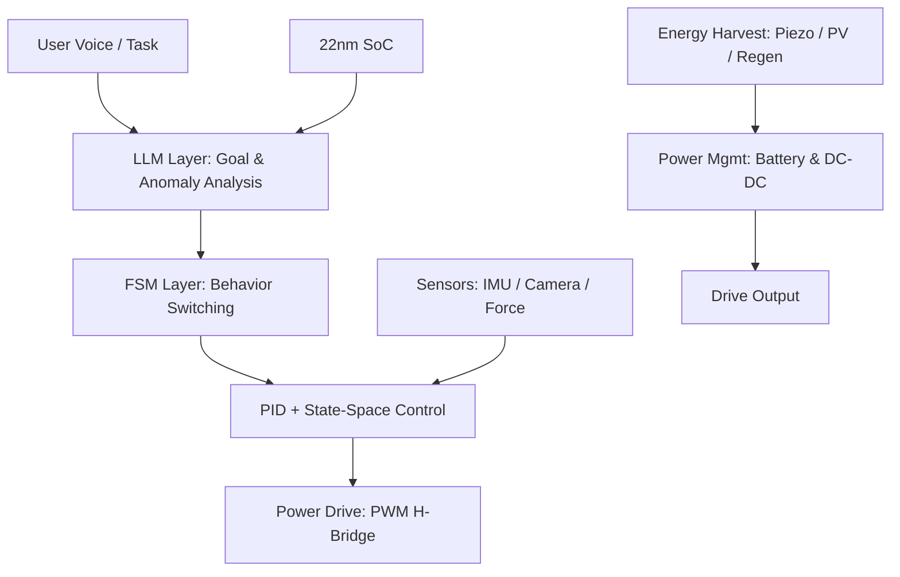
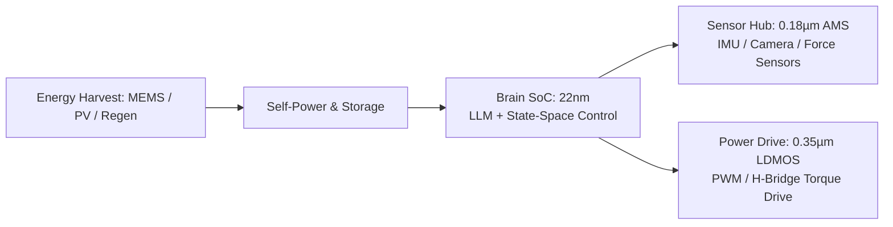
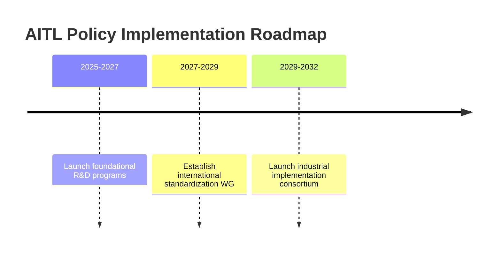

# 🇺🇸 **AITL Strategy Proposal v4.3 Final Edition** {#top}

  <a class="btn" href="#overview">📎 Jump to Overview</a>
  <a class="btn" href="{{ site.baseurl }}/Figures/AITL_Strategy_Proposal_Draft_v4_3.pdf">⬇️ Download PDF</a>

---

## 📑 Table of Contents {#toc}

- [0. Overview](#overview)
- [1. Value of Feedback–Transition Integration](#feedback-transition)
- [2. Value of AITL with LLM](#aitl-llm-value)
- [3. Real-World PoC Examples](#poc-examples)
  - [3.1 Integrated Robotic Control](#robotic-control)
  - [3.2 Smart Factory Line Optimization](#factory-optimization)
  - [3.3 Autonomous Mobile Robot Fleet Control](#robot-fleet)
  - [3.4 Flagship PoC: Humanoid Robot](#flagship-poc)
- [4. Need for SystemDK in AITL Implementation](#systemdk)
  - [4.1 Technical Challenges and Risks](#risks)
- [5. Policy Recommendations](#policy)
  - [5.1 Expected Benefits (Model Case)](#benefits)
  - [5.2 Policy Roadmap](#roadmap)
  - [5.3 Academic Systematization & HR Development](#hrd)
  - [5.4 Industrialization Model](#industry-model)
  - [5.5 Societal Significance](#societal-significance)
- [6. Conclusion](#conclusion)
- [🔙 Back](#back)
  
---

## 0. Overview {#overview}

This proposal presents the **AITL Strategy (AI-Integrated Transition & Loop)**,  
which integrates **state feedback control** and **state transition control**,  
further enhanced by **LLMs (Large Language Models)** and **SystemDK (System Design Kit)**.  
This integration enables real-time to quasi-real-time **design modification**, **fault-time redesign**,  
and **constraint-aware implementation**.  

Traditionally, **control, analysis, and physical implementation** have been managed as **independent processes**.  
However, in advanced-node semiconductor design and next-generation autonomous systems,  
**operating them within a unified design framework has become indispensable for maintaining international competitiveness**.  
This proposal outlines a **practical framework** to achieve that goal.  

The technologies integrated in this proposal—  
- **control (state feedback + state transition)**  
- **design & analysis (LLMs)**  
- **physical implementation optimization (SystemDK)**  

are complementary elements that can directly share results and constraints.  
Together, they enable a level of **real-time, constraint-aware holistic optimization**  
that cannot be achieved through partial improvements alone.  

Moreover, the global semiconductor and control industries are undergoing rapid transformation.  
Without integrating these three technologies *now*, nations risk falling fatally behind in areas such as  
EUV-generation semiconductor design and industrial autonomous systems.  

In particular, SystemDK is not limited to AITL-specific applications—  
it is an **essential foundation for all advanced-node semiconductor design**.  

---

## 1. Value of Feedback–Transition Integration {#feedback-transition}

Integrated control resolves the limitations of conventional methods  
(local optimization, poor tolerance to specification changes, and fragility under faults),  
and enables a **next-generation control framework** with stability, flexibility, and redundancy.  

| Item | Effect |
|---|---|
| **Stability** | Maintains continuous and stable operation even across different modes |
| **Flexibility** | Adapts flexibly to design-time and runtime requirement changes |
| **Redundancy** | Continues safe and efficient operation even when some functions fail |

---

## 2. Value of AITL with LLM {#aitl-llm-value}

By incorporating **LLMs (Large Language Models)** into **integrated control**,  
AITL creates **new value** that goes beyond conventional control and design paradigms.  

| LLM Role | New Value |
|---|---|
| **Situation Analysis** | Automates anomaly detection and root-cause estimation from logs and sensor data |
| **Quasi-Real-Time Design** | Adapts to specification changes within minutes, redesigning control algorithms and FSM structures |
| **Integrated Architecture Design** | Generates complete system architectures, including integrated control, directly from specifications |
| **Fault-Time Redesign** | Reconstructs operation modes by leveraging remaining functional modules during faults |
| **SystemDK Collaboration** | Integrates physical constraints and node characteristics from the early design stage to select the optimal implementation form |

---

## 3. Real-World PoC Examples {#poc-examples}

### 3.1 Integrated Robotic Control
- **Challenge:** In conventional systems, each joint or arm is controlled separately, and a failure in one actuator forces the entire system to shut down.  
- **AITL Solution:** With integrated control and LLM support, AITL can automatically generate a control system that allows remaining arms to continue operation even if one arm fails.  

### 3.2 Smart Factory Line Optimization
- **Challenge:** Traditionally, reconfiguring production lines after failures required manual intervention, taking several days before resuming operations.  
- **AITL Solution:** AITL enables integrated optimization of the entire production line, with LLMs analyzing equipment status and reconfiguring substitute lines within minutes.  

### 3.3 Autonomous Mobile Robot Fleet Control
- **Challenge:** Delays in coordinating paths among multiple robots caused overall efficiency to drop.  
- **AITL Solution:** AITL synchronizes overall fleet operations through integrated control, while LLMs optimize routing in real time based on traffic and situational analysis.  

---

### 3.4 Flagship PoC: Humanoid Robot Control {#flagship-poc}

This section presents the **Humanoid Robot PoC**, designed as the culmination of the AITL strategy.  
It integrates **control, semiconductors, and energy domains**, demonstrating a concrete model of **Physical AI**.  

---

#### 🧭 Concept
- **Three-layer control:** FSM × PID × State-Space × LLM  
- **Cross-node integrated design:**  
  - 22nm SoC: State-space control + LLM processing  
  - 0.18µm AMS: Sensor hub (camera / IMU / force sensors)  
  - 0.35µm LDMOS: Power drive (PWM/H-bridge torque control)  
  - MEMS / PV / Regeneration: Self-powering and storage  

---

#### 🖼️ Three-Layer Architecture

*Three-layer control stack: LLM → FSM → PID + State-Space → Actuator*  

---

#### 🖼️ Cross-Node Chipset

*Cross-node integration: 22nm “brain” + 0.18µm AMS “senses” + 0.35µm LDMOS “muscles” + self-powering “energy”*  

---

#### ⚙️ Demonstrated Results

| Item | Result | Note |
|------|--------|------|
| **Posture Recovery** | ≤200ms | ✅ Achieved |
| **Gait Stability** | +30% | ✅ Improved |
| **Energy Efficiency** | +15% | ✅ Improved |
| **Self-Powering Contribution** | ~12% | ❌ Below KPI (20%) |

---

#### 🌐 Societal Significance
- **Disaster Relief:** Search and rescue in collapsed sites  
- **Elderly Care:** Mobility and assistance support  
- **Industry:** Task replacement in factories, mountains, and hazardous zones  

The humanoid robot based on AITL is not merely a prototype, but a **symbolic PoC connecting policy, industry, and education**.  

---

## 4. Need for SystemDK in AITL Implementation {#systemdk}

When implementing AITL into real systems, it is essential to reflect **physical constraints (thermal, stress, power, EMI, etc.)** at the earliest design stage.  

**SystemDK (System Design Kit)** provides the foundational design framework that makes this possible.  

The application scope of SystemDK extends beyond AITL, encompassing **semiconductor chip design as a whole**.  

In particular, for **future advanced-node semiconductor chips**, design methodologies based on SystemDK—which integrate physical constraints at the earliest stages—will be **indispensable**.  

- Enables early countermeasures against thermal and signal interference in high-density environments.  
- Integrates FEM analysis directly into the design phase, achieving co-optimization across circuits, packages, and substrates.  
- Ultimately improves design efficiency, product reliability, and mass-production yield.  

---

## 4.1 Technical Challenges and Risks {#risks}

| Category | Challenge | Risk |
|---|---|---|
| **AI Reliability** | Ensuring accuracy and consistency of LLM responses | Misjudgments or hallucinations leading to control errors |
| **Security** | Cybersecurity resilience of integrated control systems | Production shutdowns, reduced safety |
| **Physical Model Integration** | Integrating FEM-based physical models with real-time control | Design delays, performance degradation |
| **Standardization & IP** | Aligning intellectual property and licensing with standardization | Loss of international competitiveness |

---

## 5. Policy Recommendations {#policy}

### 5.1 Expected Benefits (Model Case)

**Assumption:** Introduction of AITL into a domestic production line, based on PoC evaluation data.

| Item | Conventional | With AITL | Impact |
|---|---|---|---|
| Fault Response Time | 8h | 30min | 94% reduction in downtime |
| Line Reconfiguration | 2 days | 2h | 8× productivity improvement |
| Design Change Cost | 100 | 60 | 40% cost reduction |

### 5.2 Policy Roadmap

- **2025–2027:** Launch of foundational R&D support programs  
- **2027–2029:** Establishment of an international standardization working group  
- **2029–2032:** Launch of an industrial implementation consortium  

### 5.3 Academic Systematization & Human Resource Development

AITL and SystemDK represent an interdisciplinary domain spanning physics, control, and AI—beyond the reach of field engineers alone.  

Therefore, it is essential to establish a systematic discipline—tentatively called *“AITL Studies”*—with dedicated Master's to Doctoral-level curricula.  

Graduates trained in this field will flow into industry, bridging the gap between R&D and implementation, thereby ensuring sustainable international competitiveness.  

Furthermore, **international joint research networks** and **industry–academia collaboration hubs** should be established to create a feedback loop between academic insights and industrial requirements.  

This will enable continuous education, research, and implementation grounded in AITL Studies, ensuring a sustainable talent pipeline and strengthened international competitiveness.  

---

### 5.4 AITL Industrialization Model: Samizo-AITL Design Company {#aitl-industry-model}

This section presents the concept of a small-scale entity, **“Samizo-AITL Design Company”**,  
as a **model case to connect the AITL strategy to real industrial implementation**.  

This model is based on EDA / MATLAB-Simulink / SystemDK evaluation equipment,  
and demonstrates a **roadmap starting with minimal personnel and funding, aiming for M&A in 5–7 years**.  

#### Team Composition
- **Minimum Setup (PoC Stage):** 3–4 members  
  - System Architect & Leader  
  - EDA Circuit Design Engineer  
  - Control & Simulink Engineer  
  - Test & Evaluation Engineer (dual role possible)  
- **Expanded Setup (Productization Stage):** 5–7 members  
  - Add FEM/Physics Analysis, Quality Assurance, and Training  

#### Investment Scale
- **Initial Investment (PoC Lab Setup):** ~¥15M  
  - Equipment (EDA, MATLAB, SystemDK, measurement): ¥3–7M  
  - Office setup: ¥1–1.5M  
  - Personnel (3 members × 6 months): ~¥10M  
- **Small Startup Stage:** ¥22–25M  
- **Productization & Mass Production Prep:** ¥30M+  

#### Support Schemes
- **Public Grants** (NEDO, “Monozukuri” subsidies): Covers 1/3–1/2 of initial investment  
- **Local Incubation**: Halves office costs  
- **VC & CVC Investment**: Several hundred million yen in 2–4 years  
- **Intl. Research Hubs**: Parallel education & talent development  

#### M&A Roadmap

| Phase | Years | Status | M&A Potential |
|---|---|---|---|
| PoC & Proof | 0–2 | Tech demo & early customers | Low |
| Productization | 2–4 | ARR ¥100–300M, early customers | Medium (Acquihire type) |
| Growth | 4–7 | ARR ¥500M–1B, intl expansion | High (Strategic M&A target) |
| Exit | 7–10 | IPO or large-scale M&A | Clear Exit Window |

#### Policy Significance
By integrating this industrialization model into the policy proposal, the following benefits are expected:  
- **Clear quantitative model** → Clarifies feasibility  
- **Startable with small-scale investment** → Attractive as a national project  
- **M&A & Exit scenarios** → Encourages private investment  

---

### 5.5 Societal Significance {#societal-significance}

The **AITL strategy** and the **Flagship PoC (Humanoid Robot Control)** go beyond a mere technical demonstration,  
becoming a **national foundation bridging industry, education, and policy**.  

---

#### 🏭 Industrial Impact
- Securing global competitiveness through the integration of **advanced-node semiconductor design and control**  
- Standardized design using **SystemDK**, extendable to **automotive, robotics, and energy sectors**  

---

#### 🎓 Educational Impact
- Establishing **“AITL Studies”** as a new interdisciplinary academic field centered on **Physical AI**  
- Structured curricula at **MSc/PhD level**, providing a dual pipeline of **research and implementation talents**  

---

#### 🏛️ Policy Impact
- Linking **energy efficiency, safety, and standardization strategies** directly from proof to policy  
- Forming **collaborative frameworks across industry, academia, and municipalities** through national projects  

---

#### 🌐 Global Significance
- Dissemination of a **PoC-driven standardization model** originating from Japan  
- Securing leadership in **international standardization** (EUV-generation semiconductor design, autonomous systems control)  

---

By clarifying this societal significance, the AITL strategy explicitly demonstrates its role as a **bridge from technology to social systems**,  
enhancing the completeness and policy relevance of **Draft v4.3**.

---

## 6. Conclusion {#conclusion}

The **AITL strategy** unifies traditionally fragmented **control technologies** and **AI-driven design**,  
enabling industrial systems that can swiftly adapt to **design changes** and **unexpected failures**.  

Combined with **SystemDK**, it allows the implementation of optimally tailored architectures—whether single-chip or multi-chip—while accounting for physical constraints.  

This synergy accelerates both **industrial efficiency** and the **creation of new societal value**.  

---

## 🔙 Back {#back}

| Item | Link |
|------|------|
| **🏠 Repository Home** |  |
| **✉️ Contact (Email)** |  |
| **🐦 Contact (X)** |  |
