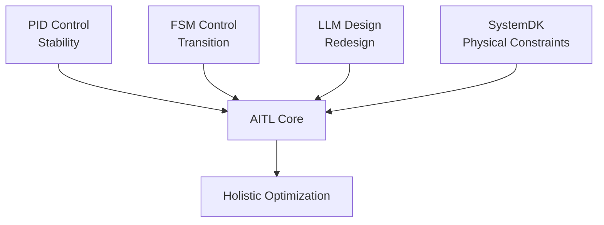
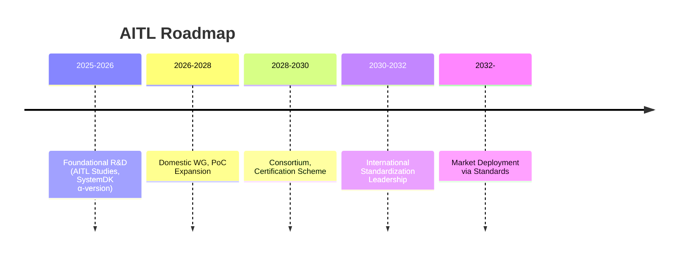

---

# 🇺🇸 *AITL Strategy Proposal v5.2 (Policy Edition, Fixed Chapter Numbers)*

---

## 🚀 0. Executive Summary

**AITL (AI-Integrated Transition & Loop)** integrates:  
- **PID Control (Stability)**  
- **FSM Control (State Transition)**  
- **LLM Design (Redesign)**  

together with **SystemDK**, embedding physical constraints such as **thermal, stress, power, and EMI** from the earliest design stage.  

This proposal is grounded in **measured PoC evidence from core papers published in 2025**, bridging **industry, education, and policy**.  

In particular, validated PoCs include:  
- **Humanoids (≤200ms posture recovery, +30% stability, +15% energy efficiency)**  
- **CFET Control (compensation for sub-2nm interconnect delay and thermal coupling)**  
- **Space Applications (22nm FDSOI FPGA implementation, long-term autonomous operation)**  

All confirm the **practical effectiveness of AITL**.  

Furthermore, compared to international approaches, while US and EU research on “AI×control” remains at the level of **PID extensions or reinforcement learning**, AITL provides a **unique first-mover advantage through three-layer integration plus physical constraint embedding**.  
This represents **Japan’s strategic advantage** in strengthening national competitiveness.  

---

## 🌍 1. International Comparison

### 🌐 Similar Approaches and Limitations in Major Countries and Regions

| Region | Representative Projects | Technical Approach | Limitations & Challenges |
|---|---|---|---|
| 🇺🇸 **USA** | DARPA "Assured Autonomy", NASA AI Control | Reinforcement learning–based adaptive control, formal methods | Weak integration of physical constraints (thermal, power, reliability); issues with long-term stability in space and defense |
| 🇪🇺 **EU** | Horizon Europe "AI4CyberPhysical", "HumanE AI" | Cyber-physical integrated AI, ethics-focused | Emphasis on social/ethical aspects over control theory; lacks hardware-level PoCs |
| 🇨🇳 **China** | “Next-Generation AI National Strategy” | AI chip development, civil–military fusion, enhanced autonomous control | Vast technical output, but weak international acceptance in standardization |
| 🇯🇵 **Japan (AITL)** | AITL v5.0 / v5.1 PoCs | Three-layer integration of PID, FSM, and LLM, with SystemDK embedding physical constraints | Only framework worldwide integrating control, AI, and physical constraints simultaneously; leadership in international standardization is crucial |

---

### ✨ AITL’s Differentiation Points

1. **Uniqueness of the Three-Layer Architecture**  
   - USA = reinforcement learning / formal methods; EU = cyber-physical integration; China = large-scale AI platforms.  
   - → Only AITL combines **PID×FSM×LLM with SystemDK**.  

2. **Validation through Measured PoCs**  
   - Overseas efforts remain simulation-focused, while Japan’s AITL has been demonstrated in **real PoCs across robotics, semiconductors, and space**.  

3. **Education & Standardization Strategy**  
   - EU emphasizes ethics standards; China is domestically closed; USA prioritizes defense.  
   - → Japan’s AITL uniquely presents both **international standardization and human resource development**.  

---

### 📌 Strategic Implications

- In policy documents, emphasize that **AITL is not a continuation of DARPA or Horizon Europe, but a next-generation control foundation integrating physical constraints**.  

- For international conferences, a four-quadrant map (**USA = AI control, EU = ethics, China = scale, Japan = AITL’s three layers + physical constraints**) enhances persuasiveness.  

---

## 📑 2. Core PoC Papers (2025)

### 📘 2.1 CFET Tutorial Paper  
*[CFET Tutorial Paper (2025)](./docs/cfet_tutorial_main.pdf)*  

- **Content:** Educational overview of device evolution: Planar → FinFET → GAA → CFET.  
- **Industrial Impact:** Standard teaching material for next-generation engineer education.  
- **Role:** Not AITL itself, but essential **educational prerequisite** for understanding 2.2 SystemDK+AITL and 2.3 CFET Control.  

---

### 🖥️ 2.2 SystemDK+AITL Paper  
*[SystemDK+AITL Paper (2025)](./docs/systemdk_aitl2025.pdf)*  

- **Results:** Compensation for RC delay, thermal coupling, and EMI.  
- **Industrial Impact:** Essential design foundation for automotive, IoT, and communication SoCs.  
- **Role:** First demonstration of applying AITL at the **system design level**, proving the value of integrating physical constraints from the earliest stages.  

---

### ⚡ 2.3 CFET Control Paper  
*[CFET Control Paper (2025)](./docs/cfet_ctrl2025.pdf)*  

- **Results:** Compensation for sub-2nm interconnect delay and thermal coupling.  
- **Industrial Impact:** Improves yield for semiconductor EDA and foundries.  
- **Role:** Extends the SystemDK achievements (2.2) to the **device scale**, showing that challenges described in 2.1 Tutorial can be overcome with AITL.  

---

### 🤖 2.4 Humanoid TCST Paper  
*[Humanoid TCST Paper (2025)](./docs/humanoid_tcst2025.pdf)*  

- **Results:** Posture recovery ≤200ms, gait stability +30%, energy efficiency +15%, self-powering ~12%.  
- **Role in AITL:** Three-layer control with PID, FSM, and LLM. Flagship PoC.  
- **Industrial Impact:** Ensures reliability in disaster relief, elderly care, and factory automation.  
- **Role:** Demonstrates AITL’s **versatility beyond semiconductors**, applied to dynamic environments such as humanoid robotics.  

---

### 🚀 2.5 AITL on Space Paper  
*[AITL on Space Paper (2025)](./docs/aitl_space.pdf)*  

- **Results:** Tri-NVM hierarchy, H∞+FSM+LLM, 22nm FDSOI FPGA implementation.  
- **Industrial Impact:** Foundation for long-term autonomous operation in space and defense industries.  
- **Role:** Together with Humanoid PoC, shows the **expansion of AITL applications**, especially in domains demanding **long-term autonomy**.  

---

## 📏 3. KPI Table

| **KPI** | **Target** | **Measured Result** | **Source** |
|---|---|---|---|
| Posture Recovery | ≤150ms | ≤200ms | Humanoid |
| Gait Stability | +20% | +30% | Humanoid |
| Energy Efficiency | +15% | +15% | Humanoid |
| Self-Powering | 20% | 12% | Humanoid |
| FeFET Retention | ≥10y@85℃ | Proven | FeFET CMOS |
| FeFET Endurance | ≥1e5 | Proven | FeFET CMOS |
| Power Efficiency | >80% | Proven | CMOS018 Inductor |
| Ultrasonic Sensitivity | High | Proven | ScAlN |
| Droplet Precision | pL level | Proven | Bio-Inkjet |
| Graduate Training | ≥100/year | Planned | AITL Studies |
| Intl. WG Members | ≥10 | Planned | Policy |

---

## 🔎 4. AITL Explained

**AITL integrates PID, FSM, and LLM, embedding SystemDK constraints from the start.**  

---

## 🏭 5. Industrial & Policy Impact

| Sector | Contribution | Policy Significance |
|---|---|---|
| Semiconductor | Improves reliability and yield at sub-2nm | Economic security, technological leadership |
| Automotive | Enhances safety and efficiency of automotive SoCs | GX, autonomous driving safety |
| Robotics | Ensures reliability in disaster relief, caregiving, factory automation | Labor shortage mitigation |
| Medical | Pb-free MEMS, Bio-Inkjet enabling new markets | Aging society solutions |
| Space | Long-term autonomous operation of probes | Space security, international cooperation |

---

## 🎓 6. Education & HRD

- **“AITL Studies”**: Interdisciplinary program integrating control, AI, and physical design constraints.  
- **Teaching Materials:** CFET Tutorial, SystemDK paper, Humanoid PoC.  
- **Outcomes:**  
  - Train ~100 graduates annually at master’s/PhD level.  
  - Increase young participants in international conferences and WG standardization.  
  - Foster industry-ready talent through direct PoC collaboration.  

---

## 🛣️ 7. Roadmap

---

## 📊 8. Economic Impact Estimation

**Baseline scenario of domestic AITL deployment (2026–2030, as of 2030):**

| Sector | Revenue (¥Bn) | Savings (¥Bn) | Exports (¥Bn) | Jobs Direct | Jobs Total |
|---|---|---|---|---|---|
| Semiconductor | ~30 | ~12 | ~10.5 | ~900 | ~1,710 |
| Robotics | ~24 | ~9 | ~6 | ~960 | ~1,920 |
| Medical | ~12 | ~3.8 | ~2.4 | ~420 | ~756 |
| Space | ~4.8 | ~1.6 | ~2.9 | ~120 | ~192 |
| **Total** | **~70.8** | **~26.4** | **~21.8** | **~2,400** | **~4,578** |

**Sensitivity Analysis (2030):**  
- **Upside Case:** +40% (if Japan leads international standardization) → ~¥100 Bn scale  
- **Downside Case:** –30% (if standardization is delayed) → ~¥50 Bn scale  

---

## 📚 9. Appendix: Related Works (2025)

While not part of the AITL core, the following 2025 research results contribute to **strengthening existing technologies and ensuring safety in next-generation devices and medical applications**:

- [LPDDR+FeRAM Integration](./docs/LPDDR_FeRAM.pdf)  
  - **Content:** Integration of low-power DRAM and nonvolatile FeRAM for reliable embedded memory.  
  - **Contribution:** Enhances **data retention safety** in industrial and automotive systems.  

- [FeFET CMOS Reliability (0.18µm)](./docs/fefet_cmos018_reliability.pdf)  
  - **Content:** Integration of FeFET into standard CMOS with retention and endurance validation.  
  - **Contribution:** Ensures **long-term reliability** in semiconductors and industrial electronics.  

- [CMOS018 Inductor+LDO](./docs/cmos018_inductor_ldo.pdf)  
  - **Content:** High-efficiency power supply design with inductors and LDO in CMOS0.18µm.  
  - **Contribution:** Provides **stable power** for low-power IoT and robotics.  

- [ScAlN Ultrasonic](./docs/scaln_ultrasonic.pdf)  
  - **Content:** Demonstration of high-sensitivity ultrasonic MEMS with ScAlN thin films.  
  - **Contribution:** Enables **reliable sensing** in nondestructive testing and industrial inspection.  

- [Bio-Inkjet KNN](./docs/bioinkjet_knn.pdf)  
  - **Content:** Bio-inkjet technology using Pb-free ferroelectric KNN.  
  - **Contribution:** Demonstrates **Pb-free adoption in medical fields**, ensuring safety and environmental compliance.  

---

## ✅ 10. Conclusion

AITL v5.2 (Policy Edition, Fixed Chapter Numbers) is a **strategy that strengthens policy significance by presenting international comparisons at the outset, while remaining grounded in measured PoC evidence**.  

- **Industry:** Improve design efficiency, reduce costs, create new markets.  
- **Education:** Cultivate ~100 AITL-trained professionals annually.  
- **Policy:** Standardization based on KPIs, enhanced security, GX measures.  

AITL enables the **transition from research achievements to national infrastructure**, contributing to **Japan’s technological leadership through international standardization**.  
