---

# 🚀 AITL Strategy Proposal v5.7 (Policy Edition, English Only)

## 0. Executive Summary

AITL (AI-Integrated Transition & Loop) integrates three layers:
- **PID Control (Stability)**
- **FSM Control (State Transition)**
- **LLM Design (Redesign & Integration)**

SystemDK embeds physical constraints (thermal, stress, power, EMI) from the earliest design stage, enabling a new design paradigm: **Runtime Physics-Aware DTCO**.

This proposal, grounded in measured PoC evidence from multiple core papers published in 2025, presents concrete pathways to industry, education, and policy.

Key achievements include:
- **Humanoid control:** posture recovery within 200ms, 30% gait stability improvement, 15% energy efficiency improvement.
- **CFET control:** compensation for sub-2nm interconnect delay and thermal coupling.
- **Space applications:** long-term autonomous operation on 22nm FDSOI FPGA.

These validated hardware-based PoCs are rare internationally. While the US, EU, and China emphasize reinforcement learning, ethics, or large-scale AI, Japan uniquely integrates **control + AI + physical constraints** through AITL.

This uniqueness grants Japan a **strategic advantage for technological leadership and economic security**.

---

## 1. International Comparison

### 1.1 Similar Approaches and Limitations

| Region | Representative Projects | Technical Approach | Limitations & Challenges |
|---|---|---|---|
| USA | DARPA "Assured Autonomy", NASA AI Control | Reinforcement learning–based adaptive control, formal methods | Weak integration of physical constraints (thermal, power, reliability); issues with long-term stability in space and defense |
| EU | Horizon Europe "AI4CyberPhysical", "HumanE AI" | Cyber-physical integrated AI, ethics-focused | Emphasis on social/ethical aspects; lacks hardware-level PoCs |
| China | Next-Generation AI National Strategy | AI chip development, civil–military fusion, autonomous control | Massive technical output but weak global acceptance in standardization |
| Japan (AITL) | AITL v5.0/v5.1 PoCs | Three-layer PID+FSM+LLM with SystemDK embedding physical constraints | Only framework worldwide integrating control, AI, and physical constraints; leadership in international standardization is key |

### 1.2 Differentiation Points
1. **Uniqueness of Three-Layer Architecture** → Only AITL combines PID×FSM×LLM with SystemDK.  
2. **Validation through Hardware PoCs** → Demonstrated in robotics, semiconductors, and space.  
3. **Education & Standardization Strategy** → Japan can uniquely push both international standards and HRD.  

### 1.3 Strategic Implications
- AITL should be emphasized as a **next-generation control foundation integrating physical constraints**, distinct from DARPA or Horizon Europe.  
- A four-quadrant map (USA = AI control, EU = ethics, China = scale, Japan = AITL) is recommended for international presentations.  

---

## 2. Core Framework: SystemDK with AITL

### 2.1 What is SystemDK?  
SystemDK (System Design Kit) extends PDK by enabling designers to consider thermal, stress, EMI, and RC delay constraints at circuit/system stages. Integrated with EDA and simulation, it ensures feasibility and reliability from the start.

### 2.2 What is AITL?  
AITL integrates PID (stability), FSM (state transitions), and LLM (redesign) in three layers. PID guarantees real-time stability, FSM supervises mode transitions, and LLM assists redesign under disturbances/failures.

### 2.3 Integration of SystemDK with AITL  
Combining SystemDK and AITL realizes **Runtime Physics-Aware DTCO**: a real-time framework embedding physical constraints from the start, where AITL consumes SystemDK thermal/power/stress models in feedback to close the loop from design to operation.

### 2.4 Position in International Context  
The US is beginning post-hoc compensation for physics; the EU focuses on ethics; China emphasizes mass production. Japan, via **SystemDK with AITL**, has established the world’s only framework unifying design, control, and physical constraints.

---

### 2.X EDA Integration Flow with SystemDK and AITL

The following diagram illustrates the integration flow of **SystemDK with AITL**.  
Unlike traditional “post-design compensation,” this framework embeds physical constraint analysis into the EDA design flow and recursively feeds it back through the AITL control modules.  
This enables **Runtime Physics-Aware DTCO** from the earliest design stages.  

---

#### 📊 Mermaid Version (For Technical Audience)

---

## 📑 3. Core PoC Papers (2025)

---

### 📘 3.1 CFET Tutorial Paper (2025)  
- **Content:** An educational overview of device evolution from Planar → FinFET → GAA → CFET.  
- **Industrial Impact:** Standard teaching material for next-generation engineers, providing foundational knowledge for PoCs.  
- **Role in AITL:** Not directly AITL, but essential as a prerequisite for understanding SystemDK and CFET control PoCs.  

[📄 CFET Tutorial Paper (PDF)](../docs/cfet_tutorial_main.pdf)

---

### 🖥️ 3.2 SystemDK for 3D-IC Paper (2025)  
- **Content:** Introduces a constraint-driven design framework that translates FEM-based thermal/stress maps and S-parameter EMI analyses directly into EDA-native constraints (STA derates, placement blockages, CTS shielding).  
- **Industrial Impact:** Demonstrated on a 4-die TSV stack, achieving **87% slack recovery, 11 °C hotspot reduction, and 23% eye-opening improvement under EMI**. Establishes SystemDK as a practical DTCO methodology bridging multiphysics analysis and design closure.  
- **Role in AITL:** Serves as the **foundational PoC** of SystemDK, validating constraint translation as the bridge between device-level physics and system-level EDA. Provides the baseline for subsequent AITL integration.  

[📄 SystemDK for 3D-IC Paper (PDF)](../docs/systemdk_3dic.pdf)

---

### 🖥️ 3.3 SystemDK+AITL Paper (2025)  
- **Content:** Compensates RC delay, thermal coupling, and EMI in the EDA flow. PID and FSM stabilize variations.  
- **Industrial Impact:** Essential for automotive, IoT, and communication SoC design. High potential for collaboration with EDA vendors.  
- **Role in AITL:** The first result applying AITL at the system design level, proving SystemDK’s capability to embed physical constraints from early design stages.  

[📄 SystemDK+AITL Paper (PDF)](../docs/systemdk_aitl2025.pdf)

---

### ⚡ 3.4 CFET Control Paper (2025)  
- **Content:** Compensates interconnect delay and thermal coupling at sub-2nm nodes, improving yield.  
- **Industrial Impact:** Directly linked to next-generation semiconductor EDA flows, improving foundry efficiency.  
- **Role in AITL:** A PoC applying SystemDK at the device scale, proving that CFET-specific challenges can be overcome with AITL.  

[📄 CFET Control Paper (PDF)](../docs/cfet_ctrl2025.pdf)

---

### 🤖 3.5 Humanoid TCST Paper (2025)  
- **Content:** Implements three-layer control (PID + FSM + LLM) in humanoids. Achieved ≤200ms posture recovery, +30% gait stability, +15% energy efficiency, and ~12% self-power contribution.  
- **Industrial Impact:** Ensures reliability in disaster relief, eldercare, and factory automation.  
- **Role in AITL:** The flagship PoC of AITL, demonstrating versatility in dynamic environments beyond semiconductors.  

[📄 Humanoid TCST Paper (PDF)](../docs/humanoid_tcst2025.pdf)

---

### 🚀 3.6 AITL on Space Paper (2025)  
- **Content:** Implements H∞ + FSM + LLM on 22nm FDSOI FPGA with a Tri-NVM hierarchy, ensuring long-term autonomy.  
- **Industrial Impact:** Provides a foundation for long-term operation in space and defense.  
- **Role in AITL:** A broadening PoC alongside humanoids, proving AITL’s long-term stability advantage in space/defense applications.  

[📄 AITL on Space Paper (PDF)](../docs/aitl_space.pdf)

---

### ✈️ 3.7 SkyEdge Drone Paper (2025)  
- **Content:** A reference design for a high-altitude UAV platform. Integrates H∞ control, variable-pitch rotor scheduling, domestically manufactured devices, and PQC-secured system stack. Achieves reliable operation up to 10 km.  
- **Industrial Impact:** Targeted for disaster-relief communication, border surveillance, environmental monitoring, and defense ISR. Also strengthens supply-chain resilience with domestic sourcing.  
- **Role in AITL:** An aerospace application PoC, expanding AITL’s control architecture into air mobility. Considered a broadening PoC alongside Humanoid and Space.  

[📄 SkyEdge Drone Paper (PDF)](../docs/skyedge_drone.pdf)

---

## 4. KPIs & Policy Implications

### 4.1 KPI Table

| KPI | Target | Result | Source |
|---|---|---|---|
| Posture Recovery | ≤150ms | ≤200ms | Humanoid |
| Gait Stability | +20% | +30% | Humanoid |
| Energy Efficiency | +15% | +15% | Humanoid |
| Self-Powering | 20% | 12% | Humanoid |
| FeFET Retention | ≥10y@85℃ | Validated | FeFET CMOS |
| FeFET Endurance | ≥1e5 cycles | Validated | FeFET CMOS |
| Power Efficiency | >80% | Validated | CMOS018 Inductor |
| Ultrasonic Sensitivity | High | Validated | ScAlN |
| Droplet Precision | pL-scale | Validated | Bio-Inkjet |
| Graduate Training | ≥100/year | Planned | AITL Studies |
| Intl. WG Participation | ≥10 | Planned | Policy |

### 4.2 Analysis & Implications
- Achieved: Semiconductor, MEMS, inkjet KPIs met.  
- Partial: Humanoid recovery lagging but stability/efficiency exceeded.  
- Unmet: Self-powering at 12% (target 20%) → R&D focus.  
- Planned: HRD and standardization → require policy support.  

Policy should prioritize **energy harvesting R&D**, and treat HRD/standardization as **policy-driven KPIs**.  

### 4.3 KPI Visualization

---

## 5. Industrial & Policy Impact

| Sector | Contribution | Policy Significance |
|---|---|---|
| Semiconductor | Reliability/yield at sub-2nm | Economic security, leadership |
| Automotive | Safety and low-power SoCs | GX, autonomous driving safety |
| Robotics | Reliable control in disaster/eldercare/factories | Labor shortage response |
| Medical | Pb-free MEMS, Bio-Inkjet | Aging society, environmental compliance |
| Space | Long-term autonomous operation | Space security, international cooperation |

Policy: semiconductors/auto/space → “national infrastructure”; robotics/medical → “social problem-solving.” 

---

## 6. Education & HRD

“AITL Studies” program integrates PID, FSM, LLM, SystemDK.  
Master’s/PhD curricula include fundamentals, SystemDK modeling, adaptive control, humanoid/space practicum, and international standardization workshops.  

Outcomes: ~100 graduates annually, young researcher participation in global WGs, industry-ready workforce linked to PoCs.  

---

## 7. Policy Roadmap

### 7.1 Overall Roadmap (Timeline)

### 7.2 Roles of Government Agencies
- **METI:** Support PoCs; WG secretariat; issue industrial standardization guidelines.  
- **MEXT:** Introduce AITL Studies; lead PhD-level HRD; strengthen education/research bases.  
- **MOFA:** Secure WG chair positions; diplomacy at ISO/IEC & IEEE.  
- **MIC:** Frameworks for IoT/telecom PoCs; align with spectrum/cyber policies.  
- **CAO:** Package AITL within economic security & GX; cross-ministerial coordination.

### 7.3 Milestones
- 2025–26: Launch education; release SystemDK α.  
- 2026–28: Establish domestic WG; expand PoCs.  
- 2028–30: Build certification; form consortium.  
- 2030–32: Target ISO/IEEE chairmanship.  
- Post-2032: Deploy globally via standards.

---

## 8. Economic Impact Estimation

### 8.1 Quantitative Estimate (2030)
| Sector | Revenue (¥Bn) | Savings (¥Bn) | Exports (¥Bn) | Jobs Direct | Jobs Total |
|---|---|---|---|---|---|
| Semiconductor | ~30 | ~12 | ~10.5 | ~900 | ~1,710 |
| Robotics | ~24 | ~9 | ~6 | ~960 | ~1,920 |
| Medical | ~12 | ~3.8 | ~2.4 | ~420 | ~756 |
| Space | ~4.8 | ~1.6 | ~2.9 | ~120 | ~192 |
| **Total** | **~70.8** | **~26.4** | **~21.8** | **~2,400** | **~4,578** |

### 8.2 Sensitivity (2030)
- **Upside:** +40% if Japan leads standardization → ~¥100B scale.  
- **Downside:** –30% if delayed → ~¥50B scale.

### 8.3 Visualization

```mermaid
%%{init: {"theme": "default"}}%%
xychart-beta
    title "AITL Economic Impact by Sector (2030)"
    x-axis ["Semiconductor", "Robotics", "Medical", "Space"]
    y-axis "¥Bn" 0 --> 40
    bar "Revenue" [30,24,12,4.8]
    bar "Savings" [12,9,3.8,1.6]
    bar "Exports" [10.5,6,2.4,2.9]
```

---

## 9. International Standardization Scenario

### 9.1 Importance of Standardization  
AITL’s unique integration of control, AI, and physical constraints should be codified in international standards to secure leadership and set market entry conditions.

### 9.2 Relevant Bodies  
ISO/IEC JTC1, IEEE CASS, IEEE PELS, IEC TC47.

### 9.3 Tactics for Japan  
- **Short-term (2025–26):** AITL sessions at IEEE; present PoCs.  
- **Mid-term (2026–30):** Proposals to ISO/IEC JTC1; secure WG chair/secretariat roles.  
- **Long-term (Post-2030):** Establish AITL international standards; set favorable conditions for Japanese industry.

### 9.4 Path Visualization

---

## 10. Strategy for Global Leadership: SystemDK with AITL

### 10.1 Core Strategy  
Position AITL as **national infrastructure**, with SystemDK integration at its core; link PoCs directly to standards to secure technological leadership and economic security.

### 10.2 Roles by Ministries  
METI (PoCs, guidelines), MEXT (education, PhD deployment), MOFA (diplomacy, chairs), MIC (IoT/telecom frameworks), CAO (GX/DX integration, coordination).

### 10.3 Role of Industry  
Semiconductor (CFET control, EDA integration), Automotive (AITL in SoCs), Robotics (200ms recovery as product requirement), Space (deep-space autonomy).

### 10.4 Role of Academia  
Introduce AITL Studies; ~100 grads/year; dispatch young researchers to conferences/WGs; PoC-based practica.

### 10.5 Strategic Conclusion  
**SystemDK with AITL** unifies ministries, industry, and academia, charting the path from **research achievements to national infrastructure**.

---

## 11. Appendix: Related Works (2025)

- 📄 [Historical Case Study: 0.25-µm DRAM & VSRAM (2025)](../docs/dram_vsram_history.pdf)  
  Case study of 0.25 µm DRAM ramp-up and pseudo-SRAM mass production, focusing on yield-improvement cycles and mobile application impact.  

- 📄 [Historical Case Study on Ti Silicide (TiSi₂) Reliability Issues (2025)](../docs/tisalicide_case.pdf)  
  Analysis of TiSi₂ phase-transition instability at 0.25 µm CMOS, its effect on embedded SRAM yield, and process countermeasures.  

- 📄 [Process-Based Differentiation for Analog CMOS (2025)](../docs/cmos018_noise.pdf)  
  Demonstrates >50% reduction in 1/f noise at 0.18 µm CMOS through substrate, doping, oxide/interface control, and annealing.  

- 📄 [FeFET CMOS Reliability (0.18µm) (2025)](../docs/fefet_cmos018_reliability.pdf)  
  Integration of FeFET into 0.18 µm CMOS baseline, with validated endurance (>10⁵ cycles) and retention (>10 years).  

- 📄 [CMOS018 Inductor+LDO (2025)](../docs/cmos018_inductor_ldo.pdf)  
  On-chip laminated inductor with hybrid Buck–LDO design achieving >80% efficiency and low noise for IoT/automotive.  

- 📄 [Inkjet Tutorial: Principles, Materials, and Emerging Applications (2025)](../docs/inkjet_tutorial.pdf)  
  Comprehensive tutorial reviewing actuation principles, droplet physics, ink materials, system/device design, and applications.  

- 📄 [ScAlN Ultrasonic MEMS (2025)](../docs/scaln_ultrasonic.pdf)  
  Pb-free ScAlN MEMS ultrasonic array integrated with CMOS, targeting eco-friendly and reliable medical sensor applications.  

- 📄 [Bio-Inkjet KNN (2025)](../docs/bioinkjet_knn.pdf)  
  Bio-Inkjet architecture using Pb-free KNN actuators, enabling picoliter droplet generation for biomedical printing.  

- 📄 [LPDDR+FeRAM Integration (2025)](../docs/LPDDR_FeRAM.pdf)  
  Hybrid memory architecture combining low-power LPDDR and non-volatile FeRAM, achieving instant resume and low standby power.  

- 📄 [Post-CFET Device Architectures (2025)](../docs/post_cfet.pdf)  
  Survey of post-CFET device options (2D FETs, 3D integration, spintronics, quantum) and a 2030–2045 technology roadmap.
  
---

### Figure 1. EDA Integration Flow (SystemDK with AITL)

---

## 12. Conclusion

**AITL v5.7** strengthens policy significance with upfront international comparison and PoC evidence.

- **Industry:** Design efficiency, cost reduction, new markets.  
- **Education:** ~100 AITL-trained professionals annually, directly involved in standardization.  
- **Policy:** KPI-driven standards, economic security, GX response.

**SystemDK with AITL** enables the leap from research to national infrastructure, and—by leading international standardization—supports Japan’s technological leadership.
