---

# 🇺🇸 **AITL Strategy Proposal v5.0**  

---

## 🚀 0. Executive Summary

**AITL (AI-Integrated Transition & Loop)** integrates:  
- **PID control (Stability)**  
- **FSM control (Mode Transition)**  
- **LLM design (Redesign)**  

and embeds **physical constraints** (thermal, stress, power, EMI) from the earliest design stage through **SystemDK**.  

This proposal is based on **PoC evidence from core papers published in 2025**, providing a bridge across **industry, education, and policy**.  

---

## 📑 1. Core PoC Papers (2025)

### 🤖 1.1 Humanoid TCST Paper  
*[Humanoid TCST Paper (2025)](./docs/humanoid_tcst2025.pdf)*  

- **Results:** Posture recovery ≤200ms, gait stability +30%, energy efficiency +15%, self-powering ~12%  
- **AITL Role:** Three-layer control with PID, FSM, and LLM. Flagship PoC.  
- **Industrial Impact:** Ensures reliability in disaster relief, elderly care, and factory automation.  

---

### 🚀 1.2 AITL on Space Paper  
*[AITL on Space Paper (2025)](./docs/aitl_space.pdf)*  

- **Results:** Tri-NVM hierarchy, H∞ + FSM + LLM, 22nm FDSOI FPGA implementation  
- **Industrial Impact:** Foundation for long-term autonomous operation in space and defense industries.  

---

### ⚡ 1.3 CFET Control Paper  
*[CFET Control Paper (2025)](./docs/cfet_ctrl2025.pdf)*  

- **Results:** Compensation for sub-2nm interconnect delay and thermal coupling  
- **Industrial Impact:** Improves yield and reliability in semiconductor EDA and foundries.  

---

### 🖥️ 1.4 SystemDK+AITL Paper  
*[SystemDK+AITL Paper (2025)](./docs/systemdk_aitl2025.pdf)*  

- **Results:** Compensation for RC delay, thermal coupling, and EMI  
- **Industrial Impact:** Essential design foundation for automotive, IoT, and communication SoCs.  

---

### 📘 1.5 CFET Tutorial Paper  
*[CFET Tutorial Paper (2025)](./docs/cfet_tutorial_main.pdf)*  

- **Content:** Educational overview of device evolution: Planar → FinFET → GAA → CFET  
- **Industrial Impact:** Standard teaching material for next-generation semiconductor engineers.  

---

## 📏 2. KPI Table

| 🧪 **KPI** | 🎯 **Target** | 📊 **Result** | 📄 **Source** |
|---|---|---|---|
| Posture Recovery | ≤150ms | ≤200ms | Humanoid |
| Gait Stability | +20% | +30% | Humanoid |
| Energy Efficiency | +15% | +15% | Humanoid |
| Self-Powering Contribution | 20% | 12% | Humanoid |
| FeFET Retention | ≥10y@85℃ | Verified | FeFET CMOS |
| FeFET Endurance | ≥1e5 | Verified | FeFET CMOS |
| Power Efficiency | >80% | Verified | CMOS018 Inductor |
| Ultrasonic Sensitivity | High | Verified | ScAlN |
| Droplet Precision | pL scale | Verified | Bio-Inkjet |

---

## 🔎 3. AITL Explained

**AITL integrates PID, FSM, and LLM, embedding SystemDK constraints from the beginning.**  

---

## 🏭 4. Industrial Impact of AITL

| Sector | Contribution |
|---|---|
| Semiconductor | Improves reliability and yield in sub-2nm design |
| Automotive | Enhances safety and energy efficiency in automotive SoCs |
| Robotics | Reliability for disaster relief, elderly care, and factory automation |
| Medical | Eco-friendly MEMS & Bio-Inkjet enabling new markets |
| Space | Long-term autonomous operation of spacecraft |

---

## 🎓 5. Education & Human Resource Development

- **“AITL Studies” (tentative)**  
  *Interdisciplinary program integrating control, AI, and physical design constraints.*  
- **Teaching Materials:** CFET Tutorial, SystemDK Paper, Humanoid PoC  
- **Outcomes:** Graduate-level curricula, industry–academia PoC training, leaders for international standardization  

---

## 🛣️ 6. Roadmap

```mermaid
timeline
    title AITL Roadmap
    2025-2026 : Foundational R&D (AITL Studies, SystemDK α-version)
    2026-2028 : Domestic WG, PoC Expansion
    2028-2030 : Consortium, Certification System
    2030-2032 : International Standardization Leadership
```

---

## 📚 Appendix: Related Works (2025)

The following works were published in 2025 as related but non-core research:  

- [LPDDR+FeRAM Integration](./docs/LPDDR_FeRAM.pdf)  
- [FeFET CMOS Reliability (0.18µm)](./docs/fefet_cmos018_reliability.pdf)  
- [CMOS018 Inductor+LDO](./docs/cmos018_inductor_ldo.pdf)  
- [ScAlN Ultrasonic](./docs/scaln_ultrasonic.pdf)  
- [Bio-Inkjet KNN](./docs/bioinkjet_knn.pdf)  

---

## ✅ 7. Conclusion

AITL v5.0 is a **strategy grounded in core paper evidence**, enabling:  

- **Industry:** More efficient design, lower cost, and creation of new markets  
- **Education:** Human resource development through “AITL Studies”  
- **Policy:** KPI-based standardization and national competitiveness  

**AITL enables the transition from research results to national infrastructure.**
